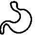
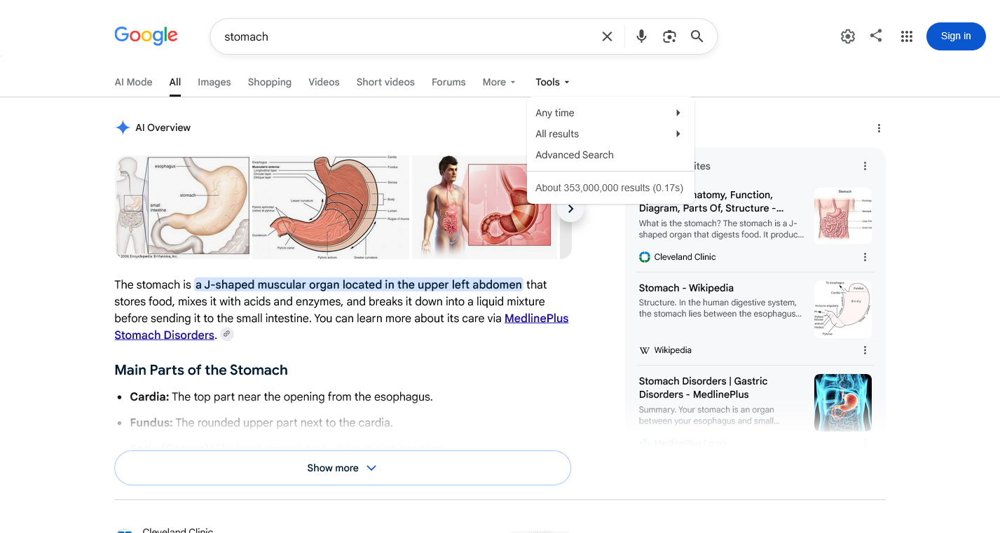
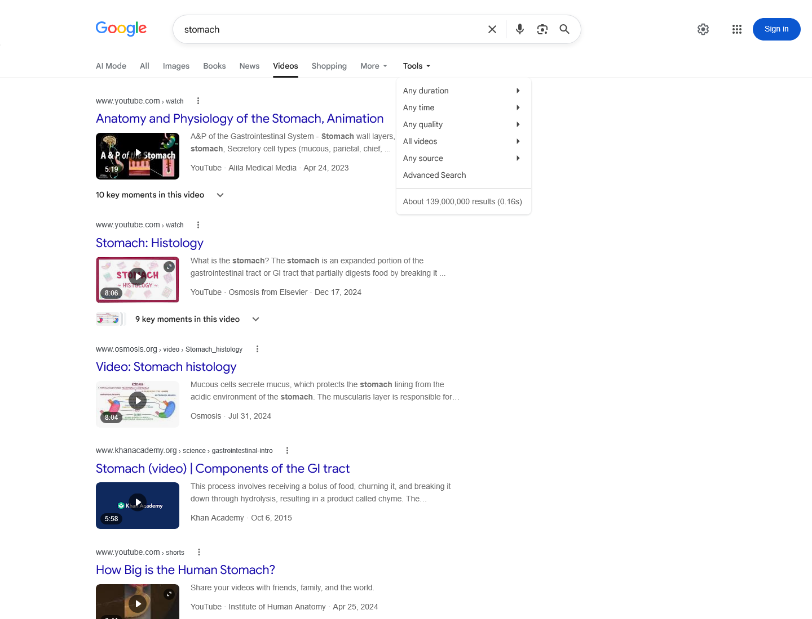
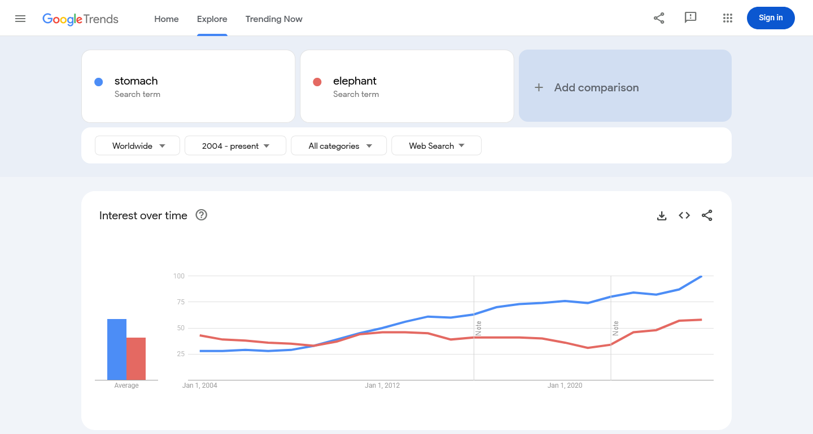
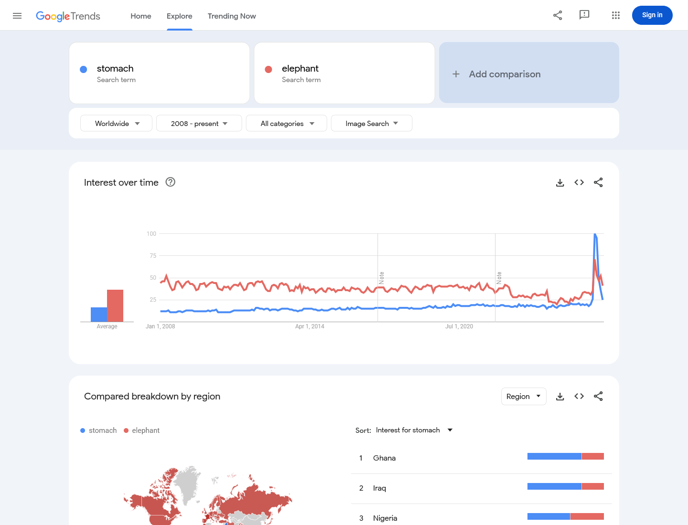

# Proposal for Emoji: Stomach

**Submitters:** Shuhan He, MD; David Rhew, MD; Heena Purohit 
**Main point of contact:** Shuhan He 
**Date:** 2026-07-26

## Identification

**Suggested name:** Stomach 
**Suggested keywords:** digestion; gut; belly; abdomen; hunger; appetite; fullness; nausea; indigestion; reflux 
**Suggested category:** People & Body - body-parts 
**Suggested sort location:** Near anatomical heart, lungs, and brain in the body-parts subgroup.

## Required Example Images

| Size | Color | Black and white |
| --- | --- | --- |
| 18x18 |  |  |
| 72x72 |  |  |

I, Shuhan He, certify that these example images are original work created for this proposal, that I own all IP
Rights in them, and that they contain no third-party artwork, logo, trademark, or text. I release the images
under the CC0 1.0 Universal Public Domain Dedication and grant the rights required by the Unicode Emoji
Proposal Agreement and License.

[CC0 1.0 Universal Public Domain Dedication](https://creativecommons.org/publicdomain/zero/1.0/)

## Factors for Inclusion

### A. Multiple meanings

Stomach names the digestive organ and everyday body area.
[Merriam-Webster](https://www.merriam-webster.com/dictionary/stomach) also records appetite and the verb meaning
to tolerate something. Familiar expressions include
[butterflies in your stomach](https://dictionary.cambridge.org/us/dictionary/english/butterflies-in-stomach),
[a strong stomach, and being unable to stomach something](https://dictionary.cambridge.org/us/dictionary/english/stomach).

### B. Use in sequences

Stomach adds a specific organ meaning to several short combinations:

- Stomach + fork and knife: digestion after a meal.
- Stomach + nauseated face: an upset stomach.
- Stomach + butterfly: butterflies in the stomach.

### C. Breaks new ground

**Yes.** Faces, food emoji, and Butterfly can express nausea, eating, disgust, or nervousness, but none identifies
the stomach or digestion. Stomach adds one recognizable symbol that connects the organ itself with appetite,
fullness, tolerance, and the familiar butterflies-in-the-stomach expression.

### D. Distinctiveness

Stomach is shown with a clear J shape, a long upper inlet, an open inner curve, a broad lower body, and a short
outlet. At 18x18, the J shape and two openings distinguish it from Beans, Anatomical Heart, Meat on Bone, and
other organs. Vendors may vary color, angle, outline, and shading while keeping these features.

### E. Expected usage level

Stomach appears in everyday communication about appetite, fullness after eating,
[an upset stomach](https://dictionary.cambridge.org/us/dictionary/english/upset), digestion, nervous anticipation,
and tolerating something unpleasant. The five required sources show broad use in web search, video, image search,
and published books. Google Trends and Google Books compare `stomach` with Unicode's reference term `elephant`.

#### Google Search

Captured 2026-07-26. Google Search displays about 353,000,000 results for `stomach`.
[Open the Google Search query](https://www.google.com/search?q=stomach&hl=en&filter=0).

#### Google Video Search

Captured 2026-07-26. Google Video Search displays about 139,000,000 results for `stomach`.
[Open the Google Video Search query](https://www.google.com/search?tbm=vid&q=stomach&hl=en&num=10&pws=0).

#### Google Trends - Web Search

Captured 2026-07-26 using Worldwide, 2004-present, All categories, and Web Search. Stomach has the higher
displayed average across the full range and a strong sustained lead in recent years.
[Open the Web Search comparison](https://trends.google.com/trends/explore?date=all&q=stomach,elephant).

#### Google Trends - Image Search

Captured 2026-07-26 using Worldwide, 2008-present, All categories, and Image Search. Stomach shows sustained
worldwide image-search interest across the full available range and a strong recent peak above elephant.
[Open the Image Search comparison](https://trends.google.com/trends/explore?date=all&gprop=images&q=stomach,elephant).

#### Google Books Ngram Viewer

Captured 2026-07-26 using the English corpus, 1500-2022, case-insensitive matching, and smoothing 3. Stomach
substantially exceeds elephant in the latest displayed years and shows durable published-book use across the
longest available range.
[Open the Google Books comparison](https://books.google.com/ngrams/graph?content=elephant%2Cstomach&year_start=1500&year_end=2022&corpus=en&smoothing=3).

### F. Completeness

Not applicable. Stomach does not complete a recognized closed set.

### G. Compatibility

Not applicable. This proposal does not claim compatibility with an emoji from an older system.

## Factors for Exclusion

### A. Already represented

Nauseated Face can express nausea or disgust and, with Fork and Knife, sickness after eating. Butterfly with an
Anxious Face can suggest nervous anticipation. Those combinations work for individual situations, but they
cannot name the stomach itself or provide the common anchor for digestion, fullness, tolerance, and butterflies
in the stomach.

### B. Overly specific

Stomach names a familiar organ and body area, not a disease, procedure, brand, or subtype. Its appetite,
nervousness, and tolerance meanings reach beyond any single digestive condition.

### C. Open-ended

**No.** Stomach is not proposed as one member of an anatomy series. It combines one familiar, visually
recognizable organ with established everyday meanings for appetite, fullness, tolerance, and nervous
anticipation. The same J-shaped symbol can express the literal stomach, digestion, a strong stomach, being unable
to stomach something, and butterflies in the stomach. Selecting this bounded communication concept does not
create a reason to encode every other organ.

### D. Transient

Stomach is durable, not tied to a temporary event, product, or campaign. Google Books shows published use across
centuries, and current dictionaries document butterflies in the stomach and the verb stomach.

### E. Faulty comparison

`Elephant` appears only as Unicode's required frequency comparator. Anatomical Heart, Lungs, and Brain are not
precedents that entitle Stomach to encoding.

## Other Information

The name Stomach is concise and searchable. Vendors should preserve the J shape, upper inlet, open inner curve,
and short outlet, while varying color, angle, outline, and shading. Fine anatomical detail should yield to
clarity at 18x18.
