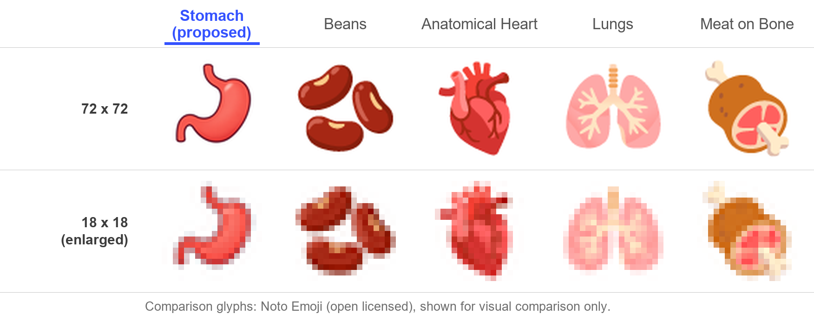
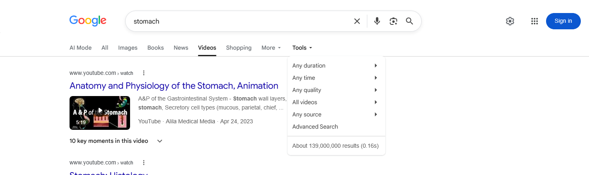
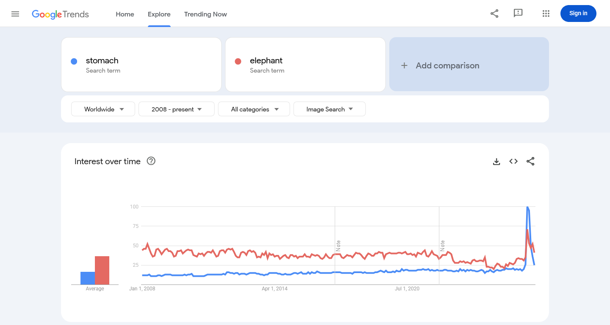

# Proposal for Emoji: Stomach

**Submitters:** Shuhan He, MD; David Rhew, MD; Heena Purohit 
**Main point of contact:** Shuhan He 
**Date:** 2026-07-28

## Identification

**Suggested name:** Stomach 
**Suggested keywords:** digestion; gut; belly; abdomen; hunger; appetite; fullness; nausea; indigestion; reflux 
**Suggested category:** People & Body - body-parts 
**Suggested sort location:** Near anatomical heart, lungs, and brain in the body-parts subgroup.

## Required Example Images

| Size | Color | Black and white |
| --- | --- | --- |
| 18x18 |  |  |
| 72x72 |  |  |

I, Shuhan He, certify that these example images are original work created for this proposal, that I own all IP
Rights in them, and that they contain no third-party artwork, logo, trademark, or text. I release the images
under the CC0 1.0 Universal Public Domain Dedication and grant the rights required by the Unicode Emoji
Proposal Agreement and License.

[CC0 1.0 Universal Public Domain Dedication](https://creativecommons.org/publicdomain/zero/1.0/)

## Factors for Inclusion

### A. Multiple meanings

Stomach names the digestive organ and everyday body area.
[Merriam-Webster](https://www.merriam-webster.com/dictionary/stomach) also records appetite and the verb meaning
to tolerate something. Familiar expressions include
[butterflies in your stomach](https://dictionary.cambridge.org/us/dictionary/english/butterflies-in-stomach),
[a strong stomach, and being unable to stomach something](https://dictionary.cambridge.org/us/dictionary/english/stomach).

These senses are in ordinary published use, not dictionary curiosities. The two Google Books Ngram exhibits below
are supplementary to the five required frequency sources in section E.

**Verb sense.** Captured 2026-07-27 using the English corpus, 1500-2022, and smoothing 3. Tagged verb use of
`stomach` appears continuously from the seventeenth century and rises steeply after 1990 to the highest level in
the charted range.
[Open the verb-sense comparison](https://books.google.com/ngrams/graph?content=stomach_VERB&year_start=1500&year_end=2022&corpus=en&smoothing=3).

**Idiomatic phrases.** Captured 2026-07-27 using the same settings. `A strong stomach` and `turn my stomach`
show durable published use across centuries, and `butterflies in my stomach` rises sharply after 1990.
[Open the idiom comparison](https://books.google.com/ngrams/graph?content=butterflies+in+my+stomach%2Ca+strong+stomach%2Cturn+my+stomach&year_start=1500&year_end=2022&corpus=en&smoothing=3).

A note on method: a `stomach_VERB, liver_VERB, kidney_VERB` comparison was prepared and then discarded, because
Ngram's part-of-speech tagger mis-tags archaic text and reports implausible `liver_VERB` volume across roughly
1550 to 1950. The single-term chart above is used instead.

### B. Use in sequences

Stomach gives existing emoji a precise body-related meaning:

- Stomach + Fork and Knife: fullness or digestion after a meal.
- Stomach + Nauseated Face: an upset stomach.
- Stomach + Butterfly: nervous anticipation, or "butterflies in the stomach."

### C. Breaks new ground

**Yes.** Faces, food emoji, and Butterfly can express nausea, eating, disgust, or nervousness, but none names the
stomach itself. Stomach adds one recognizable symbol linking the literal organ and digestion with appetite,
fullness, tolerance, and butterflies in the stomach.

### D. Distinctiveness

Stomach is shown with a clear J shape, a long upper inlet, an open inner curve, a broad lower body, and a short
outlet. At 18x18, the J shape and two openings distinguish it from Beans, Anatomical Heart, Lungs, Meat on Bone,
and other organs. Vendors may vary color, angle, outline, and shading while keeping these features.

The figure below shows the proposed art beside the nearest already-encoded emoji at both required sizes. The
18x18 row is the submitted 18x18 file enlarged with nearest-neighbour sampling, so it shows the true pixel
structure rather than a smoothed approximation.

The comparison glyphs are from the open-licensed Noto Emoji project and are included only to show relative
legibility. They are not part of the proposed artwork covered by the certification above.

### E. Expected usage level

Stomach appears in everyday communication about appetite, fullness after eating,
[an upset stomach](https://dictionary.cambridge.org/us/dictionary/english/upset), digestion, nervous anticipation,
and tolerating something unpleasant. All five required sources are given below, each compared with Unicode's
reference term `elephant`, and the result is mixed rather than uniform:

| Source | `stomach` | `elephant` | Higher |
| --- | --- | --- | --- |
| Google Search | 353,000,000 | 491,000,000 | elephant |
| Google Video Search | 139,000,000 | 86,300,000 | stomach |
| Google Trends, Web Search | higher displayed average | lower displayed average | stomach |
| Google Trends, Image Search | lower across most of the range | higher across most of the range | elephant |
| Google Books Ngram | substantially higher recently | lower recently | stomach |

Method: all captures were made in a private browser window with search personalization disabled, using the
widest date range each tool offers. No qualifying category was applied to either Google Trends exhibit. `Stomach`
is not an ambiguous term in the way `seal` or `fly` are, and constraining the comparison to a health category
would distort the `elephant` baseline that Unicode requires. Both Trends exhibits therefore use All categories
so the two terms are measured on the same basis.

#### Google Search

Captured 2026-07-26. Google Search displays about 353,000,000 results for `stomach`.
[Open the Google Search query](https://www.google.com/search?q=stomach&hl=en&filter=0).

Captured 2026-07-27. The same search displays about 491,000,000 results for `elephant`, which is higher than
`stomach` on this source.
[Open the Google Search query for elephant](https://www.google.com/search?q=elephant&hl=en&num=10&pws=0).

#### Google Video Search

Captured 2026-07-26. Google Video Search displays about 139,000,000 results for `stomach`.
[Open the Google Video Search query](https://www.google.com/search?tbm=vid&q=stomach&hl=en&num=10&pws=0).

Captured 2026-07-27. The same search displays about 86,300,000 results for `elephant`, which is lower than
`stomach` on this source.
[Open the Google Video Search query for elephant](https://www.google.com/search?tbm=vid&q=elephant&hl=en&num=10&pws=0).

#### Google Trends - Web Search

Captured 2026-07-26 using Worldwide, 2004-present, All categories, and Web Search. Stomach holds the higher
displayed average and is the higher line across most of the charted range. Elephant leads in the earliest years,
and stomach takes a sustained lead thereafter.
[Open the Web Search comparison](https://trends.google.com/trends/explore?date=all&q=stomach,elephant).

#### Google Trends - Image Search

Captured 2026-07-26 using Worldwide, 2008-present, All categories, and Image Search. This is the weakest of the
five sources for `stomach`. Elephant is the higher line across most of the range and holds the higher displayed
average. Stomach shows continuous worldwide image-search interest for the full range and rises above elephant
only in the most recent period, and a single terminal move in Google Trends can reflect an incomplete final
interval, so no weight is placed on that crossover here.
[Open the Image Search comparison](https://trends.google.com/trends/explore?date=all&gprop=images&q=stomach,elephant).

#### Google Books Ngram Viewer

Captured 2026-07-26 using the English corpus, 1500-2022, case-insensitive matching, and smoothing 3. Stomach
substantially exceeds elephant in the latest displayed years and shows durable published-book use across the
longest available range.
[Open the Google Books comparison](https://books.google.com/ngrams/graph?content=elephant%2Cstomach&year_start=1500&year_end=2022&corpus=en&smoothing=3).

### F. Completeness

Not applicable. Stomach does not complete a recognized closed set.

### G. Compatibility

Not applicable. This proposal does not claim compatibility with an emoji from an older system.

## Factors for Exclusion

### A. Already represented

Nauseated Face can express nausea or disgust and, with Fork and Knife, sickness after eating. Butterfly with an
Anxious Face can suggest nervous anticipation. Those combinations work for individual situations, but they
cannot name the stomach itself or provide the common anchor for digestion, fullness, tolerance, and butterflies
in the stomach.

### B. Overly specific

Stomach is the general organ concept, not a disease, procedure, brand, or anatomical subtype. Its everyday
meanings include appetite, fullness, nervous anticipation, and tolerance, extending well beyond medicine.

### C. Open-ended

**No.** Stomach is not proposed as one member of an anatomy series, and the reason is measurable rather than
asserted. The selection criterion here is not that stomach is an organ. It is that `stomach` carries an
established non-anatomical sense in ordinary English, which the corpus evidence in section A shows directly:
a tagged verb sense in continuous published use since the seventeenth century and now at its charted peak, and
the idioms `a strong stomach`, `turn my stomach`, and `butterflies in my stomach`.

That criterion is self-limiting. It selects `stomach` because the word does work in everyday language beyond
naming the organ, and it does not extend to organ words that lack that behaviour. A proposal for another organ
would have to demonstrate its own comparable everyday sense on its own evidence, and would stand or fall on
that evidence rather than on this proposal. Encoding Stomach therefore does not create a reason to encode every
other organ, because what is being selected is the idiomatic load of the word, not membership in the anatomy.

### D. Transient

Stomach is durable, not tied to a temporary event, product, or campaign. The Ngram exhibits in section A show
the verb sense in continuous published use since the seventeenth century and the idioms `a strong stomach` and
`turn my stomach` across centuries, with `butterflies in my stomach` rising steadily since 1990. Current
dictionaries document both the idiom and the verb.

### E. Faulty comparison

`Elephant` appears only as Unicode's required frequency comparator. Anatomical Heart, Lungs, and Brain are not
precedents that entitle Stomach to encoding.

## Other Information

The name Stomach is concise and searchable. Vendors should preserve the J shape, upper inlet, open inner curve,
and short outlet, while varying color, angle, outline, and shading. Fine anatomical detail should yield to
clarity at 18x18.
