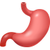
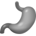
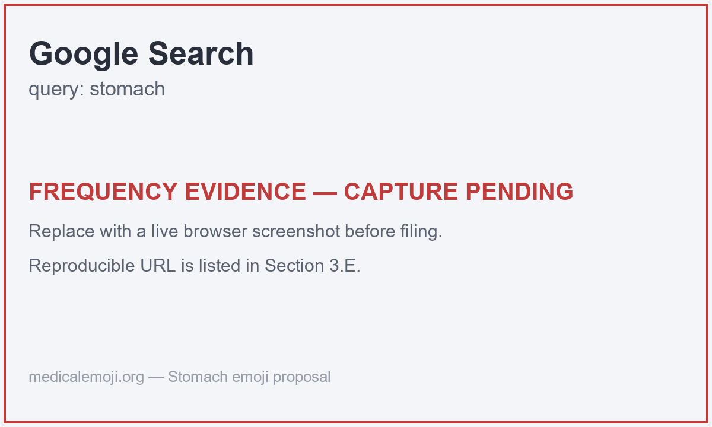
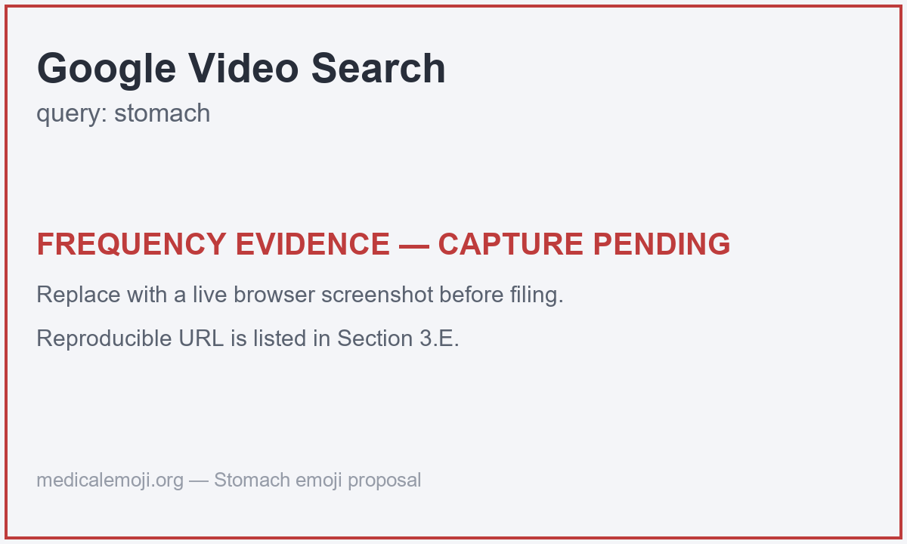
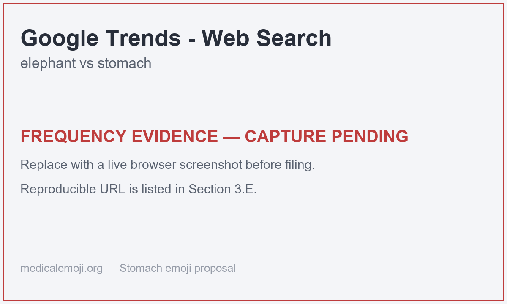
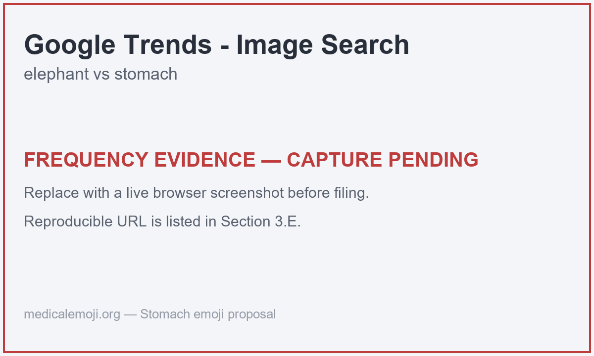
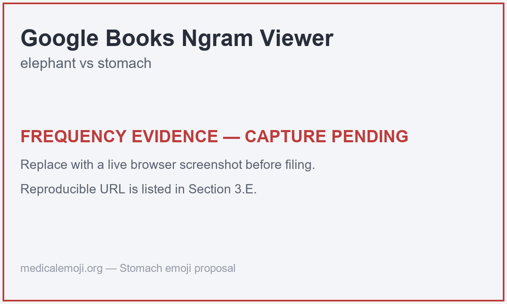

# Proposal for Emoji: Stomach

Title: Proposal for Emoji: Stomach

Submitter: Shuhan He; additional gastroenterology and patient-advocacy co-submitters to be confirmed

Main point of contact: Shuhan He

Date: 2026-06-12

### Required Example Images

Color 18x18:

Color 72x72:

Black-and-white 18x18:

Black-and-white 72x72:

### Image License And Rights

The color stomach artwork was created for the Medical Emoji project and is owned by the Conductscience Foundation, which will turn over the rights required for use in this Unicode emoji proposal. The black-and-white 18x18 and 72x72 example images are simplified reference images derived from the color artwork for this proposal. The submitter will confirm the final artist credit, authorization, and agreement to the Unicode Emoji Proposal Agreement and License before filing:

https://www.unicode.org/emoji/emoji-proposal-agreement.pdf

## 1. Identification

Suggested name: Stomach

Suggested keywords: stomach; digestion; gut; belly; abdomen; hunger; appetite; nausea; stomach ache; upset stomach; reflux; heartburn; indigestion; dyspepsia; gastroenterology; endoscopy; stomach cancer

Suggested category: People & Body, body-parts.

Suggested sort location: in the body-parts subgroup with the other internal-organ emoji (for example near `anatomical heart`, `lungs`, and `brain`).

Unicode emoji list and ordering reference:
https://www.unicode.org/emoji/charts/emoji-list.html

The proposed name is `Stomach`. The singular common-language label matches everyday usage and search behavior across digestion, hunger, symptoms, metaphor, and clinical contexts.

## 2. Images

The proposal includes the required color and black-and-white example images at both 18x18 and 72x72 pixels at the top of the first page. The image represents the stomach as a recognizable digestive organ with its characteristic curved, J-shaped form. The image is a reference image for vendors, not a request for exact vendor artwork.

Artwork source:
https://medicalemoji.org/images/emoji/3-stomach.png

Black-and-white source note: the black-and-white 18x18 and 72x72 example images are simplified reference images derived from the color artwork for this proposal. They are included as proposal reference artwork, not as required vendor art.

### Essential Visual Cues

The example image is a paradigm image, not a request for exact vendor artwork. To remain recognizable at emoji size, vendor renderings should preserve the core stomach concept through a single curved hollow-organ form with the inlet (esophagus) and outlet (toward the small intestine). The image should not read primarily as a food item, a generic blob, a logo, or a text-bearing medical icon.

Vendor variation is expected. Vendors may simplify internal detail, adjust color, or vary the degree of anatomical realism as long as the result remains recognizably stomach-related at small sizes.

| Visual cue | Importance | Reason |
| --- | --- | --- |
| Curved J-shaped organ silhouette | Required | Carries the core stomach shape and separates it from other organs. |
| Visible inlet and outlet (esophagus in, duodenum out) | Strongly preferred | Signals digestive-tract anatomy and reduces confusion with a generic blob. |
| Smooth hollow-organ body | Strongly preferred | Distinguishes the stomach from solid organs and from food shapes. |
| Pink, red, or organ-like color | Optional | Vendors can vary palette if the shape stays legible. |
| Fine surface or rugae detail | Optional | Can be simplified or removed at 18x18. |

## 3. Factors For Inclusion

### A. Multiple Concepts

The Stomach emoji represents a broad and familiar concept, not a single disease, campaign, or medical specialty. It supports digestion, hunger, appetite, fullness, nausea, stomach ache, upset stomach, belly pain, reflux, heartburn, indigestion, dyspepsia, endoscopy, gastroenterology care, nutrition, meals, and stomach cancer.

The concept also has durable everyday and metaphorical meanings. People talk about a nervous stomach, butterflies in the stomach, a gut feeling, having the stomach for something, being unable to stomach something, eating on an empty stomach, and feeling full or nauseated after a meal. These are common phrases used across ordinary communication, not specialist jargon.

Medical and public-health evidence supports the durability of the concept (provided as background, not as Unicode frequency evidence). A Scientific Reports systematic review estimated global pooled prevalence of gastro-oesophageal reflux disease at 13.98%, corresponding to about 1.03 billion affected individuals:
https://www.nature.com/articles/s41598-020-62795-1

A 2024 Scientific Reports systematic review estimated global prevalence of functional dyspepsia at 8.4% across Rome criteria:
https://www.nature.com/articles/s41598-024-54716-3

WHO/IARC reported about 970,000 new stomach cancer cases and about 660,000 stomach cancer deaths globally in 2022:
https://www.who.int/news/item/01-02-2024-global-cancer-burden-growing--amidst-mounting-need-for-services

These health sources are not substitutes for Unicode's required frequency evidence. They explain why the stomach is a durable, widely understood body concept with everyday, educational, clinical, nutritional, and metaphorical uses.

### B. Use In Sequences

Stomach can combine naturally with existing emoji:

- Stomach plus fork and knife: digestion, meals, appetite, or fullness.
- Stomach plus water drop: hydration, nausea, vomiting risk, or body function.
- Stomach plus nauseated face or face with thermometer: stomach flu, nausea, or feeling sick.
- Stomach plus warning sign: stomach pain, urgent symptoms, or food reaction.
- Stomach plus pill: antacid, medication effects, or treatment.
- Stomach plus hospital: gastroenterology visit, endoscopy, or clinical care.
- Stomach plus butterfly: butterflies in the stomach or nervous anticipation.
- Stomach plus brain or thought bubble: gut feeling or intuition.

These are ordinary emoji-composition examples. This proposal does not request any standardized sequence.

### C. Breaks New Ground

Stomach would add a distinct digestive-organ concept that is not currently represented by existing emoji. Existing emoji can imply food, illness, or general medical care, but none directly represents the stomach as an organ for digestion, hunger, fullness, nausea, reflux, indigestion, stomach pain, or stomach cancer.

The proposal does not rely on the existence of anatomical heart, lungs, or brain as its main argument. Stomach stands on its own broad usage, multiple concepts, visual recognizability, and inability to be represented clearly by existing emoji.

### D. Distinctiveness

The stomach has a recognizable curved, J-shaped silhouette in medical education and public illustration. The example image uses a simple organ silhouette intended to remain recognizable at 18x18 pixels. The black-and-white reference images are included above to show legibility without color.

Evidence and final checks still required before filing:

- Side-by-side visual review of the 18x18 image against existing organ emoji and common food emoji.
- Non-specialist recognizability review at small size.
- Final color and black-and-white example-image sign-off.
- Final image-rights confirmation.

### E. Expected Usage Level

Expected usage is supported by public search-result, video-result, search-interest, image-search-interest, and corpus evidence. The Trends and Ngram figures compare `stomach` with `elephant`.

The reproducible URLs below are final; the result counts and screenshots must be captured in a clean browser session immediately before filing. The figures are included as labeled placeholders until those captures are taken.

| Evidence source | Query | Captured result | Reproducible URL |
| --- | --- | --- | --- |
| Google Search | `stomach` | Capture pending | https://www.google.com/search?q=stomach&hl=en&num=10&pws=0 |
| Google Video Search | `stomach` | Capture pending | https://www.google.com/search?tbm=vid&q=stomach&hl=en&num=10&pws=0 |
| Google Trends Web Search | `elephant,stomach` | Screenshot pending | https://trends.google.com/trends/explore?date=all&q=elephant,stomach |
| Google Trends Image Search | `elephant,stomach` | Screenshot pending | https://trends.google.com/trends/explore?date=all_2008&gprop=images&q=elephant,stomach |
| Google Books Ngram Viewer | `elephant,stomach` | Screenshot pending | https://books.google.com/ngrams/graph?content=elephant%2Cstomach&year_start=1500&year_end=2019&corpus=en-2019&smoothing=3 |

Figure 1. Google Search results for `stomach`:

Figure 2. Google Video Search results for `stomach`:

Figure 3. Google Trends Web Search, `elephant` versus `stomach`:

Figure 4. Google Trends Image Search, `elephant` versus `stomach`:

Figure 5. Google Books Ngram Viewer, `elephant` versus `stomach`:

Supplemental evidence may include `upset stomach`, `stomach ache`, `stomach pain`, `heartburn`, `indigestion`, `butterflies in stomach`, and `gut feeling`, but the base concept evidence centers on `stomach`.

### F. Completeness

Stomach would help fill a practical gap in the limited set of emoji available for major human anatomy and health communication, but the proposal is not asking Unicode to encode every organ. Stomach has independent grounds for consideration because it is associated with a broad set of durable, common concepts: digestion, hunger, appetite, fullness, nausea, stomach ache, reflux, heartburn, indigestion, dyspepsia, endoscopy, stomach cancer, nutrition, and everyday metaphor.

### G. Compatibility

No compatibility claim is currently made. The proposal does not rely on an existing stomach pictograph in a legacy carrier set or another major communication system. If a documented high-usage stomach pictograph is found before submission, this section can be updated with the source and evidence. Otherwise, compatibility should be treated as not applicable.

## 4. Factors For Exclusion

### A. Already Represented

Stomach is not already represented by existing emoji. Food emoji, nauseated face, hospital, pill, syringe, anatomical heart, lungs, and brain can support nearby meanings, but none identifies the stomach itself.

### B. Overly Specific

Stomach is not overly specific. It is a primary human organ and a broad public-health and everyday concept. The proposal is not for a particular disease subtype, treatment brand, advocacy organization, medical specialty logo, campaign ribbon, or procedure. A stomach emoji would cover many contexts across anatomy, digestion, symptoms, nutrition, metaphor, and clinical care.

### C. Open-Ended

The proposal does not ask Unicode to create a complete anatomy taxonomy. Stomach is proposed because it meets a bounded set of independent criteria rather than because it is one item in an open-ended organ list.

| Criterion | Stomach evidence |
| --- | --- |
| High public frequency | Google Search, Google Video Search, Google Trends Web Search, Google Trends Image Search, and Google Books Ngram Viewer evidence will be included in this proposal (reproducible URLs in Section 3.E). |
| Broad ordinary-language use | Stomach is used for the organ, hunger, fullness, nausea, stomach ache, reflux, gut feelings, butterflies in the stomach, and school science. |
| Global and durable concept | Digestion, reflux, dyspepsia, stomach cancer, nutrition, and everyday metaphor recur across countries and health systems. |
| Not clearly substitutable | Food emoji, nauseated face, hospital, pill, syringe, heart, lungs, and brain all fail in different contexts. |
| Visually testable | Curved J-shaped organ silhouette with inlet and outlet can be tested at 18x18. |

If future organ proposals are submitted, they should be judged on their own usage evidence, distinctiveness, and expressive value. This proposal does not argue that every organ should become an emoji.

### D. Transient

Stomach is not transient. Digestion, hunger, fullness, nausea, stomach ache, reflux, indigestion, stomach cancer, and metaphorical stomach and gut expressions are enduring topics. The proposed emoji is not tied to a temporary event, a single campaign year, or a trend.

### E. Justified By An Existing Emoji

This proposal is not justified solely by comparison with existing emoji. The existence of anatomical heart, lungs, or brain can show that anatomical concepts can be represented as emoji, but it does not itself justify stomach. The stomach proposal is based on the organ's own broad meanings, expected usage, visual distinctiveness, public-health relevance, and inability to be represented clearly by existing emoji.

## 5. Other Information

### A. Public-Health And Clinical Context

Stomach-related communication often requires plain, patient-facing language. A simple stomach emoji could make digestion, hunger, nausea, reflux, indigestion, endoscopy, medication, and stomach-cancer messages easier to scan and recognize in ordinary digital communication. The proposal does not claim that an emoji will directly improve clinical outcomes. The more defensible claim is that the stomach is a high-utility concept in health communication, patient education, nutrition, and everyday discussion.

### B. Coalition And Support Materials

The Medical Emoji project has recovered public support materials from gastroenterology organizations, and has a 2026 multi-specialty letter of support from the American College of Emergency Physicians that names the stomach among ten medical concepts. These letters demonstrate professional support, but the expected-usage case in Section 3.E is based on public frequency evidence rather than support letters, petitions, hashtags, or social-media requests.

American Gastroenterological Association:
https://medicalemoji.org/documents/AGA-FINAL-Emoji-Letter_Signed.pdf

American Society for Gastrointestinal Endoscopy:
https://medicalemoji.org/documents/GI-Emojis_Letter-to-Consortium_Final_Signed.docx-1.pdf

American College of Emergency Physicians (multi-specialty letter of support, 2026-06-05; names the stomach among ten medical concepts relevant to emergency care):
https://medicalemoji.org/documents/ACEP-Medical-Emoji-Support-Letter-2026.pdf

### C. Eligibility Caveat

Unicode's public status CSV lists Stomach declined with a latest public submitted date of 2022-07-28. By the public submitted-date clock, Stomach is likely eligible on 2026-07-28, three days before the 2026 intake deadline of 2026-07-31. Before filing, confirm whether Unicode counts the four-year re-review bar from the public submitted date, internal decline decision date, notification date, or another date.

### D. Submission Mechanics

The final proposal must be exported as a publicly accessible PDF and submitted through the official Unicode Emoji Submission Form:
https://forms.gle/6KSiYHrUdBkTMNaB8
