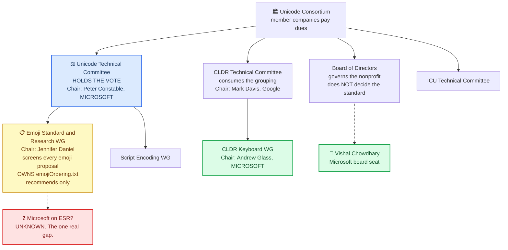
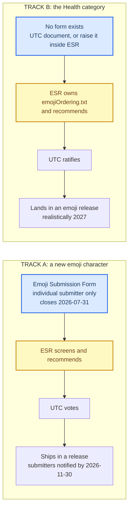
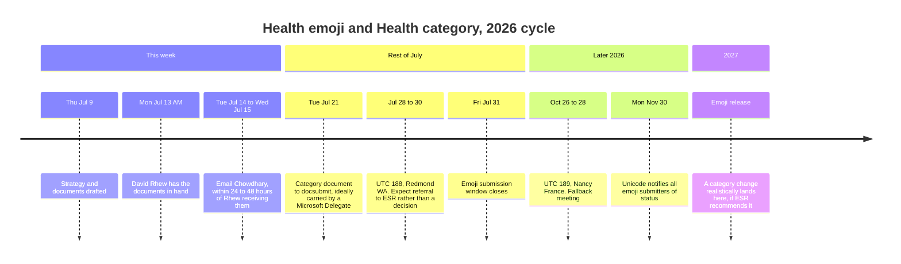

# Unicode: who decides what, and how we get in

Written 2026-07-09. Every claim was checked against a primary source on that date and is footnoted.
Anything marked **UNVERIFIED** must not be repeated to Microsoft as fact.

Three things to know before reading anything else.

1. **There are two machines with different front doors.** A new emoji is a *character*. A Health category
   is a *line in a text file*. They are decided in different places by different people.
2. **A board seat decides nothing about the standard.** The Board governs the nonprofit.
3. **Microsoft's position is far stronger than a board seat.** The **Chair of the Unicode Technical
   Committee is a Microsoft employee of 23 years**, and Microsoft is one of only about five voting members
   who regularly show up.

---

## 🗺️ The bodies, and where Microsoft actually sits



---

## 🧩 What ESR and CLDR actually are

They both touch emoji, they are constantly confused, and only one of them matters to us.

### ESR: the room where it happens

The **Emoji Standard & Research Working Group** is a working group under the UTC. It used to be the
**Emoji Subcommittee (ESC)**, and the rename is recent enough that Unicode's own leadership page uses both
names in one entry: Jennifer Daniel's title reads *"Chair, UTC Emoji Standard & Research Working Group,"*
and her biography, one line down, says *"Jennifer Daniel is the Unicode Emoji Subcommittee chair."*[^1] So
ESC in older documents and ESR in newer ones are the same body.

Every emoji proposal on earth lands here first. ESR reads them, decides which are worth advancing, and
writes a report to the UTC recommending what to approve. Those reports are public and are signed "on behalf
of the ESR," with no member roster.

Formally, ESR only recommends. The UTC votes. That understates it badly. The UTC does not relitigate
proposals one by one; it takes the recommendation. **A proposal ESR does not advance never reaches a vote.**
Section 5 below shows exactly that happening to us.

ESR also owns the grouping: the ten top-level groups, the `medical` subgroup, and the file where they live.

### CLDR: the plumbing underneath every language

The **Common Locale Data Repository** is a separate technical committee, a sibling of the UTC, chaired by
Mark Davis. It is *"responsible for the Unicode Locales Project, the Common Locale Data Repository, and
related software localization standards."*[^18] It is the database that makes software work in every
language: date formats, number formats, currency symbols, translated country names, and the sort order of
each language's alphabet.

Emoji touch CLDR in two places. **Names and keywords in every language** live there, which is why searching
your keyboard for "kidney" or *riñón* works, and it is where the `Keywords` field of an emoji proposal
eventually lands. And **sort order** lives there, which is why `emoji-test.txt` says "the file is in CLDR
order."

**The trap.** Read those two facts and you conclude CLDR owns emoji grouping. It does not. The taxonomy is
typed by hand into `emojiOrdering.txt` in `unicode-org/unicodetools`,[^7] generated into
`emoji-test.txt`,[^8] and only then copied into CLDR. **CLDR receives the grouping. It does not decide it.**
A CLDR ticket asking for a Health group would land on people who do not own the answer.

| | ESR | CLDR |
|---|---|---|
| Is | Working group under the UTC | Sibling technical committee |
| Cares about | Which emoji exist, and how they are grouped | How software behaves in every language |
| Owns | `emojiOrdering.txt`, and proposal screening | Emoji names and keywords per language, sort order |
| To us | The room where everything is decided | Downstream plumbing |
| Members public | **No.** Chair only | Chair public |

---

## 🧑‍💼 Microsoft's real footprint

| Person | Role | Microsoft? | Status |
|---|---|---|---|
| **Peter Constable** | **Chair, Unicode Technical Committee**; Chair, UTC Release Management WG | Yes. *"Since 2003, Peter has worked for Microsoft"* | **CONFIRMED**[^1] |
| **Andrew Glass** | Chair, CLDR Keyboard Working Group | Yes. *"Principal Product Manager … at Microsoft"* | **CONFIRMED**[^1] |
| **Vishal Chowdhary** | Board of Directors, 2026 to present | Yes | **CONFIRMED**[^2] |
| Cathy Wissink | **Chair, Board of Directors** | Historically. Led Microsoft's UTC participation 2000 to 2005. Now listed with **no company affiliation** | Board role CONFIRMED[^2]; not a current Microsoft delegate |
| Jennifer Daniel | **Chair, UTC Emoji Standard & Research WG** | No. Google | Chair role CONFIRMED[^1]; employer UNVERIFIED on a unicode.org page |

The UTC Chair is a Microsoft employee. Read that twice. The chair *"has the following powers and duties:
To set and manage the agenda."*[^3]

**An ethical line, and it is not optional.** Peter Constable chairs the UTC on behalf of the Consortium,
not on behalf of Microsoft. Asking him to favour a Microsoft proposal would be improper, and asking him to
would damage both the proposal and Microsoft. What is entirely proper is asking him, as a colleague, for
**procedural guidance**: which venue is correct, who at Microsoft participates in ESR, and what a
persuasive submission looks like. That is the ask.

---

## 📊 What is public, and what is not

This is what you asked. The answer is mixed, and the gap is real.

| Thing | Public? | Where |
|---|---|---|
| The list of **member companies** | **Yes** | Members page, and roll-call in UTC minutes[^4] |
| The **chairs** of the UTC and every working group | **Yes**, with biographies and employers | Technical Group Leadership page[^1] |
| The **Board of Directors** with affiliations | **Yes** | Directors page[^2] |
| Which **individual is a company's UTC delegate** | **No.** No such roster is published | Minutes record companies, and name individuals only when they speak |
| The **membership of the ESR working group** | **No.** Only the chair is disclosed | ESR reports are signed "on behalf of the ESR", with no roster |

So there is no document anywhere that says "Microsoft's UTC delegate is ___." The closest published,
defensible facts are the three Microsoft people in the table above. **Whether Microsoft has anyone inside
ESR is not discoverable from outside.** Only Chowdhary or Constable can answer it.

---

## 🗳️ The vote is smaller than it sounds, which helps us

From the UTC #186 minutes, verbatim:[^4]

> "Total full members in good standing = 9 (Adobe, Airbnb, Amazon, Apple, Google, Meta, Microsoft, Translated)"

> "Voting members in regular attendance = 4.5: Adobe, Apple, Google, Microsoft, UCB."

Nine full members exist. **About four and a half turn up.** Microsoft is one of them, every time. So
Microsoft is not one voice among dozens; it is one of roughly five that consistently vote.

That does not make approval a formality. The guidelines say the Consortium *"approves fewer and fewer emoji
proposals every year."*[^5] It does mean a Microsoft-carried proposal is heard by a small room in which
Microsoft always has a chair.

---

## 📜 What Unicode's public record says about us

Yes, there are public minutes, and we are in them. Every document below was fetched and read on
2026-07-09.

### The heart and lungs are in the permanent record, and they were carried by an organization

From the 2019 document register, verbatim rows:[^14]

| Doc | Title | Source | Date |
|---|---|---|---|
| L2/19-149 | `Proposal for Emoji: LUNG` | **`Emojination` / Christian Kamkoff, Shuhan He** | 2019-04-23 |
| L2/19-150 | `Proposal for Emoji: HEART (ORGAN)` | **`Emojination` / Christian Kamkoff, Shuhan He** | 2019-04-23 |

Read the source field again. **The only medical emoji this project ever landed were filed under an
organization's name, not an individual's.** Emojination, the advocacy group that shepherds outside
proposals through Unicode, is listed first. That is the same pattern as Apple's accessibility set. It is
already our own precedent, and we stopped using it.

### They made the agenda, and the UTC discussed them by name

The Emoji Subcommittee's own recommendation document, **L2/19-190R**, lists both, each cross-referenced to
our proposal numbers, with the keywords and the classification the subcommittee assigned:[^15]

```
U+1FAC0 HEART    L2/19-150   heartbeat | pulse | center | organ                People_and_Body body-parts
U+1FAC1 LUNGS    L2/19-149   breath | inhalation | exhalation | respiration    People_and_Body body-parts
```

Note the last column. **`People_and_Body body-parts` was assigned by the subcommittee in this document.**
The classification we now want revisited was a default set at recommendation time, not a considered
decision about medical emoji. Document C should cite this line.

Then the UTC acted, on the record:

- **UTC #159**, minutes L2/19-122: *"[159-C12] Consensus: Advance the 55 characters in point 1 of
  L2/19-190 to draft candidate status for Unicode 13.0."*[^16] Our two are among the 55.
- **UTC #160**, minutes L2/19-270: *"[160-C8] Consensus: Change the name of U+1FAC0 from HEART to
  ANATOMICAL HEART."*[^17] Four action items follow, to Ken Whistler and Mark Davis, updating
  `UnicodeData.txt`, the pipeline and the emoji charts.

That is the moment the anatomical heart got its name, written down.

### Everything else does not exist

I grepped every published document register from 2018 through 2026.

> **"kidney" appears zero times. In every register. In all nine years.**

The same for stomach, liver, spine, intestines, ECG, white blood cell, blood bag, IV bag, CT scan, pill
pack, pill box, leg cast and weight scale. Zero in the registers. Zero in the UTC agendas. Zero in the
minutes.

Unicode still publishes individual emoji proposals as L2 documents. `L2/23-031 Proposal for Emoji: Lime`,
`L2/24-249 Proposal for Emoji: Orca`, `L2/25-253 Proposal for Emoji: PICKLE`. So the absence is not a
change of policy. **The absence means our declined proposals never advanced far enough to become
documents.**

### What that means, plainly

The UTC never saw the kidney. It was never voted down, never debated, never minuted. **It died inside ESR,
in a room whose membership is not published, and no record of the decision exists anywhere public.** That
is why there is no decline date to find.

There is nothing to appeal, because nothing was decided in the open. The gate is ESR, and it always was.
Everything in the strategy below follows from that single fact.

---

## 🚪 Two machines, two front doors



### Track A: characters

Encoded forever. Requires a publicly hosted PDF filed through a Google Form,[^5] artwork at 18x18 and
72x72 in colour and black and white,[^5] and a signed irrevocable perpetual licence to Unicode.[^5] The
form's Submitter field: *"The name must be of an individual. Names of organizations or companies will not
be considered."*[^6] **Rhew signs personally.** Microsoft is the affiliation.

### Track B: the category

The taxonomy is authored by hand in `emojiOrdering.txt` in `unicode-org/unicodetools`, where `@@ Objects`
sits at line 605 and `@ medical` at line 640.[^7] That file is generated into `emoji-test.txt`,[^8] and the
ordering is then incorporated into CLDR.[^9] **CLDR consumes the grouping; it does not define it.** A CLDR
ticket alone changes nothing.

The grouping carries no conformance weight. `emoji-test.txt` says *"The groups and subgroups are
illustrative,"*[^8] and the stability policies never mention group membership.[^10] The change is cheap,
and nothing forbids it.

---

## 🔑 How anyone gets heard

> "Proposals may be submitted by any Delegate. The group may also provide mechanisms for proposals from
> other organizations or individuals, **but is not obliged to consider or respond to such proposals.**"[^3]

A document from David Rhew, private citizen, may never be read. The same document, submitted by a Microsoft
**Delegate**, is member business.

A second condition breaks the timeline. The seven-day deadline covers only *"document submissions which do
not require pre-screening or further review,"* and *"most proposal documents must be pre-screened and
reviewed by specialized groups of experts prior to their placement on the UTC agenda."*[^11] Emoji matters
go to ESR. So a document filed before UTC #188 earns a permanent public `L2/26-nnn` number and a place on
the record. **It will not be decided there.**

There is also no precedent for an outsider changing emoji grouping by document. The Emoji 12.0 regrouping,
our best evidence that groups can change, came from **inside** the Emoji Subcommittee.[^12] It proves the
categories are revisable. It does not prove we can revise them.

---

## 🎯 The levers, ranked

| Rank | Lever | Who | Why |
|---|---|---|---|
| 1 | **Find out whether Microsoft sits on ESR, and get a seat if not** | Chowdhary, or Constable | ESR screens every emoji proposal and owns the grouping file. It is the room. |
| 2 | **Have a Microsoft Delegate submit the category document** | Chowdhary names them | Turns a proposal the committee may ignore into business it handles |
| 3 | **Ask Constable for procedural guidance** | Chowdhary introduces | The UTC Chair is a Microsoft colleague. Ask about venue and process, never about outcome. |
| 4 | **Rhew signs the emoji proposals personally** | Rhew | The form rejects company names. There is no alternative. |
| 5 | **Re-engage Emojination** | Shuhan | Our only two successful emoji were filed under Emojination's name.[^14] Its founder later became vice-chair of the emoji subcommittee. We already know this works. |
| 6 | **Microsoft's UTC vote** | the Delegate | One of about five that regularly attend, cast at the very end |
| 7 | **The board seat** | Chowdhary | Opens doors. Decides nothing about the standard. |

---

## 📅 Timeline

_Timeline of the 2026 cycle. Note: timeline diagrams do not support accTitle and accDescr._



The critical path is short and it starts with two names nobody has.

---

## ✉️ The email to Chowdhary

Send it Tuesday July 14 or Wednesday July 15, within 24 to 48 hours of Rhew having the documents. Three
questions, nothing else:

1. Who is Microsoft's Delegate to the Unicode Technical Committee?
2. Does Microsoft have a representative on the Emoji Standard & Research Working Group? If not, can it have
   one?
3. Would you introduce us to Peter Constable for guidance on the correct venue? We are asking about
   process, not about the outcome of any proposal.

Everything downstream is gated on the answers, and the whole thing costs one message.

---

## ⚠️ Unverified, and unsafe to repeat

| Claim | Status |
|---|---|
| Microsoft's named UTC Delegate | **UNKNOWN.** No roster is published anywhere. |
| Whether Microsoft sits on ESR | **UNKNOWN.** Not discoverable from outside. The load-bearing gap. |
| Jennifer Daniel works for Google | **UNVERIFIED** on a unicode.org page. Her ESR chairmanship is confirmed.[^1] |
| Microsoft hosts UTC #188 | **NOT CLAIMED.** The register lists Redmond WA and names no host.[^13] Member companies do host meetings: the #186 minutes record *"Apple tentatively offers to host UTC meeting #190, with Microsoft as a backup."*[^4] That is suggestive and it is not proof. |
| Microsoft has ever proposed an emoji | **NOT FOUND.** Absence of evidence, not evidence of absence. |
| The exact Full-member roster | Nine, per the #186 roll-call,[^4] which names only eight. Do not quote a count. |

---

[^1]: Unicode Consortium, "Unicode Technical Group Leadership." Peter Constable: "Technical Vice President; Chair, Unicode Technical Committee … Since 2003, Peter has worked for Microsoft." Andrew Glass: "Chair, CLDR Keyboard Working Group … Principal Product Manager in the Experiences and Devices Group at Microsoft." Jennifer Daniel: "Chair, UTC Emoji Standard & Research Working Group." https://www.unicode.org/consortium/techchairs.html (retrieved 2026-07-09)

[^2]: Unicode Consortium, "Directors and Officers." https://unicode.org/consortium/directors.html

[^3]: Unicode Consortium, "Unicode Technical Group Procedures." https://www.unicode.org/consortium/tc-procedures.html

[^4]: UTC #186 Minutes, L2/26-003. https://www.unicode.org/L2/L2026/26003.htm

[^5]: Unicode Consortium, "Guidelines for Submitting Unicode Emoji Proposals" (Last Update 2026-05-20). https://unicode.org/emoji/proposals.html

[^6]: Unicode Emoji Submission Form, Submitter Name field. https://forms.gle/6KSiYHrUdBkTMNaB8

[^7]: `emojiOrdering.txt`, `unicode-org/unicodetools`. https://raw.githubusercontent.com/unicode-org/unicodetools/main/unicodetools/src/main/resources/org/unicode/tools/emoji/emojiOrdering.txt

[^8]: `emoji-test.txt`, Emoji 17.0. https://unicode.org/Public/emoji/latest/emoji-test.txt

[^9]: UTS #51, section 5, Ordering and Grouping. https://www.unicode.org/reports/tr51/

[^10]: Unicode Consortium, "Unicode Character Encoding Stability Policies." https://www.unicode.org/policies/stability_policy.html

[^11]: Unicode Consortium, "How to Submit Proposal Documents." https://www.unicode.org/pending/docsubmit.html

[^12]: L2/18-024, "ESC Recommendations for Emoji 12.0." https://www.unicode.org/L2/L2018/18024-emoji-recs12.pdf

[^13]: Unicode Consortium, "UTC Meetings and Minutes." https://www.unicode.org/L2/meetings/utc-meetings.html

[^14]: Unicode Document Register 2019. Rows for L2/19-149 and L2/19-150, source field "Emojination / Christian Kamkoff, Shuhan He", dated 2019-04-23. https://www.unicode.org/L2/L2019/Register-2019.html . The proposals themselves: https://www.unicode.org/L2/L2019/19149-lung-emoji.pdf and https://www.unicode.org/L2/L2019/19150-heart-emoji.pdf

[^15]: L2/19-190R, "Emoji Recommendations 2019Q2 (revised)", source ESC. https://www.unicode.org/L2/L2019/19190r-emoji-candidate-recs.pdf

[^16]: UTC #159 Minutes, L2/19-122. https://www.unicode.org/L2/L2019/19122.htm

[^17]: UTC #160 Minutes, L2/19-270. https://www.unicode.org/L2/L2019/19270.htm

[^18]: Unicode Consortium, "The Unicode Consortium": the CLDR Technical Committee is "Responsible for the Unicode Locales Project, the Common Locale Data Repository, and related software localization standards and documents." https://www.unicode.org/consortium/consort.html
