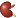
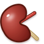
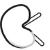
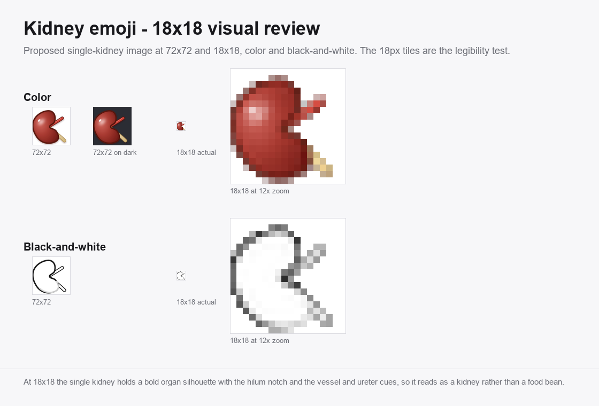
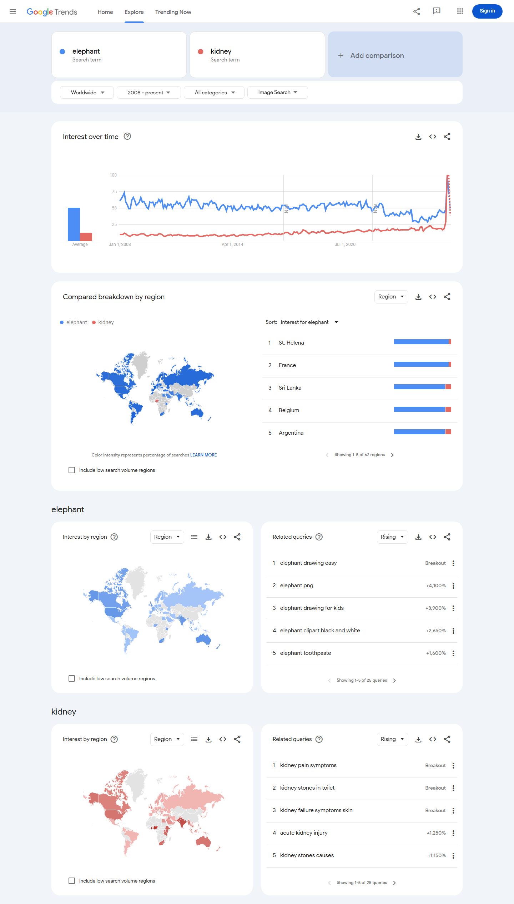

# Proposal for Emoji: Kidney

Title: Proposal for Emoji: Kidney

Submitter: Shuhan He; Edgar Lerma; Caitlyn Vlasschaert; Jade M. Teakell; Harish Seethapathy; Jarone Lee; Danielle Miller

Main point of contact: Shuhan He

Date: 2026-05-14

### Required Example Images

Color 18x18:

Color 72x72:

Black-and-white 18x18:

Black-and-white 72x72:

### Image License And Rights

The color and black-and-white kidney example images were created for the Medical Emoji project by ConductScience as original vector artwork. ConductScience owns this artwork and authorizes its use in this Unicode emoji proposal. The images are paradigm reference artwork that shows the intended single-organ design; they are not a request for one exact vendor rendering.

The submitter will confirm final authorization and agree to the Unicode Emoji Proposal Agreement and License before filing:

https://www.unicode.org/emoji/emoji-proposal-agreement.pdf

## 1. Identification

Suggested name: Kidney

Suggested keywords: renal; organ; anatomy; body; urine; filtration; hydration; bean; bean-shaped; stone; health; nephrology; dialysis; transplant; donation; chronic disease; acute injury

Suggested category: People & Body, body-parts.

Suggested sort location: after `lungs` in the body-parts subgroup.

Unicode emoji list and ordering reference:
https://www.unicode.org/emoji/charts/emoji-list.html

The proposed name is `Kidney`. The singular name is the clearest ordinary-language label and is likely to match user search behavior better than `Kidneys`. The example artwork depicts a single kidney, which matches the singular name and follows the established style of the existing single-organ emoji such as anatomical heart, lungs, and brain. The encoded name should remain broad, concise, and easy to find.

## 2. Images

The proposal includes the required color and black-and-white example images at both 18x18 and 72x72 pixels at the top of the first page. The image represents a single kidney shown as a bold internal organ: a curved bean-shaped body, a medial indentation at the hilum, and short renal vessel and ureter stubs emerging from the hilum. This single-organ presentation follows the established design pattern of the existing organ emoji, each of which is a single specimen that fills the frame and stays legible at 18x18. The image is a paradigm reference for vendors, not a request for exact vendor artwork.

### Essential Visual Cues

To remain recognizable at emoji size, vendor renderings should preserve the core kidney concept through a single curved kidney-bean body, a clear medial indentation at the hilum, and a short indication of the renal vessels and ureter at that hilum. Organ coloring (red, maroon, or brown with a soft sheen) and the vessel and ureter cues are what separate the kidney from a food bean at small sizes. The image should not read primarily as a food bean, a generic red blob, a logo, or a text-bearing medical icon.

Vendor variation is expected. Vendors may simplify the vessels, adjust color, or vary the degree of anatomical realism, as long as the result remains recognizably a kidney organ at small sizes.

| Visual cue | Importance | Reason |
| --- | --- | --- |
| Single curved kidney-bean body | Required | Carries the core anatomical silhouette and matches the single-organ emoji style. |
| Medial indentation at the hilum | Required | The concave notch reads as an organ, not a smooth food bean. |
| Renal vessel and ureter stubs at the hilum | Strongly preferred | Signals urinary-system anatomy and separates the image from a food bean. |
| Red, maroon, or organ-like color with a soft sheen | Strongly preferred | Organ coloring distinguishes it from the tan or brown beans emoji. |
| Fine vascular detail | Optional | Can be simplified or removed at 18x18. |

## 3. Factors For Inclusion

### A. Multiple Concepts

The kidney emoji represents a broad, durable, and widely understood concept rather than a single diagnosis, procedure, campaign, or profession. People use the word `kidney` in ordinary life for the body part, kidney beans, kidney-shaped objects, anatomy lessons, hydration, filtration, body functions, wellness, diet, cooking, donation, transplant, stones, urine, and health.

The everyday case comes first. A kidney emoji would support ordinary communication about the human body, school science, food and recipes, body-function jokes, hydration reminders, fitness and wellness conversations, family health updates, donor and transplant conversations, patient education, and public-health messages. It would not be limited to clinicians, nephrology groups, or awareness campaigns.

The kidney bean is a useful example of the word's everyday reach. The proposal is not arguing that an anatomical kidney emoji should replace the existing bean emoji for food. Instead, the kidney bean shows that the kidney shape and name are already familiar outside clinical settings. People recognize the term in grocery, cooking, recipe, and nutrition contexts, as well as in phrases such as kidney-shaped pool, kidney-shaped table, kidney stone, kidney donor, kidney function, and kidney health.

The concept also works metaphorically. Kidneys are commonly understood as filters and regulators: they clean, balance, process, and remove waste. Those functions make the emoji useful for non-specialist expressions about filtering, cleansing, hydration, balance, body maintenance, and checking whether something is functioning properly. These are plain-language associations, not narrow medical jargon.

Current public-health sources support the durability of the concept without replacing the everyday usage case. WHO describes kidney disease as including acute kidney injury and chronic kidney disease, estimates that 674 million people have chronic kidney disease worldwide, and notes that kidney failure requires dialysis or kidney transplantation to sustain life:

https://www.who.int/news-room/fact-sheets/detail/kidney-disease

The 2025 Lancet Global Burden of Disease analysis estimated that, in 2023, 788 million adults aged 20 years and older had chronic kidney disease and that chronic kidney disease was the ninth leading cause of death globally:

https://doi.org/10.1016/S0140-6736(25)01853-7

CDC's 2026 United States summary estimates that more than 1 in 10 adults aged 18 or older, approximately 37 million people, have chronic kidney disease:

https://www.cdc.gov/kidney-disease/php/data-research/index.html

These health sources are not substitutes for Unicode's required frequency evidence. They explain one important part of the concept's durability, but the proposal's multiple-concepts case is broader: body part, everyday word, food association, recognizable shape, education, wellness, filtration, donation, and health communication.

### B. Use In Sequences

The kidney emoji would work as a building block with existing emoji to convey additional concepts without requiring new standardized sequences.

| Message context | Possible emoji composition |
| --- | --- |
| Hydration reminder, urine production, or filtration | Kidney plus droplet. |
| Kidney beans, chili, meal planning, or nutrition | Kidney plus bowl, cooking pot, or bean. |
| Anatomy class or school science | Kidney plus book, school, or microscope. |
| Donor, recipient, patient, clinician, caregiver, or family update | Kidney plus person, family, or hospital. |
| Medication safety or kidney-function monitoring | Kidney plus pill. |
| Kidney stone warning, urgent symptoms, or abnormal lab concern | Kidney plus warning sign. |
| Transplant preparation or post-transplant care | Kidney plus hospital, person, or syringe. |

These are ordinary emoji-composition examples. This proposal does not request a standardized ZWJ sequence.

### C. Breaks New Ground

Kidney would add a distinct internal-organ concept that is not currently represented by existing emoji. Existing emoji can imply health care in general, such as hospital, pill, syringe, drop, anatomical heart, lungs, and brain, but none directly represents kidney anatomy, kidney function, kidney disease, dialysis, kidney transplant, living donation, kidney stones, acute kidney injury, or kidney-specific medication safety.

The proposal does not depend on the argument that heart, lungs, or brain already exist. Those emoji are useful context, but the kidney case stands on independent grounds: the kidney is a globally important organ concept with public-health salience, broad everyday and clinical uses, and several communication contexts that existing emoji cannot express clearly.

Current substitutes fail in predictable ways:

| Existing emoji or sequence | Why it is insufficient |
| --- | --- |
| Bean | Primarily food; wrong tone for anatomy, donor, transplant, patient, and clinical communication. |
| Droplet | Can mean water, sweat, tears, blood, or urine; does not identify kidney anatomy or kidney function. |
| Hospital | Identifies a place or institution, not an organ, body function, symptom, or donor/transplant concept. |
| Pill | Identifies medication or treatment, not kidney anatomy, kidney function, kidney stones, or kidney donation. |
| Syringe | Suggests injection, vaccination, blood draw, or procedure; does not identify kidney. |
| Anatomical heart, lungs, or brain | Different organs with different meanings; cannot substitute for kidney-specific communication. |
| Warning sign plus medical emoji | Indicates risk or urgency, but still does not tell the reader that the topic is kidney-related. |

The global and universal case is functional and contextual. Across countries and health systems, kidneys are associated with filtering blood, producing urine, kidney-function testing, dialysis, transplantation, donation, kidney stones, diabetes, hypertension, medication safety, and chronic disease. Those concepts recur in patient education, public-health campaigns, clinical care, organ donation systems, and everyday health conversations even when the exact local illustration style varies.

### D. Distinctiveness

The kidney has a recognizable anatomical form in medical education: a curved bean-shaped body, a medial indentation at the hilum, and renal vessels and a ureter emerging from that hilum. The proposed image presents a single kidney organ in this form. This follows the established design of the existing organ emoji, each of which is a single specimen with a bold silhouette and a dark keyline that stays legible at 18x18.

The most likely point of confusion is the existing beans emoji. The kidney is kept distinct by organ characteristics that the food bean does not have: organ coloring with a soft sheen rather than a matte food surface, the pronounced hilum indentation, and the renal vessel and ureter stubs. The table below states this directly.

The proposal includes an 18x18 visual review board showing the proposed single-kidney image at 72x72 and at 18x18, in color and black-and-white, to demonstrate that the organ remains recognizable at emoji size.

| Cue | Kidney | Beans emoji |
| --- | --- | --- |
| Color and finish | Maroon or organ-red with a soft sheen | Tan or brown, matte food surface |
| Plumbing | Renal vessel and ureter stubs at the hilum | None |
| Hilum indentation | Pronounced medial notch | Smooth bean outline |
| Count and framing | One organ filling the frame | Several beans in or near a pod |

| Distinctiveness question | Proposal answer |
| --- | --- |
| Could it be confused with the beans emoji? | Organ color and sheen, the hilum notch, and the vessel and ureter stubs distinguish the kidney from a food bean. |
| Could it be confused with anatomical heart, lungs, or brain? | The single curved bean shape with a hilum and downward ureter is different from those organ silhouettes. |
| Does it require exact vendor art? | No. Vendors may simplify the vessels and color treatment if the single kidney body and hilum remain clear. |
| Does it work at 18x18? | The included visual review board shows the proposed image at emoji size in color and black-and-white. |

### E. Expected Usage Level

Expected usage is supported by public search-result, video-result, search-interest, image-search-interest, and corpus evidence. The Trends and Ngram figures compare `kidney` with `elephant`.

| Evidence source | Query | Captured result | Reproducible URL |
| --- | --- | --- | --- |
| Google Search | `kidney` | About 211,000,000 results | https://www.google.com/search?q=kidney&hl=en&num=10&pws=0 |
| Google Video Search | `kidney` | About 66,000,000 results | https://www.google.com/search?tbm=vid&q=kidney&hl=en&num=10&pws=0 |
| Google Trends Web Search | `elephant,kidney` | Screenshot included below | https://trends.google.com/trends/explore?date=all&q=elephant,kidney |
| Google Trends Image Search | `elephant,kidney` | Screenshot included below | https://trends.google.com/trends/explore?date=all_2008&gprop=images&q=elephant,kidney |
| Google Books Ngram Viewer | `elephant,kidney` | Screenshot included below | https://books.google.com/ngrams/graph?content=elephant%2Ckidney&year_start=1500&year_end=2019&corpus=en-2019&smoothing=3 |

Figure 1. Google Search results for `kidney`:

Figure 2. Google Video Search results for `kidney`:

Figure 3. Google Trends Web Search, `elephant` versus `kidney`:

Figure 4. Google Trends Image Search, `elephant` versus `kidney`:

Figure 5. Google Books Ngram Viewer, `elephant` versus `kidney`:

### F. Completeness

Kidney would help fill a practical gap in the limited set of emoji available for major human anatomy and health communication, but the proposal is not asking Unicode to encode every organ. Kidney has independent grounds for consideration because it is associated with a broad set of durable, common concepts: kidney health, kidney disease, kidney failure, dialysis, transplant, donation, kidney stones, urine production, filtration, acute kidney injury, medication safety, diabetes, hypertension, and global public health.

### G. Compatibility

No compatibility claim is currently made. The proposal does not rely on an existing kidney pictograph in a legacy carrier set or another major communication system. If a documented high-usage kidney pictograph is found before submission, this section can be updated with the source and evidence. Otherwise, compatibility should be treated as not applicable.

## 4. Factors For Exclusion

### A. Already Represented

Kidney is not already represented by existing emoji. General medical emoji such as hospital, pill, syringe, and drop can support some kidney-related messages, but they do not identify the kidney. Anatomical heart, lungs, and brain represent different organs and cannot substitute for kidney-specific contexts. The bean emoji is also not an adequate substitute because it represents food and can cause ambiguity in clinical, transplant, donor, public-health, anatomy, and body-function communication.

### B. Overly Specific

Kidney is not overly specific. It is a primary human organ and a broad public-health concept. The proposal is not for a particular disease subtype, treatment brand, advocacy organization, medical specialty logo, campaign ribbon, or procedure. A kidney emoji would cover many contexts across anatomy, physiology, disease, treatment, symptoms, transplant, donation, and everyday health conversations.

### C. Open-Ended

The proposal does not ask Unicode to create a complete anatomy taxonomy. Kidney is proposed because it meets a bounded set of independent criteria rather than because it is one item in an open-ended organ list.

| Criterion | Kidney evidence |
| --- | --- |
| High public frequency | Google Search, Google Video Search, Google Trends Web Search, Google Trends Image Search, and Google Books Ngram Viewer evidence are included in this proposal. |
| Broad ordinary-language use | Kidney is used for the body part, kidney beans, kidney-shaped objects, hydration, filtration, stones, donation, transplant, and school science. |
| Global and durable concept | Kidney function, kidney disease, dialysis, transplantation, diabetes, hypertension, donation, and medication safety recur across countries and health systems. |
| Not clearly substitutable | Bean, droplet, hospital, pill, syringe, heart, lungs, and brain all fail in different contexts. |
| Visually testable | Paired kidney shape, medial indentation, vessels, and ureters can be tested at 18x18. |

If future organ proposals are submitted, they should be judged on their own usage evidence, distinctiveness, and expressive value. This proposal does not argue that every organ should become an emoji.

### D. Transient

Kidney is not transient. Kidney health, kidney disease, kidney stones, kidney failure, dialysis, transplantation, living donation, diabetes, hypertension, medication safety, and acute kidney injury are enduring topics. The proposed emoji is not tied to a temporary event, a single campaign year, or a trend.

### E. Justified By An Existing Emoji

This proposal is not justified solely by comparison with existing emoji. The existence of anatomical heart, lungs, or brain can show that anatomical concepts can be represented as emoji, but it does not itself justify kidney. The kidney proposal is based on the organ's own broad meanings, expected usage, visual distinctiveness, public-health relevance, and inability to be represented clearly by existing emoji.

## 5. Other Information

### A. Public-Health And Clinical Context

Kidney-related communication often requires plain, patient-facing language. A simple kidney emoji could make kidney health, transplant, donation, dialysis, testing, hydration, urine, medication safety, and chronic disease messages easier to scan and recognize in ordinary digital communication. This is especially relevant because kidney disease may be asymptomatic until late stages and because kidney failure requires dialysis or transplantation to sustain life.

The proposal does not claim that an emoji will directly improve clinical outcomes. The more defensible claim is that the kidney is a high-utility concept in health communication, patient advocacy, public education, and everyday discussion.

### B. Coalition And Support Materials

The Medical Emoji project has recovered public support materials from nephrology, patient-advocacy, and kidney-health organizations. These letters demonstrate expert and patient-advocacy support, but the expected-usage case in Section 3.E is based on public frequency evidence rather than support letters, petitions, hashtags, or social-media requests.

Supplemental support-letter links:

American Association of Kidney Patients:
https://medicalemoji.org/documents/AAKP-Kidney-Emoji-Letter-1.7.22.pdf

American Society of Nephrology:
https://medicalemoji.org/documents/kidney-support-letters/ASN_Long-2.pdf

American Society of Diagnostic and Interventional Nephrology:
https://medicalemoji.org/documents/kidney-support-letters/ASDIN.pdf

Canadian Society of Nephrology:
https://medicalemoji.org/documents/Kidney_Emoji_Letter-1.pdf

Glomerular Disease Study and Trial Consortium / GlomCon:
https://medicalemoji.org/documents/kidney-support-letters/Glomcon.pdf

International Society of Nephrology:
https://medicalemoji.org/documents/kidney-support-letters/ISN.pdf

Kidney Disease: Improving Global Outcomes:
https://medicalemoji.org/documents/The-Unicode-Consortium_Signed.pdf

National Kidney Foundation:
https://medicalemoji.org/documents/kidney-support-letters/NKF-1.pdf

NephJC:
https://medicalemoji.org/documents/NephJC_KidneyEmoji.pdf

Renal Physicians Association:
https://medicalemoji.org/documents/kidney-support-letters/RPA.pdf

Kidney Foundation of Western New York:
https://medicalemoji.org/documents/Kidney-Foundation-of-WNY-kidney-emoji-letter.pdf

Women Nephrology India:
https://medicalemoji.org/documents/Kidney-Emoji-WIN-Letter-Head-V4B-converted.docx
