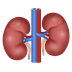

# Proposal for Emoji: Kidney

Packet version: `v0.7.0`

Status: `PLANNED_FOR_SUBMISSION` proposal source. This is the clean proposal document intended to become the public Unicode PDF after final evidence recapture, submitter approval, and PDF hosting.

## Top Of First Page

Title: Proposal for Emoji: Kidney

Submitter: Shuhan He; Edgar Lerma; Caitlyn Vlasschaert; Jade M. Teakell; Harish Seethapathy; Jarone Lee; Danielle Miller

Main point of contact: Shuhan He

Date: 2026-05-13

### Required Example Images

Color 18x18:

Color 72x72:

Black-and-white 18x18:

Black-and-white 72x72:

### Image License And Rights

The kidney artwork was created for the Medical Emoji project by Alla Shamanska for ConductScience. ConductScience owns the artwork and authorizes its use in this Unicode emoji proposal. The submitter will agree to the Unicode Emoji Proposal Agreement and License before filing:

https://www.unicode.org/emoji/emoji-proposal-agreement.pdf

## 1. Identification

Suggested name: Kidney

Suggested keywords: renal; nephrology; dialysis; transplant; donation; organ; urine; filtration; kidney stone; kidney disease; chronic kidney disease; acute kidney injury

Suggested category: People & Body, body-parts.

The proposed name is `Kidney`. The singular name is the clearest ordinary-language label and is likely to match user search behavior better than `Kidneys`. Vendor artwork could depict a pair of kidneys if that proves more recognizable at emoji size, but the encoded name should remain broad, concise, and easy to find.

## 2. Images

The proposal includes the required color and black-and-white example images at both 18x18 and 72x72 pixels at the top of the first page. The image represents paired kidneys with vessels and ureters so that the design reads as an anatomical organ rather than a bean. The image is a reference image for vendors, not a request for exact vendor artwork.

Artwork source:
https://medicalemoji.org/images/emoji/kidneysnew2.png

Repository source asset:
https://github.com/ShuhanCS/medicalemoji/blob/master/public/images/emoji/kidneysnew2.png

## 3. Factors For Inclusion

### A. Multiple Concepts

The kidney emoji represents a broad, durable, and widely understood concept rather than a single diagnosis, procedure, campaign, or profession. It can be used for human anatomy, kidney function, kidney health, urine production, filtration, hydration, electrolyte balance, chronic kidney disease, kidney failure, dialysis, kidney replacement therapy, kidney transplantation, organ donation, living donation, kidney stones, acute kidney injury, medication safety, nephrology care, and public-health communication about diabetes and hypertension complications.

Kidney is also an ordinary word outside specialist nephrology. People encounter it in common phrases such as kidney stone, kidney donor, kidney transplant, kidney failure, kidney infection, kidney function, kidney disease, kidney health, and dialysis. This breadth matters because the proposed emoji would not be used only by clinicians or only in awareness campaigns. It would support patient-to-family communication, public-health messaging, education, donation and transplant discussions, and everyday conversations about symptoms or diagnoses.

Current public-health sources support the breadth and durability of this concept. WHO describes kidney disease as including acute kidney injury and chronic kidney disease, estimates that 674 million people have chronic kidney disease worldwide, and notes that kidney failure requires dialysis or kidney transplantation to sustain life:

https://www.who.int/news-room/fact-sheets/detail/kidney-disease

The 2025 Lancet Global Burden of Disease analysis estimated that, in 2023, 788 million adults aged 20 years and older had chronic kidney disease, adult age-standardized prevalence was 14.2%, and chronic kidney disease was the ninth leading cause of death globally:

https://doi.org/10.1016/S0140-6736(25)01853-7

CDC's 2026 United States summary estimates that more than 1 in 10 adults aged 18 or older, approximately 37 million people, have chronic kidney disease, and that about 9 in 10 adults aged 20 or older with chronic kidney disease do not know they have it:

https://www.cdc.gov/kidney-disease/php/data-research/index.html

These health sources are not substitutes for Unicode's required frequency evidence. They explain why the term is broad, durable, and important across multiple communication contexts.

### B. Use In Sequences

The kidney emoji would work as a building block with existing emoji to convey additional concepts without requiring new standardized sequences.

Kidney plus water drop could represent urine production, filtration, hydration, dehydration, or kidney function. Kidney plus hospital could represent a nephrology appointment, hospitalization for kidney disease, or kidney care. Kidney plus pill could represent medication safety, kidney-protective treatment, or medications that require kidney-function monitoring. Kidney plus syringe could represent laboratory testing, biopsy, treatment, transplant preparation, or post-transplant care. Kidney plus warning sign could represent acute kidney injury, abnormal kidney-function tests, nephrotoxic medication risk, or urgent symptoms. Kidney plus person could represent a donor, recipient, patient, clinician, or caregiver.

These are ordinary emoji-composition examples. This proposal does not request a standardized ZWJ sequence.

### C. Breaks New Ground

Kidney would add a distinct internal-organ concept that is not currently represented by existing emoji. Existing emoji can imply health care in general, such as hospital, pill, syringe, drop, anatomical heart, lungs, and brain, but none directly represents kidney anatomy, kidney function, kidney disease, dialysis, kidney transplant, living donation, kidney stones, acute kidney injury, or kidney-specific medication safety.

The proposal does not depend on the argument that heart, lungs, or brain already exist. Those emoji are useful context, but the kidney case stands on independent grounds: the kidney is a globally important organ concept with high public-health salience, broad clinical and everyday uses, and several communication contexts that existing emoji cannot express clearly. A bean emoji is not a practical substitute. In medical, patient-facing, transplant, donation, and public-health contexts, a bean can be confusing, unserious, or simply wrong.

The global and universal case is functional and contextual. Across countries and health systems, kidneys are associated with filtering blood, producing urine, kidney-function testing, dialysis, transplantation, donation, kidney stones, diabetes, hypertension, medication safety, and chronic disease. Those concepts recur in patient education, public-health campaigns, clinical care, organ donation systems, and everyday health conversations even when the exact local illustration style varies.

### D. Distinctiveness

The kidney has a recognizable anatomical form in medical education: a curved organ shape, a medial indentation, vessels, ureters, and a common paired-organ presentation. The proposal acknowledges that kidney is less universally iconic than symbols such as a heart. That is why the proposed image uses a paired anatomical presentation with vessels and ureters rather than relying on a single bean-like silhouette.

The packet includes an 18x18 visual review board comparing the kidney rendering against the bean emoji and current anatomical emoji:

https://github.com/ShuhanCS/medicalemoji/blob/master/submissions/v0.7.0/evidence/visual-review/v0.7.0_18x18_visual_review_board_REFERENCE_ONLY.png

The current paired-kidney image is the preferred direction because it makes the concept more universal: users do not need specialist anatomical knowledge to infer that the image represents a pair of internal organs connected to the urinary system.

### E. Expected Usage Level

Unicode requires publicly reproducible frequency evidence from Google Search, Google Video Search, Google Trends Web Search, Google Trends Image Search, and Google Books Ngram Viewer. Trends and Ngram evidence must include `elephant` as a comparative search term.

Required evidence status for this submission-candidate packet:

| Evidence | URL | Current packet status |
| --- | --- | --- |
| Google Search | https://www.google.com/search?q=kidney | Required final recapture: automated capture returned CAPTCHA. |
| Google Video Search | https://www.google.com/search?tbm=vid&q=kidney | Required final recapture: automated capture returned CAPTCHA. |
| Google Trends Web Search | https://trends.google.com/trends/explore?date=all&q=elephant,kidney | Required final recapture: current screenshot is partial because the interest-over-time panel errored. |
| Google Trends Image Search | https://trends.google.com/trends/explore?date=all_2008&gprop=images&q=elephant,kidney | Captured as usable draft evidence. |
| Google Books Ngram Viewer | https://books.google.com/ngrams/graph?content=elephant%2Ckidney&year_start=1500&year_end=2019&corpus=en-2019&smoothing=3 | Captured as usable draft evidence. |

Captured draft frequency evidence is archived here:

https://github.com/ShuhanCS/medicalemoji/tree/master/submissions/v0.7.0/evidence/frequency

The final public PDF should insert fresh accepted screenshots for all five required evidence categories before filing. Support letters, petitions, hashtags, and social-media requests are not used as frequency evidence.

### F. Completeness

Kidney would help fill a practical gap in the limited set of emoji available for major human anatomy and health communication, but the proposal is not asking Unicode to encode every organ. Kidney has independent grounds for consideration because it is associated with a broad set of durable, common concepts: kidney health, kidney disease, kidney failure, dialysis, transplant, donation, kidney stones, urine production, filtration, acute kidney injury, medication safety, diabetes, hypertension, and global public health.

### G. Compatibility

No compatibility claim is currently made. The proposal does not rely on an existing kidney pictograph in a legacy carrier set or another major communication system. If a documented high-usage kidney pictograph is found before submission, this section can be updated with the source and evidence. Otherwise, compatibility should be treated as not applicable.

## 4. Factors For Exclusion

### A. Already Represented

Kidney is not already represented by existing emoji. General medical emoji such as hospital, pill, syringe, and drop can support some kidney-related messages, but they do not identify the kidney. Anatomical heart, lungs, and brain represent different organs and cannot substitute for kidney-specific contexts. The bean emoji is also not an adequate substitute because it represents food and can cause ambiguity in clinical, transplant, donor, and public-health communication.

### B. Overly Specific

Kidney is not overly specific. It is a primary human organ and a broad public-health concept. The proposal is not for a particular disease subtype, treatment brand, advocacy organization, medical specialty logo, campaign ribbon, or procedure. A kidney emoji would cover many contexts across anatomy, physiology, disease, treatment, symptoms, transplant, donation, and everyday health conversations.

### C. Open-Ended

The proposal does not ask Unicode to create a complete anatomy taxonomy. Kidney is proposed because it has independent expected usage and a distinct communication role. Its relevance spans high-burden chronic disease, acute injury, transplant and donation, dialysis, stones, medication safety, urine production, hydration, filtration, and public-health education. Those uses are broader than a narrow specialty symbol and more specific than a generic medical icon.

The proposal should not be understood as an argument that all organs should become emoji. If future organ proposals are submitted, they should be judged on their own usage evidence, distinctiveness, and expressive value.

### D. Transient

Kidney is not transient. Kidney health, kidney disease, kidney stones, kidney failure, dialysis, transplantation, living donation, diabetes, hypertension, medication safety, and acute kidney injury are enduring topics. The proposed emoji is not tied to a temporary event, a single campaign year, or a trend.

### E. Justified By An Existing Emoji

This proposal is not justified solely by comparison with existing emoji. The existence of anatomical heart, lungs, or brain can show that anatomical concepts can be represented as emoji, but it does not itself justify kidney. The kidney proposal is based on the organ's own broad meanings, expected usage, visual distinctiveness, public-health relevance, and inability to be represented clearly by existing emoji.

## 5. Other Information

### A. Public-Health And Clinical Context

Kidney-related communication often requires plain, patient-facing language. A simple kidney emoji could make kidney health, transplant, donation, dialysis, testing, hydration, urine, medication safety, and chronic disease messages easier to scan and recognize in ordinary digital communication. This is especially relevant because kidney disease may be asymptomatic until late stages and because kidney failure requires dialysis or transplantation to sustain life.

The proposal does not claim that an emoji will directly improve clinical outcomes. The more defensible claim is that the kidney is a high-utility concept in health communication, patient advocacy, public education, and everyday discussion.

### B. Coalition And Support Materials

The Medical Emoji project has recovered public support materials from nephrology, patient-advocacy, and kidney-health organizations. These letters are coalition context and may be included as optional appendix links after permission is confirmed. They are not presented as primary frequency evidence.

Support-letter map:
https://github.com/ShuhanCS/medicalemoji/blob/master/docs/proposals/support-letter-link-map.md

### C. Coordination And Eligibility

Unicode's public status list shows `Kidney` declined with date submitted 2019-12-17 and `KIDNEYS` declined with date submitted 2022-07-19. The public sheet does not expose the actual decline decision date or notification date. The team should assume the concept is likely eligible in the 2026 cycle with one caveat: before filing, confirm with Unicode or ESR whether the four-year re-review rule is counted from the public submitted date, the internal decision date, the notification date, or another date.

Unicode proposal status page:
https://www.unicode.org/emoji/emoji-proposals-status.html

The team should also confirm whether the Turkish Kidney Foundation has already filed a kidney proposal. If TKF has submitted, the preferred path is to coordinate a single joint proposal or ask Unicode whether the prior filing can be withdrawn, replaced, updated, or treated as part of a combined submission. Parallel kidney proposals should be avoided unless Unicode specifically recommends that approach.

### D. Submission Mechanics

The final proposal must be exported as a publicly accessible PDF and submitted through the official Unicode Emoji Submission Form. Email, fax, and hard-copy submissions are not accepted.

Unicode emoji proposal guidelines:
https://www.unicode.org/emoji/proposals.html

Unicode Emoji Submission Form:
https://forms.gle/6KSiYHrUdBkTMNaB8

Resolved Google Form URL:
https://docs.google.com/forms/d/e/1FAIpQLSesdtPEbXCxXQnOb34UwhK7yPuCk52Pqix4FfQYgmW9Kt5cAw/viewform?usp=send_form

Current planned packet:
https://github.com/ShuhanCS/medicalemoji/tree/master/submissions/v0.7.0

Final public proposal PDF URL: `TBD`
