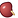
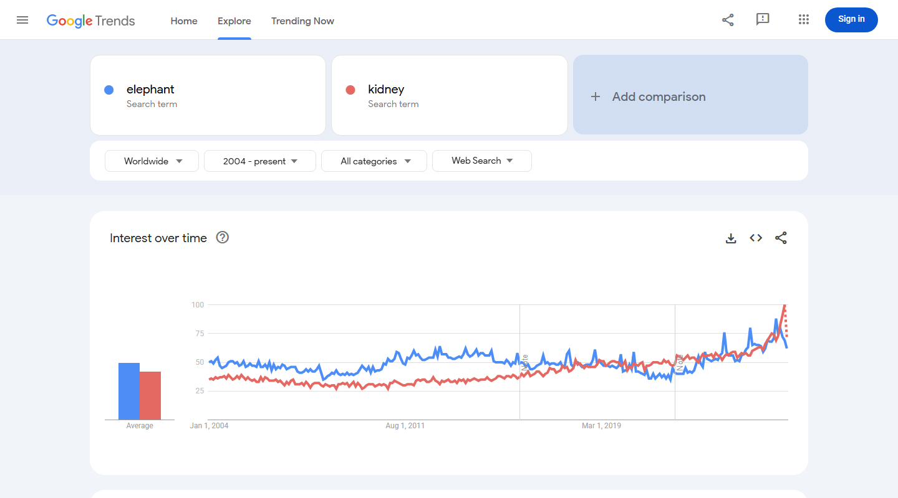

# Proposal for Emoji: Kidney

**Submitter:** Shuhan He; Edgar Lerma; Caitlyn Vlasschaert; Jade M. Teakell; Harish Seethapathy; Jarone Lee; Danielle Miller; Timur Erk; David Rhew; Heena Purohit 
**Main point of contact:** Shuhan He 
**Date:** 2026-07-26

## Identification

**Suggested name:** Kidney 
**Suggested keywords:** renal; anatomy; organ; filtration; urine; hydration; dialysis; transplant; donation; stone; bean-shaped 
**Suggested category:** People & Body - body-parts 
**Suggested sort location:** Near anatomical heart, lungs, and brain in the body-parts subgroup.

## Required Example Images

| Size | Color | Black and white |
| --- | --- | --- |
| 18x18 |  |  |
| 72x72 |  |  |

The paradigm shows one large kidney with a pronounced hilum, a short renal-vessel cue, and a tan ureter. The single bold specimen remains legible at small sizes, while the hilum and plumbing cues distinguish the organ from a food bean. Vendors may simplify shading but should preserve the medial notch and at least one short attached structure.

I, Shuhan He, certify that these example images are original work created for this proposal, that I own all IP Rights in them, and that they contain no third-party artwork, logo, trademark, or text. I release the images under the CC0 1.0 Universal Public Domain Dedication and grant the rights required by the Unicode Emoji Proposal Agreement and License.

CC0 1.0: https://creativecommons.org/publicdomain/zero/1.0/

## Factors for Inclusion

### A. Multiple meanings

Kidney has established meanings beyond a literal anatomical reference. Merriam-Webster defines a kidney bean as an edible, usually kidney-shaped seed and defines kidney-shaped as shaped like a kidney. These are established food and shape meanings rather than a pun or temporary campaign.

Sources: [Merriam-Webster: kidney bean](https://www.merriam-webster.com/dictionary/kidney%20bean) and [Merriam-Webster: kidney-shaped](https://www.merriam-webster.com/dictionary/kidney-shaped).

### B. Use in sequences

Kidney can combine with existing emoji to create messages without standardized sequences:

- Kidney + droplet: filtration, fluid balance, or urine production.
- Kidney + hospital or pill: kidney care, dialysis, transplant follow-up, or medication review.
- Kidney + people or heart: living donation, transplant, recipient, or support.
- Kidney + test tube or microscope: blood and urine tests, imaging, or biopsy.

NIDDK documents filtration, fluid balance, urine production, dialysis, transplantation, and medication review in kidney care: [Your Kidneys & How They Work](https://www.niddk.nih.gov/health-information/kidney-disease/kidneys-how-they-work) and [Choosing a Treatment for Kidney Failure](https://www.niddk.nih.gov/health-information/kidney-disease/kidney-failure/choosing-treatment). MedlinePlus lists blood, urine, imaging, and biopsy tests for kidneys: [Kidney Tests](https://medlineplus.gov/kidneytests.html).

### C. Breaks new ground

**Yes.** The [current Unicode Emoji List](https://www.unicode.org/emoji/charts/full-emoji-list.html) has no kidney or urinary-system organ. Beans primarily represent food; a droplet cannot identify the organ that filters blood and produces urine; and hospital, pill, and syringe represent care or interventions rather than the kidney itself. Kidney would therefore add a distinct internal-organ concept and enable messages that cannot be expressed clearly with existing emoji.

### D. Distinctiveness

The large maroon organ body, medial hilum, and attached vessel or ureter make the proposed paradigm visually distinct from the existing beans emoji. Beans are presented as food and have no anatomical plumbing; the proposed image is one organ with a pronounced notch and a short tan ureter. The 18x18 versions preserve the dominant silhouette and attachment cue in color and black-and-white.

Deterministic computer validation checked exact dimensions, true black-and-white palette, foreground connectedness, and normalized silhouette distance from Beans, Droplet, Anatomical Heart, Lungs, Balloon, and Light Bulb using pinned Noto Emoji assets. Both 18x18 assets passed: the maximum silhouette intersection-over-union was 0.684 against a 0.72 ceiling, and the minimum 64-bit difference-hash distance was 24 against a 16 floor. This measures machine-visible separation rather than human semantic recognition. [Reproducible validation report](https://github.com/ShuhanCS/medicalemoji/blob/codex/finalize-organ-submissions/submissions/v1.10.0/kidney/validation/computer-validation.md).

### E. Expected usage level

The term kidney spans anatomy and physiology, urine production and fluid balance, kidney tests, dialysis, transplantation, living donation, and medication review. These uses are documented by [NIDDK's kidney-function overview](https://www.niddk.nih.gov/health-information/kidney-disease/kidneys-how-they-work), [NIDDK's kidney-failure treatment guide](https://www.niddk.nih.gov/health-information/kidney-disease/kidney-failure/choosing-treatment), [NIDDK's transplant guide](https://www.niddk.nih.gov/health-information/kidney-disease/kidney-failure/kidney-transplant), and [MedlinePlus Kidney Tests](https://medlineplus.gov/kidneytests.html). The five frequency screenshots required by Unicode are embedded below; Google Trends and Google Books compare kidney with Unicode's reference term elephant.

#### Google Search

Captured 2026-05-13. The result page reports about 211,000,000 results. Reproducible query: https://www.google.com/search?q=kidney&hl=en&num=10&pws=0

#### Google Video Search

Captured 2026-05-13. The result page reports about 66,000,000 results. Reproducible query: https://www.google.com/search?tbm=vid&q=kidney&hl=en&num=10&pws=0

#### Google Trends - Web Search

Captured 2026-05-13 using Worldwide and 2004-present. Kidney is of the same order as elephant and reaches comparable or greater recent interest. Reproducible query: https://trends.google.com/trends/explore?date=all&q=elephant,kidney

#### Google Trends - Image Search

Captured 2026-05-13 using Worldwide and 2008-present. The graph shows sustained kidney image-search interest against elephant. Reproducible query: https://trends.google.com/trends/explore?date=all_2008&gprop=images&q=elephant,kidney

#### Google Books Ngram Viewer

Captured 2026-07-09 using the English corpus, 1500-2022, and smoothing 3. Kidney exceeds elephant in recent published-book usage. Reproducible query: https://books.google.com/ngrams/graph?content=elephant%2Ckidney&year_start=1500&year_end=2022&corpus=en&smoothing=3

### F. Completeness

Not applicable. Kidney is independently useful and is not proposed merely to complete a set of organs.

### G. Compatibility

Not applicable. This proposal does not rely on a legacy carrier emoji or another encoded pictograph.

## Factors for Exclusion

### A. Already representable

Kidney is not represented by an existing emoji. Beans cannot identify the organ described in NIDDK's [kidney-function overview](https://www.niddk.nih.gov/health-information/kidney-disease/kidneys-how-they-work), and general medical emoji identify care rather than the organ involved in dialysis, transplantation, medication review, or the tests documented by [MedlinePlus](https://medlineplus.gov/kidneytests.html).

### B. Overly specific

Kidney is a primary organ and a broad concept, not a particular disease, procedure, specialty, organization, campaign, or brand. Authoritative public sources use the concept across anatomy, filtration, urine production, testing, dialysis, donation, transplantation, and related care.

### C. Open-ended

This proposal does not request a complete anatomy taxonomy. Kidney is supported by its own frequency, multiple meanings, visual distinctiveness, and lack of an adequate substitute. Other organs can be judged independently on the same criteria.

### D. Transient

Kidney anatomy and care are durable rather than transient: the embedded Ngram covers 1500-2022; [Merriam-Webster's kidney bean entry](https://www.merriam-webster.com/dictionary/kidney%20bean) dates its first known use to 1548; and current [NIDDK kidney guidance](https://www.niddk.nih.gov/health-information/kidney-disease/kidneys-how-they-work) documents enduring anatomical and care uses.

### E. Faulty comparison

The proposal does not argue that kidney should be encoded merely because heart, lungs, or brain exist. Those emoji only demonstrate that anatomical organs can be legible at emoji scale. Kidney's case rests on its own expected usage and expressive gap.

## Other Information

The singular name Kidney is concise and searchable. Essential design cues are one clearly organic maroon form, a medial indentation, and a short vessel or ureter cue that prevents the image from reading as food. Fine vascular detail is optional and should yield to legibility at 18x18.

Official Unicode proposal guidance:

https://www.unicode.org/emoji/proposals.html
