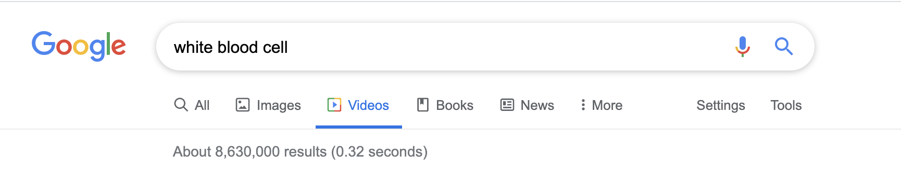
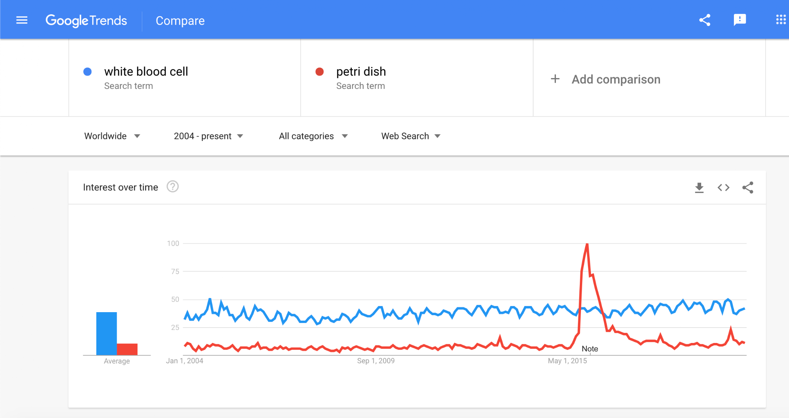
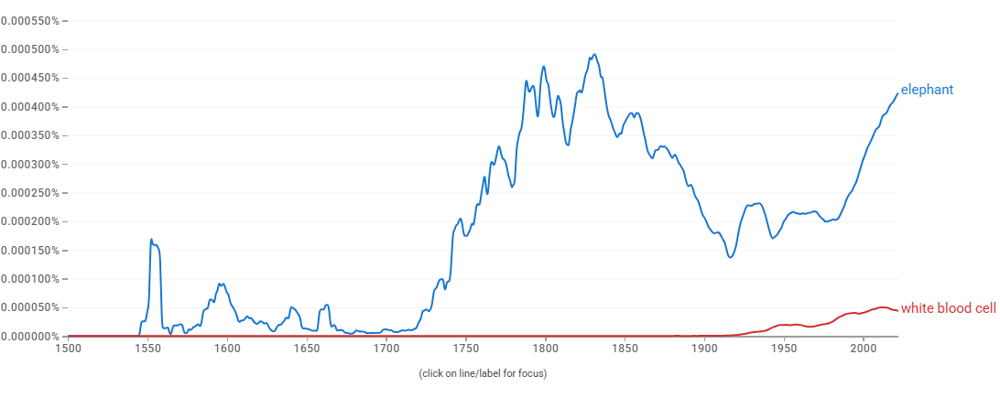

# Proposal for Emoji: White Blood Cell

**Submitter:** Shuhan He, MD 
**Main point of contact:** Shuhan He 
**Date:** 2026-07-10

## Identification

**Suggested name:** White Blood Cell 
**Suggested keywords:** leukocyte; immunity; immune system; infection; inflammation; blood; cell; laboratory; microscope; neutrophil 
**Suggested category:** People & Body - body-parts 
**Suggested sort location:** Near Drop of Blood in the body-parts subgroup.

## Required Example Images

| Size | Color | Black and white |
| --- | --- | --- |
| 18x18 |  |  |
| 72x72 |  |  |

The paradigm is a pale round cell with an irregular membrane and a dark, multi-lobed nucleus. Those cues distinguish a leukocyte from the existing Microbe emoji and from a simple colored circle.

The example images are original vector artwork created for this proposal and released under CC0 1.0. Editable SVG sources and the license are included in the public packet:

https://github.com/ShuhanCS/medicalemoji/tree/codex/eligible-2026-slate/submissions/v1.3.0/white-blood-cell/images

https://github.com/ShuhanCS/medicalemoji/blob/codex/eligible-2026-slate/submissions/v1.3.0/ARTWORK-LICENSE.md

## Factors for Inclusion

### A. Multiple usages

White blood cells are familiar components of blood and the immune system. The emoji would support ordinary conversations about immunity, infection, inflammation, immune response, white-cell counts, blood tests, laboratory results, chemotherapy monitoring, and school biology. It can also express the everyday idea of the body "fighting" an infection without specifying a disease.

The concept is useful beyond a single clinical setting. Students and educators discuss leukocytes in biology; patients and families encounter white-cell counts in routine laboratory panels; and researchers use the term across immunology, hematology, infectious disease, and microscopy. A general white blood cell provides the broad concept without encoding a particular leukocyte subtype.

### B. Use in sequences

- White Blood Cell + shield: immune defense or protection.
- White Blood Cell + Microbe: immune response to infection.
- White Blood Cell + test tube: blood count, laboratory test, or research.
- White Blood Cell + down arrow or up arrow: low or high white-cell count.
- White Blood Cell + microscope or book: cell biology, immunology, or education.
- White Blood Cell + hospital or pill: treatment monitoring or clinical care.

### C. Breaks new ground

No current emoji represents an immune cell. Microbe represents a microscopic organism, not a human defense cell; Drop of Blood represents blood as a fluid; and Test Tube represents a container or laboratory activity. White Blood Cell would add the cellular component of immunity and make interactions between host cells and microbes visually expressible.

### D. Distinctiveness

The multi-lobed nucleus is the essential distinguishing feature. In both color and black-and-white, it creates a compact silhouette unlike Microbe's radiating projections or Drop of Blood's teardrop form. The proposal does not require microscopic realism: an irregular outer edge and one dark, lobed nucleus are enough at emoji scale.

### E. Expected usage level

The included evidence documents substantial general-web, video, and published-book use. An archived Web Trends chart is retained as supporting history, but it uses `petri dish` rather than Unicode's `elephant` reference term. A fresh Web Trends capture and a fresh Image Trends capture with `elephant` must replace or supplement it before filing.

| Evidence | Result in included capture | Reproducible URL |
| --- | --- | --- |
| Google Search | About 1,100,000,000 results; captured 2020-12-18 | https://www.google.com/search?q=white+blood+cell&hl=en&num=10&pws=0 |
| Google Video Search | About 8,630,000 results; captured 2020-12-18 | https://www.google.com/search?tbm=vid&q=white+blood+cell&hl=en&num=10&pws=0 |
| Google Trends Web Search | Archived comparison with `petri dish`; fresh `elephant` comparison required before filing | https://trends.google.com/trends/explore?date=all&q=elephant,white%20blood%20cell |
| Google Trends Image Search | Fresh capture required before filing | https://trends.google.com/trends/explore?date=all_2008&gprop=images&q=elephant,white%20blood%20cell |
| Google Books Ngram Viewer | English, 1500-2022; sustained and increasing published-book usage, below `elephant`; captured 2026-07-10 | https://books.google.com/ngrams/graph?content=elephant%2Cwhite%20blood%20cell&year_start=1500&year_end=2022&corpus=en&smoothing=3 |

**Google Search**

**Google Video Search**

**Archived Google Trends - Web Search (reference only; comparator must be replaced)**

**Google Books Ngram Viewer**

### F. Completeness

Not applicable. White Blood Cell is independently useful and is not proposed merely to complete a set of blood components or cells.

### G. Compatibility

Not applicable. This proposal does not rely on a legacy carrier emoji or another encoded pictograph.

## Factors for Exclusion

### A. Already represented

White Blood Cell is not represented by Microbe, Drop of Blood, Test Tube, Microscope, or Shield. Those emoji can provide context, but none identifies an immune cell or a white-cell count.

### B. Overly specific

The proposal is for the general white blood cell concept, not a particular subtype, disease, laboratory value, or treatment. Its uses span routine testing, immunity, infection, education, and research.

### C. Open-ended

This proposal does not request an open-ended catalog of cells. White Blood Cell is supported independently by expected usage, common recognition, multiple contexts, and an expressive gap.

### D. Transient

White blood cells are a durable biological concept used in medicine, education, and research. Their relevance is not tied to a temporary outbreak, campaign, or technology.

### E. Justified only by existing emoji

The proposal does not depend on the existence of Microbe or Drop of Blood. Those emoji help demonstrate the semantic gap; the case for White Blood Cell rests on its own usages and frequency evidence.

## Other Information

The formal synonym `leukocyte` should be included as a keyword, while `White Blood Cell` is the clearer display name. The paradigm should avoid spikes or a face, which could make it read as Microbe. The lobed nucleus should remain visible in monochrome and at 18x18.

Official Unicode proposal guidance:

https://www.unicode.org/emoji/proposals.html
