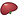
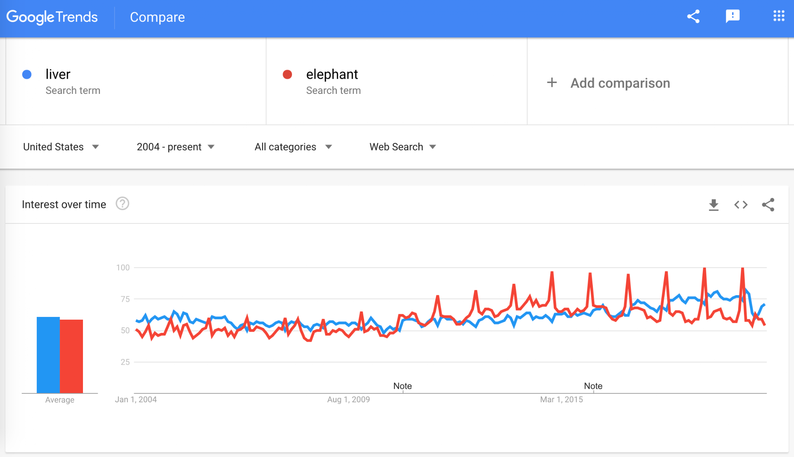

# Proposal for Emoji: Liver

**Submitter:** Shuhan He, MD 
**Main point of contact:** Shuhan He 
**Date:** 2026-07-26

## Identification

**Suggested name:** Liver 
**Suggested keywords:** hepatic; anatomy; organ; metabolism; digestion; bile; alcohol; hepatitis; transplant; donation 
**Suggested category:** People & Body - body-parts 
**Suggested sort location:** Near anatomical heart, lungs, and brain in the body-parts subgroup.

## Required Example Images

| Size | Color | Black and white |
| --- | --- | --- |
| 18x18 |  |  |
| 72x72 |  |  |

The paradigm uses a full, asymmetrical wedge with a domed large lobe, a tapering smaller lobe, and a gallbladder tucked beneath the inferior edge. Vendors may omit the gallbladder if the liver remains recognizable. Fine surface anatomy is unnecessary at emoji scale.

I, Shuhan He, certify that these example images are original work created for this proposal, that I own all IP Rights in them, and that they contain no third-party artwork, logo, trademark, or text. I release the images under the CC0 1.0 Universal Public Domain Dedication and grant the rights required by the Unicode Emoji Proposal Agreement and License.

CC0 1.0: https://creativecommons.org/publicdomain/zero/1.0/

## Factors for Inclusion

### A. Multiple meanings

Not applicable. This proposal does not rely on a metaphorical or symbolic meaning. Its case rests on direct, high-frequency uses across anatomy, metabolism, digestion, testing, medication, donation, transplant, education, and food.

### B. Use in sequences

Liver can combine with existing emoji to create messages without standardized sequences:

- Liver + test tube or chart: liver function test or laboratory results.
- Liver + pill: medication processing, side effects, or treatment.
- Liver + warning or alcoholic drink: liver risk or alcohol-related concern.
- Liver + people or heart: donation, transplant, recipient, caregiver, or support.
- Liver + hospital: hepatology visit, procedure, or inpatient care.
- Liver + plate or cooking pot: liver as food or cooking context.
- Liver + book or microscope: anatomy, school science, or research.

### C. Breaks new ground

**Yes.** No current emoji or reliable emoji sequence identifies the liver. Anatomical Heart, Lungs, and Brain identify different body parts; Cut of Meat and Beans do not reliably identify a liver. Medical-context emoji can convey testing, imaging, medication, or care, but none supplies the missing body-site term. Liver therefore adds a distinct literal semantic building block for ordinary messages that explicitly identify the organ. This claim does not depend on the existence of other organ emoji or on completing an anatomy set.

### D. Distinctiveness

The liver has a broad, wedge-like, asymmetrical silhouette with unequal lobes. The proposed paradigm adds a small gallbladder cue in color and a simple lobe division in black and white. Its low, asymmetric profile differs from Anatomical Heart, Lungs, and Brain, while the lobed whole-organ outline distinguishes the intended anatomy from Cut of Meat and Beans. The silhouette remains legible at 18x18 without text.

### E. Expected usage level

Liver is used in ordinary conversations about anatomy, laboratory results, medication effects, alcohol, hepatitis, fatty liver, transplant, living donation, school science, animal liver as food, and family health. The five frequency screenshots required by Unicode are embedded below. Google Trends and Google Books compare liver with Unicode's reference term elephant.

#### Google Search

Historical capture from 2020-07-12. The result page reports about 391,000,000 results. Reproducible query: https://www.google.com/search?q=liver&hl=en&num=10&pws=0

#### Google Video Search

Historical capture from 2020-07-12. The result page reports about 85,500,000 results. Reproducible query: https://www.google.com/search?tbm=vid&q=liver&hl=en&num=10&pws=0

#### Google Trends - Web Search

Historical capture from 2020-07-12 using United States and 2004 through the capture date. Liver and elephant show comparable average interest in the captured period. This regional capture must be refreshed to Worldwide before filing. Reproducible query: https://trends.google.com/trends/explore?date=all&geo=US&q=liver,elephant

#### Google Trends - Image Search

Historical capture from 2020-07-12 using United States and 2008 through the capture date. The graph shows sustained liver image-search interest against elephant. This regional capture must be refreshed to Worldwide before filing. Reproducible query: https://trends.google.com/trends/explore?date=all_2008&geo=US&gprop=images&q=liver,elephant

#### Google Books Ngram Viewer

Captured 2026-07-09 using the English corpus, 1500-2022, and smoothing 3. Liver substantially exceeds elephant in recent published-book usage. Reproducible query: https://books.google.com/ngrams/graph?content=elephant%2Cliver&year_start=1500&year_end=2022&corpus=en&smoothing=3

### F. Completeness

Not applicable. Liver is independently useful and is not proposed merely to complete a set of organs.

### G. Compatibility

Not applicable. This proposal does not rely on a legacy carrier emoji or another encoded pictograph.

## Factors for Exclusion

### A. Already representable

**No existing emoji or reliable sequence identifies the liver.** Anatomical Heart, Lungs, and Brain identify different organs. Cut of Meat and Beans shift the meaning toward food and remain ambiguous. General medical emoji can add context only after the body site is identifiable.

### B. Overly specific

Liver is a primary organ and a broad everyday concept, not a particular disease, procedure, specialty, organization, campaign, or brand. Its uses span anatomy, metabolism, digestion, testing, medication, alcohol, donation, transplant, food, and education.

### C. Open-ended

**No.** Liver is not proposed to complete an anatomy set. Its candidacy rests on independently documented literal usage, the absence of a reliable substitute, and a visually testable whole-organ paradigm. Encoding Liver would not establish that every internal organ qualifies; any future candidate would need to satisfy the same usage, non-substitutability, and distinctiveness tests.

### D. Transient

Liver anatomy, function, testing, medication effects, alcohol, disease, donation, transplant, and food uses are durable concepts rather than a temporary event or trend.

### E. Faulty comparison

**No.** The proposal does not rely on the existence or importance of Anatomical Heart, Lungs, Brain, or any other encoded emoji. Its independent case is documented literal usage, absence of a substitute, and a distinct visual paradigm.

## Other Information

The singular common name Liver is concise and searchable. Essential design cues are a full, asymmetrical, lobed organ silhouette with a domed major lobe and tapering edge. A tucked green gallbladder or simple lobe division can improve recognition but is optional. Vendors should avoid excessive realism and preserve a clear outline at 18x18.

Official Unicode proposal guidance:

https://www.unicode.org/emoji/proposals.html
