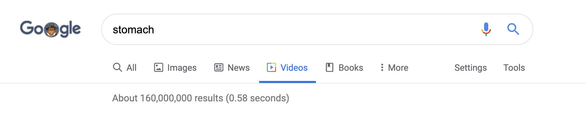
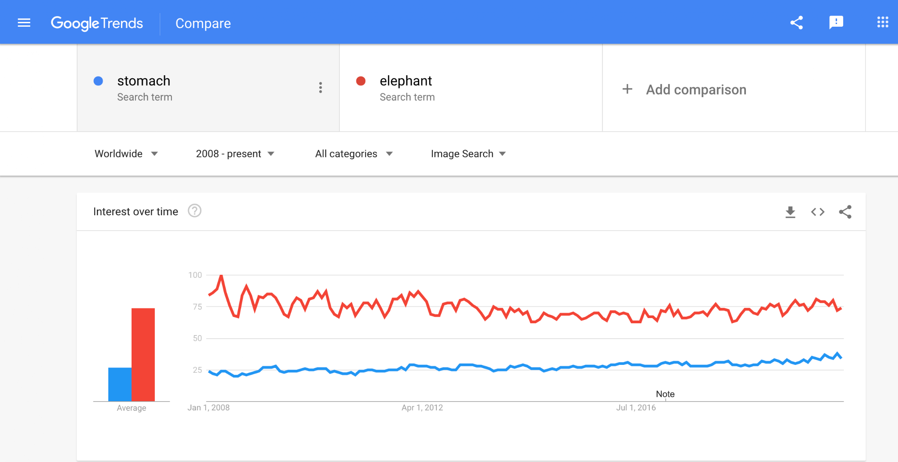
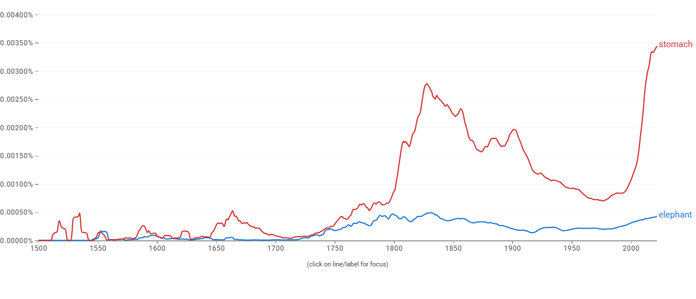

# Proposal for Emoji: Stomach

**Submitter:** Shuhan He, MD 
**Main point of contact:** Shuhan He 
**Date:** 2026-07-26

## Identification

**Suggested name:** Stomach 
**Suggested keywords:** digestion; gut; belly; abdomen; hunger; appetite; fullness; nausea; indigestion; reflux 
**Suggested category:** People & Body - body-parts 
**Suggested sort location:** Near anatomical heart, lungs, and brain in the body-parts subgroup.

## Required Example Images

| Size | Color | Black and white |
| --- | --- | --- |
| 18x18 |  |  |
| 72x72 |  |  |

The paradigm uses one bold, asymmetric J-shaped stomach silhouette with a long visible inlet, a deep open inner concavity, and a distinct short outlet. These cues distinguish it from food, a bean, a generic blob, or another solid organ. Vendors may simplify shading, but the inlet, concavity, and outlet should remain separated at typical emoji sizes.

I, Shuhan He, certify that these example images are original work created for this proposal, that I own all IP Rights in them, and that they contain no third-party artwork, logo, trademark, or text. I release the images under the CC0 1.0 Universal Public Domain Dedication and grant the rights required by the Unicode Emoji Proposal Agreement and License.

CC0 1.0: https://creativecommons.org/publicdomain/zero/1.0/

## Factors for Inclusion

### A. Multiple meanings

Stomach has established emotional and figurative meanings in addition to anatomy and digestion. Familiar expressions include butterflies in the stomach, a nervous stomach, an empty or strong stomach, and being unable to stomach something. These meanings support emotion, appetite, tolerance, and physical sensation without depending on a pun.

Cambridge Dictionary documents both butterflies in your stomach and the verb sense of stomach, meaning to accept or deal with something unpleasant:

https://dictionary.cambridge.org/us/dictionary/english/butterflies-in-stomach

https://dictionary.cambridge.org/us/dictionary/english/stomach

### B. Use in sequences

Stomach can combine with existing emoji to create messages without standardized sequences:

- Stomach + fork and knife: hunger, meals, appetite, digestion, or fullness.
- Stomach + nauseated face: nausea, stomach bug, or upset stomach.
- Stomach + warning: stomach pain, food reaction, or urgent symptom.
- Stomach + pill or hospital: antacid, treatment, endoscopy, or digestive care.
- Stomach + butterfly: nervous anticipation or butterflies in the stomach.
- Stomach + brain or thought bubble: gut feeling or intuition.

### C. Breaks new ground

**Yes.** No current emoji represents the stomach or digestion as an organ process. Food emoji show what is eaten; nauseated face shows a feeling; and hospital, pill, and syringe show care or treatment. None identifies the stomach itself. The proposal therefore adds a distinct digestive-organ concept with ordinary uses in food, sensation, emotion, education, and health.

### D. Distinctiveness

The stomach's asymmetrical J-shaped form, long inlet, deep inner concavity, broad lower body, and separate outlet are recognizable in school diagrams and public health illustration. The example remains distinguishable in black and white and at 18x18 because recognition rests on silhouette rather than color or fine internal texture. Its open concavity and two connected passages separate it from liver, anatomical heart, food, bean, and generic internal-organ shapes.

### E. Expected usage level

Stomach is used in everyday conversations about digestion, eating, hunger, appetite, fullness, nausea, stomach ache, indigestion, reflux, medication, endoscopy, family health, and school science. The five frequency screenshots required by Unicode are embedded below. Google Trends and Google Books compare stomach with Unicode's reference term elephant.

#### Google Search

Historical capture from 2020-08-31. The result page reports about 414,000,000 results. Reproducible query: https://www.google.com/search?q=stomach&hl=en&num=10&pws=0

#### Google Video Search

Historical capture from 2020-08-31. The result page reports about 160,000,000 results. Reproducible query: https://www.google.com/search?tbm=vid&q=stomach&hl=en&num=10&pws=0

#### Google Trends - Web Search

Historical capture from 2020-08-31 using Worldwide and the widest range then shown, 2004 through the capture date. Stomach exceeds elephant in average interest and rises substantially over the captured period. Reproducible query: https://trends.google.com/trends/explore?date=all&q=stomach,elephant

#### Google Trends - Image Search

Historical capture from 2020-08-31 using Worldwide and 2008 through the capture date. The graph shows sustained stomach image-search interest against elephant. Reproducible query: https://trends.google.com/trends/explore?date=all_2008&gprop=images&q=stomach,elephant

#### Google Books Ngram Viewer

Captured 2026-07-09 using the English corpus, 1500-2022, and smoothing 3. Stomach substantially exceeds elephant in recent published-book usage. Reproducible query: https://books.google.com/ngrams/graph?content=elephant%2Cstomach&year_start=1500&year_end=2022&corpus=en&smoothing=3

### F. Completeness

Not applicable. Stomach is independently useful and is not proposed merely to complete a set of organs.

### G. Compatibility

Not applicable. This proposal does not rely on a legacy carrier emoji or another encoded pictograph.

## Factors for Exclusion

### A. Already representable

Stomach is not represented by an existing emoji. Food, nauseated face, hospital, and pill can imply related circumstances but cannot identify the organ, distinguish hunger from nausea, or express stomach-specific anatomy and care.

### B. Overly specific

Stomach is a primary organ and an everyday concept, not a particular disease, procedure, specialty, organization, campaign, or brand. It covers digestion, hunger, fullness, symptoms, emotion, education, nutrition, and health.

### C. Open-ended

This proposal does not request a complete anatomy taxonomy. Stomach is supported by its own frequency, multiple meanings, visual distinctiveness, and lack of an adequate substitute. Other organs can be judged independently on the same criteria.

### D. Transient

Digestion, hunger, fullness, nausea, abdominal discomfort, and stomach-related expressions are durable across generations and are not tied to a temporary event or trend.

### E. Faulty comparison

The proposal does not argue that stomach should be encoded merely because other organs exist. Its case rests on its own expected usage, broad meanings, recognizable silhouette, and expressive gap.

## Other Information

The singular common name Stomach is concise and searchable. Essential design cues are an asymmetrical J-shaped hollow-organ body, a long visible inlet, a deep open inner concavity, and a distinct rounded outlet. Fine anatomical detail is optional and should yield to legibility at 18x18. Vendors should avoid a form that reads primarily as food, a bean, or a generic pink shape.

Official Unicode proposal guidance:

https://www.unicode.org/emoji/proposals.html
