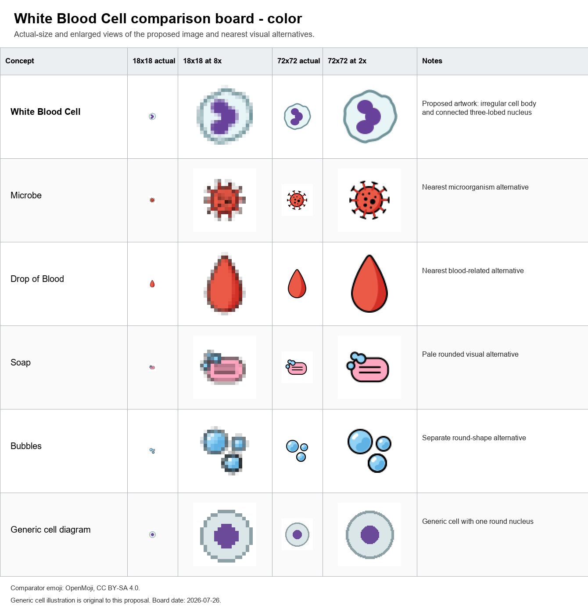
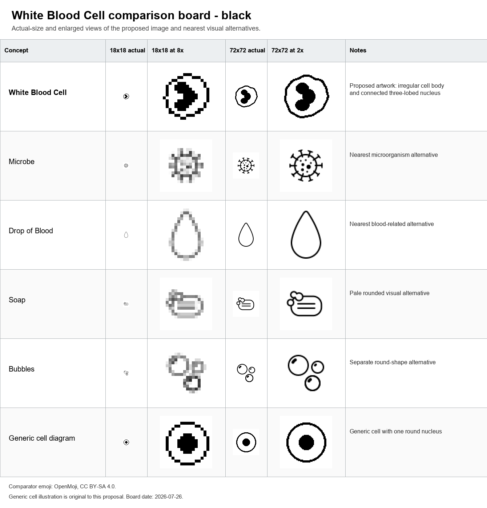
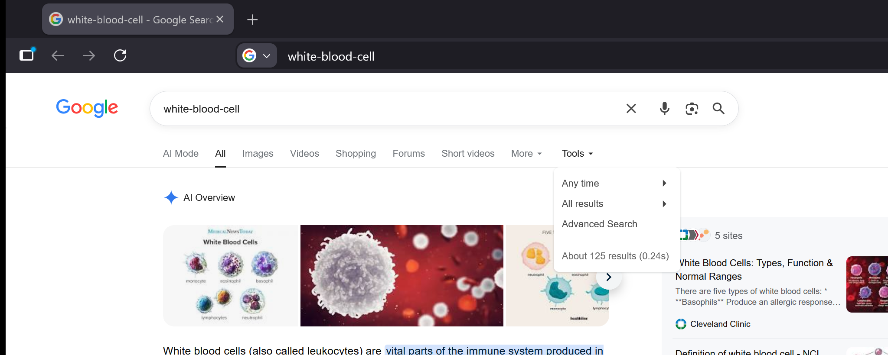
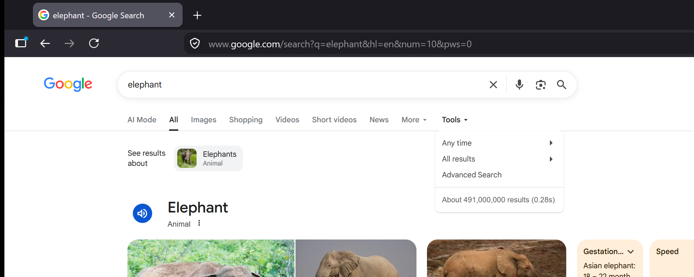
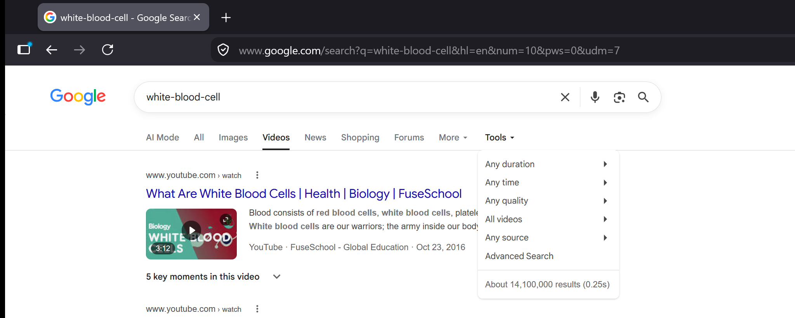
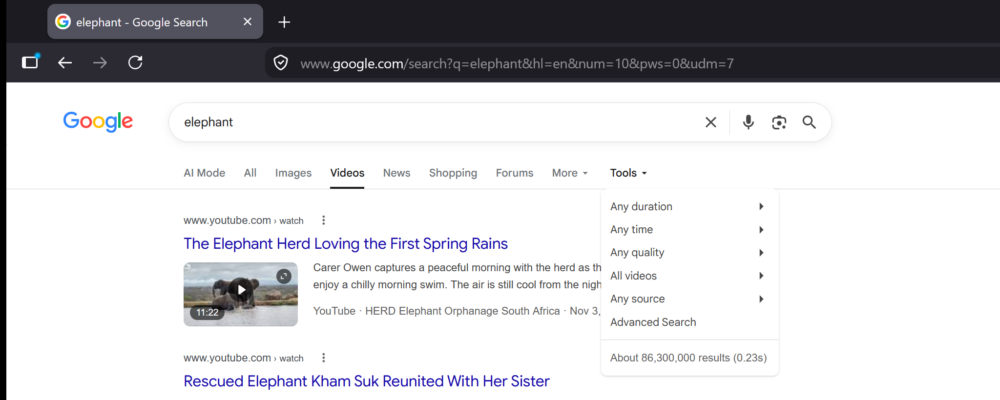
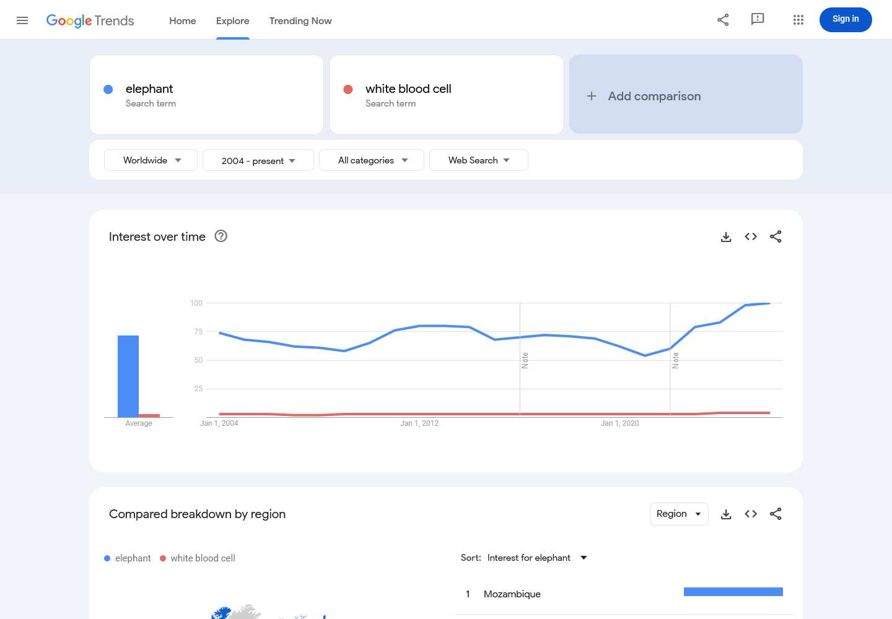
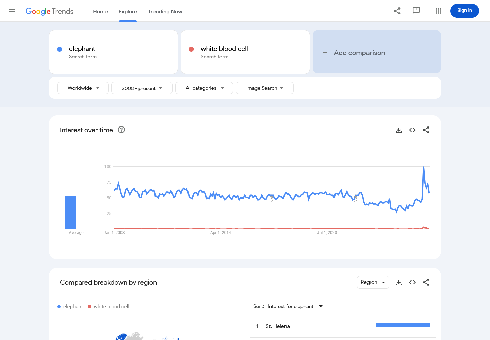
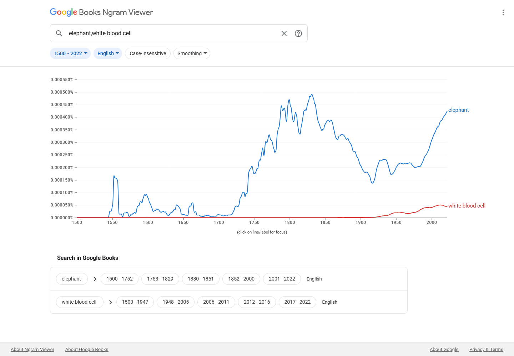

# Proposal for Emoji: White Blood Cell

**Submitters:** Shuhan He, MD; David Rhew, MD (Global Chief Medical Officer and Vice President of Healthcare,
Microsoft); Heena Purohit (Director, AI Startups, Microsoft) 
**Main point of contact:** Shuhan He 
**Date:** 2026-07-26

## 1. Identification

**Keywords:** leukocyte; immunity; infection; inflammation; laboratory 
**Category:** People & Body body-parts

## 2. Images

|  | 18x18 | 72x72 |
| --- | --- | --- |
| **Colour** |  |  |
| **Black and white** |  |  |

The paradigm is a pale, irregular cell body containing one bold, connected, multi-lobed nucleus. These cues
remain legible at actual keyboard size and distinguish the image from a spiked microbe, a teardrop-shaped Drop
of Blood, and a generic cell diagram.

I, Shuhan He, certify that these example images are original Medical Emoji artwork, that I own or control all
IP Rights in them, and that they contain no third-party artwork, logo, trademark, text, digit, or barcode. I
release the images under the CC0 1.0 Universal Public Domain Dedication and grant the rights required by the
Unicode Emoji Proposal Agreement and License.

[CC0 1.0 Universal Public Domain Dedication](https://creativecommons.org/publicdomain/zero/1.0/)

## 3. Factors for inclusion

### a. Multiple meanings

Not applicable.

### b. Use in sequences

White Blood Cell can combine with existing emoji to express common messages without standardized sequences:

- White Blood Cell + Microbe: immune response to infection.
- White Blood Cell + up arrow or down arrow: high or low white-cell count.
- White Blood Cell + Test Tube: blood count, laboratory testing, or research.

### c. Breaks new ground

**Yes.** The current Unicode emoji vocabulary has no human immune cell. Microbe represents a microscopic
organism rather than the body's defense cell; Drop of Blood represents blood as a fluid; and Test Tube
represents a container or laboratory activity. White Blood Cell adds the independently useful immune-cell
concept and makes the interaction between host defense and microbes directly expressible.

[Current Unicode Emoji List](https://www.unicode.org/emoji/charts/full-emoji-list.html)

### d. Distinctiveness

White Blood Cell is shown with a pale, irregular cell body and one bold, connected, vertical, three-lobed
nucleus. At 18 pixels, the enclosed multi-lobed nucleus distinguishes it from the spiked outline of Microbe,
the teardrop silhouette of Drop of Blood, the separate circles of Bubbles, and a generic cell diagram. Vendors
may vary the cell outline and internal shading while keeping the irregular membrane and single connected
multi-lobed nucleus.

The colour and black-and-white exhibits show that these visible cues remain clear at both required sizes and do
not depend on colour alone. Comparator emoji in the exhibits are by [OpenMoji](https://github.com/hfg-gmuend/openmoji),
licensed CC BY-SA 4.0. Full source URLs are archived with the packet. The proposed White Blood Cell artwork is
the original work identified in Section 2.

### e. Usage level

White blood cell is used across routine laboratory testing, immune response, infection, treatment monitoring,
education, and research. The required five-source evidence below shows broad Search and Video inventories,
sustained Web and Image search interest, and durable published-book usage. Its relative Trends and Ngram
levels are below `elephant`, while remaining continuous across the modern record and applicable to multiple
ordinary communication contexts.

The [National Cancer Institute](https://www.cancer.gov/publications/dictionaries/cancer-terms/def/white-blood-cell)
defines a white blood cell as a blood cell found in blood and lymph tissue that forms part of the immune system
and helps fight infection and other diseases. [MedlinePlus](https://medlineplus.gov/lab-tests/white-blood-count-wbc/)
documents white blood count as a routine test used to diagnose and monitor conditions affecting white blood
cells. Search and Video figures below are indexed-result estimates, not counts of individual users or direct
measures of emoji demand.

### f. Completeness

Not applicable.

### g. Compatibility

Not applicable.

## 4. Counterarguments to factors for exclusion

### a. Already represented

No existing emoji or sequence identifies a white blood cell. Microbe + Shield can suggest protection from a
germ, but it cannot express a white-cell count, leukocyte finding, or the immune cell itself. Drop of Blood,
Test Tube, Microscope, and Hospital provide context without supplying the missing concept.

### b. Overly specific

White Blood Cell is the broad leukocyte category, not a particular leukocyte subtype, disease, laboratory
value, procedure, specialty, treatment, or campaign. The familiar category encompasses the immune cells
described by the National Cancer Institute and the routine white blood count described by MedlinePlus.

### c. Open-ended

Red Blood Cell, Platelet, a generic Cell, and individual leukocyte subtypes are the most likely follow-on
candidates. White Blood Cell stands independently because it carries the category-level meaning of cellular
immune defense, supports high and low white-cell-count messages, combines directly with Microbe and Test Tube,
and has sustained frequency evidence across five required sources. Its selection would not automatically
justify every blood component, human cell, or leukocyte subtype; those concepts would need their own distinct
meanings, recognizable imagery, and usage evidence.

### d. Transient

White blood cells are a durable biological and medical concept. The Google Books record below extends through
2022 and shows increasing modern published use, while the current Search and Trends evidence documents ongoing
use across web, image, and video formats.

### e. Faulty comparison

The proposal does not depend on analogy to encoded anatomy or medical emoji. Its case rests on the independent
immune-cell meaning, common laboratory and educational uses, reproducible frequency evidence, and recognizable
18x18 paradigm.

## 5. Other information

Vendors should preserve a pale or neutral irregular cell body and one bold, connected, multi-lobed nucleus.
Fine microscopic detail is optional and should yield to legibility at 18x18. Radiating spikes should be
avoided because they imply Microbe, and the nucleus should remain a single connected feature rather than a
face-like arrangement.

## 6. Evidence of frequency

All data are from July 2026 and were obtained in a Firefox Private Browsing window. Search queries disable
personalized results. Trends use Worldwide, all categories, and the full available period. Books uses the
English corpus, 1500-2022, and smoothing 3.

### Google Search

Captured 2026-07-26 using the required grouped term `white-blood-cell`. The result page reports about 125
results, compared with about 491,000,000 for `elephant` under the same settings.

[Open the reproducible Google Search query](https://www.google.com/search?q=white-blood-cell&hl=en&num=10&pws=0)

### Google Video Search

Captured 2026-07-26 using the required grouped term `white-blood-cell`. The video result page reports about
14,100,000 results, compared with about 86,300,000 for `elephant` under the same settings.

[Open the reproducible Google Video Search query](https://www.google.com/search?tbm=vid&q=white-blood-cell&hl=en&num=10&pws=0)

### Google Trends - Web Search

Captured 2026-07-26 using Worldwide, 2004-present, all categories, and Web Search. Average indexed interest was
72 for `elephant` and 3 for `white blood cell`; the white-blood-cell series reaches 4 in 2024, 2025, and 2026.

[Open the Google Trends Web Search comparison](https://trends.google.com/trends/explore?date=all&q=elephant%2Cwhite%20blood%20cell)

### Google Trends - Image Search

Captured 2026-07-26 using Worldwide, 2008-present, all categories, and Image Search. Average indexed interest
was 53 for `elephant` and 1 for `white blood cell`, with recurring white-blood-cell interest across the period.

[Open the Google Trends Image Search comparison](https://trends.google.com/trends/explore?date=all_2008&gprop=images&q=elephant%2Cwhite%20blood%20cell)

### Google Books Ngram Viewer

Captured 2026-07-26 using the English corpus, 1500-2022, and smoothing 3. In 2022, the frequency of `white blood
cell` was approximately 10.13% of `elephant`, with an increasing modern series.

[Open the Google Books Ngram comparison](https://books.google.com/ngrams/graph?content=elephant%2Cwhite%20blood%20cell&year_start=1500&year_end=2022&corpus=en&smoothing=3)

