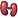
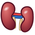
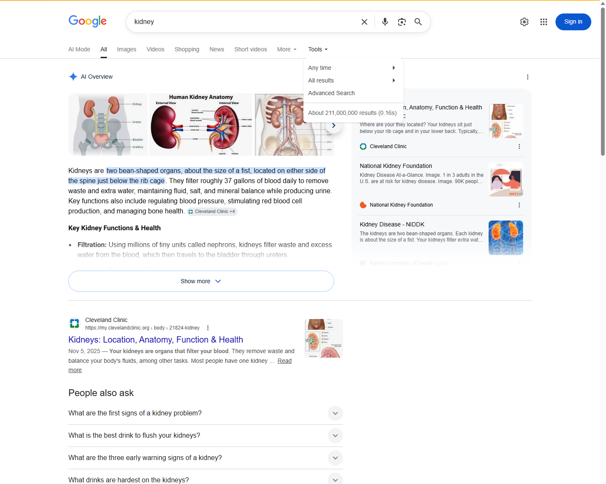

# Proposal for Emoji: Kidney

**Submitter:** Shuhan He; Edgar Lerma; Caitlyn Vlasschaert; Jade M. Teakell; Harish Seethapathy; Jarone Lee; Danielle Miller; Timur Erk; David Rhew, MD (Microsoft); Heena Purohit (Microsoft for Startups) 
**Main point of contact:** Shuhan He 
**Date:** 2026-07-26

## Identification

**Suggested name:** Kidney 
**Suggested keywords:** renal; anatomy; organ; filtration; urine; hydration; dialysis; transplant; donation; stone; bean-shaped 
**Suggested category:** People & Body - body-parts 
**Suggested sort location:** Near anatomical heart, lungs, and brain in the body-parts subgroup.

## Required Example Images

| Size | Color | Black and white |
| --- | --- | --- |
| 18x18 |  |  |
| 72x72 |  |  |

I, Shuhan He, certify that these example images are original work created for this proposal, that I own all IP Rights in them, and that they contain no third-party artwork, logo, trademark, or text. I release the images under the CC0 1.0 Universal Public Domain Dedication and grant the rights required by the Unicode Emoji Proposal Agreement and License.

[CC0 1.0 Universal Public Domain Dedication](https://creativecommons.org/publicdomain/zero/1.0/)

## Factors for Inclusion

### A. Multiple meanings

Not applicable. The proposal does not rely on a pun, metaphor, or secondary meaning.

### B. Use in sequences

Kidney can combine with existing emoji to create additional messages:

- Kidney + droplet: kidney function or urine production.
- Kidney + hospital: kidney care or treatment.
- Kidney + test tube: kidney testing.

NIDDK documents kidney function, urine production, and kidney care in [Your Kidneys & How They Work](https://www.niddk.nih.gov/health-information/kidney-disease/kidneys-how-they-work) and [Choosing a Treatment for Kidney Failure](https://www.niddk.nih.gov/health-information/kidney-disease/kidney-failure/choosing-treatment). MedlinePlus documents blood and urine testing in [Kidney Tests](https://medlineplus.gov/kidneytests.html).

### C. Breaks new ground

**Yes.** The [current Unicode Emoji List](https://www.unicode.org/emoji/charts/full-emoji-list.html) has no kidney or urinary-system organ. Beans express food, and a droplet or hospital expresses fluid or care, but none clearly identifies the kidney. Kidney adds the organ itself as a broad communicative building block for anatomy, function, testing, donation, transplantation, dialysis, and related care.

### D. Distinctiveness

Kidney is shown as two maroon, bean-shaped organs with inward-facing indentations, a slight vertical offset, and short central vessel and ureter cues. At 18 pixels, the inward-facing indentations and shared central anatomy distinguish it from Beans, whose separate pieces have no anatomical connection, and from Lungs, whose lobes join an airway from above. Vendors may vary shading and plumbing detail while keeping the paired inward-facing forms, vertical offset, and short central cues.

### E. Expected usage level

Kidney has broad, durable use across anatomy and physiology, urine production, testing, dialysis, transplantation, living donation, and medication review. These uses are documented by [NIDDK's kidney-function overview](https://www.niddk.nih.gov/health-information/kidney-disease/kidneys-how-they-work), [NIDDK's kidney-failure treatment guide](https://www.niddk.nih.gov/health-information/kidney-disease/kidney-failure/choosing-treatment), [NIDDK's transplant guide](https://www.niddk.nih.gov/health-information/kidney-disease/kidney-failure/kidney-transplant), and [MedlinePlus Kidney Tests](https://medlineplus.gov/kidneytests.html). The five required frequency exhibits below use the unfiltered term `kidney`; Google Trends and Google Books compare it with `elephant`.

#### Google Search

Captured 2026-05-13 in signed-out Google Web Search with English-language results and no date or country filter selected. The page reports about 211,000,000 indexed results. [Open the reproducible Google Search query](https://www.google.com/search?q=kidney&hl=en&num=10&pws=0).

#### Google Video Search

Captured 2026-05-13 in signed-out Google Video Search with English-language results and no date or country filter selected. The page reports about 66,000,000 indexed results. [Open the reproducible Google Video Search query](https://www.google.com/search?tbm=vid&q=kidney&hl=en&num=10&pws=0).

#### Google Trends - Web Search

Captured 2026-05-13 using Worldwide, 2004-present, All categories, and Web Search. Elephant has the higher historical average; kidney remains sustained and reaches comparable or greater interest in recent periods. [Open the reproducible Google Trends Web Search query](https://trends.google.com/trends/explore?date=all&q=elephant,kidney).

#### Google Trends - Image Search

Captured 2026-05-13 using Worldwide, 2008-present, All categories, and Image Search. Kidney shows sustained image-search interest but remains below elephant for most of the displayed range. [Open the reproducible Google Trends Image Search query](https://trends.google.com/trends/explore?date=all_2008&gprop=images&q=elephant,kidney).

#### Google Books Ngram Viewer

Captured 2026-07-09 using the English corpus, 1500-2022, and smoothing 3. Kidney exceeds elephant in recent published-book usage. [Open the reproducible Google Books Ngram query](https://books.google.com/ngrams/graph?content=elephant%2Ckidney&year_start=1500&year_end=2022&corpus=en&smoothing=3).

### F. Completeness

Not applicable. Kidney is independently useful and is not proposed merely to complete a set of organs.

### G. Compatibility

Not applicable. This proposal does not rely on a legacy carrier emoji or another encoded pictograph.

## Factors for Exclusion

### A. Already representable

Beans, or Beans combined with a hospital, can suggest food, diet, or kidney care, but the result remains ambiguous between food and anatomy. A droplet or medical emoji can express fluid or care but cannot identify the organ. Kidney would clearly identify the organ in discussions of function, testing, donation, transplantation, dialysis, and related care documented by [NIDDK](https://www.niddk.nih.gov/health-information/kidney-disease/kidneys-how-they-work) and [MedlinePlus](https://medlineplus.gov/kidneytests.html).

### B. Overly specific

Kidney represents the organ generally across anatomy, function, testing, donation, transplantation, dialysis, and related care. It is not a particular disease, procedure, specialty, organization, campaign, brand, or subtype of an existing organ emoji.

### C. Open-ended

Encoding Kidney would not automatically justify Liver, Stomach, Pancreas, Spleen, or every other organ. Each candidate must independently demonstrate expected use, a meaning that existing emoji cannot express clearly, and a legible visual identity. Kidney is proposed only on that independent evidence, not to begin or complete an anatomy set.

### D. Transient

Kidney is an established anatomical term rather than a campaign, event, or product. The embedded Google Books evidence spans 1500-2022, and current [NIDDK kidney guidance](https://www.niddk.nih.gov/health-information/kidney-disease/kidneys-how-they-work) documents continuing anatomical and care uses.

### E. Faulty comparison

This proposal does not depend on Heart, Lungs, or Brain being encoded. Kidney's case rests on its own expected use, distinct meaning, and visual identity.

## Other Information

The singular name Kidney is concise and searchable even though the example shows the familiar paired organs. Vendors may vary color, shading, and plumbing detail while preserving two inward-facing kidney forms, a visible vertical offset, and short central vessel and ureter cues. Full vascular anatomy and fine detail are intentionally omitted for legibility at 18x18.

Official Unicode proposal guidance:

https://www.unicode.org/emoji/proposals.html
