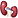
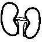

# Proposal for Emoji: Kidney

**Submitter:** Shuhan He; Edgar Lerma; Caitlyn Vlasschaert; Jade M. Teakell; Harish Seethapathy; Jarone Lee; Danielle Miller; Timur Erk; David Rhew, MD (Microsoft); Heena Purohit (Microsoft for Startups) 
**Main point of contact:** Shuhan He 
**Date:** 2026-07-26

## Identification

**Suggested name:** Kidney 
**Suggested keywords:** renal; anatomy; organ; filtration; urine; dialysis; transplant; donation; stone; kidney test 
**Suggested category:** People & Body - body-parts 
**Suggested sort location:** Near anatomical heart, lungs, and brain in the body-parts subgroup.

## Required Example Images

| Size | Color | Black and white |
| --- | --- | --- |
| 18x18 |  |  |
| 72x72 |  |  |

I, Shuhan He, certify that these example images are original work created for this proposal, that I own all IP Rights in them, and that they contain no third-party artwork, logo, trademark, or text. I release the images under the CC0 1.0 Universal Public Domain Dedication and grant the rights required by the Unicode Emoji Proposal Agreement and License.

[CC0 1.0 Universal Public Domain Dedication](https://creativecommons.org/publicdomain/zero/1.0/)

## Factors for Inclusion

### A. Multiple meanings

Not applicable. The selection case is the literal organ, not a pun or secondary meaning.

### B. Use in sequences

Two short combinations express established phrases:

- Kidney + rock: `kidney stone`.
- Kidney + test tube: `kidney tests` or `kidney function tests`.

MedlinePlus uses `kidney stone analysis` for a patient collecting a passed stone for a provider or laboratory,
and lists `kidney tests`, `kidney function tests`, and `kidney panel` as established names for blood, urine, and
imaging checks. See [Kidney Stone Analysis](https://medlineplus.gov/lab-tests/kidney-stone-analysis/) and
[Kidney Tests](https://medlineplus.gov/kidneytests.html).

### C. Breaks new ground

**Yes.** The [current Unicode Emoji List](https://www.unicode.org/emoji/charts/full-emoji-list.html) has no Kidney
character. Beans is the closest encoded pictograph, and Unicode even includes `kidney` among its search
keywords; however, its CLDR name is `beans` and it remains a Food & Drink pictograph. Generic medical emoji add
care or testing but do not supply the missing literal organ. See the
[Unicode Emoji List](https://unicode.org/emoji/charts/emoji-list.html).

### D. Distinctiveness

Kidney is shown as two maroon, inward-facing forms with visible medial notches, a slight vertical offset, and a
short central attachment. At 18 pixels, the opposed notches and offset distinguish it from separate Beans and
from the symmetric lobes and top-entering airway of Lungs. Vendors may vary color, shading, and fine anatomical
detail while keeping the paired notched forms, offset, and short central attachment.

### E. Expected usage level

Kidney is the necessary noun in several established, unrelated messages. MedlinePlus uses `kidney stone`,
`kidney stone analysis`, `kidney tests`, `kidney function tests`, and `kidney panel`. NIDDK tells a patient to
tell a doctor or nurse they want a `kidney transplant` and describes donor testing, waiting, surgery, and
follow-up. HRSA uses `donate a kidney`, `living donor`, and `kidney paired donation` in guidance for recipients,
donors, families, and transplant programs. NIDDK also explains dialysis through the work normally done by
healthy kidneys. These uses are documented in [Kidney Stone Analysis](https://medlineplus.gov/lab-tests/kidney-stone-analysis/),
[Kidney Tests](https://medlineplus.gov/kidneytests.html),
[Kidney Transplant](https://www.niddk.nih.gov/health-information/kidney-disease/kidney-failure/kidney-transplant),
[Living Donation](https://www.hrsa.gov/optn/patients/organ-donation/living-donation), and
[Hemodialysis](https://www.niddk.nih.gov/health-information/kidney-disease/kidney-failure/hemodialysis).

The five required frequency exhibits below test the unfiltered term `kidney`; Google Trends and Google Books
compare it with `elephant`. They establish sustained term visibility, not medical importance or guaranteed emoji
use.

#### Google Search

Captured 2026-05-13 in signed-out Google Web Search with English-language results and no date or country filter selected. The page reports about 211,000,000 indexed results. [Open the reproducible Google Search query](https://www.google.com/search?q=kidney&hl=en&num=10&pws=0).

#### Google Video Search

Captured 2026-05-13 in signed-out Google Video Search with English-language results and no date or country filter selected. The page reports about 66,000,000 indexed results. [Open the reproducible Google Video Search query](https://www.google.com/search?tbm=vid&q=kidney&hl=en&num=10&pws=0).

#### Google Trends - Web Search

Captured 2026-05-13 using Worldwide, 2004-present, All categories, and Web Search. Elephant has the higher historical average; kidney remains sustained and reaches comparable or greater interest in recent periods. [Open the reproducible Google Trends Web Search query](https://trends.google.com/trends/explore?date=all&q=elephant,kidney).

#### Google Trends - Image Search

Captured 2026-05-13 using Worldwide, 2008-present, All categories, and Image Search. Kidney shows sustained image-search interest but remains below elephant for most of the displayed range. [Open the reproducible Google Trends Image Search query](https://trends.google.com/trends/explore?date=all_2008&gprop=images&q=elephant,kidney).

#### Google Books Ngram Viewer

Captured 2026-07-09 using the English corpus, 1500-2022, and smoothing 3. Kidney exceeds elephant in recent published-book usage. [Open the reproducible Google Books Ngram query](https://books.google.com/ngrams/graph?content=elephant%2Ckidney&year_start=1500&year_end=2022&corpus=en&smoothing=3).

### F. Completeness

Not applicable. Internal organs are not a fixed set.

### G. Compatibility

Not applicable. This proposal does not rely on a legacy carrier emoji or another encoded pictograph.

## Factors for Exclusion

### A. Already representable

Beans is the strongest existing single emoji. Unicode's own `kidney` keyword makes it searchable, and with
shared context it can stand in for a kidney. Its visible and named meaning is still food. Beans + Hospital can
suggest kidney care, but can equally read as food, diet, or beans at a hospital. Beans + Rock does not clearly
name `kidney stone`, and Beans + Test Tube does not clearly name `kidney tests`; the reader must first assume
that Beans means an organ. A Kidney character supplies that missing noun. See the
[Unicode Emoji List](https://unicode.org/emoji/charts/emoji-list.html).

### B. Overly specific

Kidney represents the organ generally. The same noun is used in kidney stone analysis, kidney testing,
dialysis, transplantation, and living donation; it is not a specific disease, procedure, campaign, organization,
or subtype.

### C. Open-ended

The closest unencoded neighbors are Liver, Stomach, Pancreas, and Spleen. Kidney is not proposed because organs
are important or because an anatomy set should be completed. The bounded rule is that an organ must anchor
multiple established messages, remain unidentified by the strongest existing emoji or short sequence, show
strong required frequency evidence, and support a stable small-size pictograph. Kidney's specific combination
of stone + testing + dialysis + donation/transplant language meets that rule; encoding it would not establish
that every neighboring organ does.

### D. Transient

Kidney is an established anatomical term rather than a campaign, event, or product. The embedded Google Books
evidence spans 1500-2022, while current NIDDK, MedlinePlus, and HRSA guidance uses the same noun across testing,
stones, dialysis, transplantation, and donation.

### E. Faulty comparison

This proposal does not infer selection from Heart, Lungs, or Brain. Those characters supply only visual
comparisons; Kidney is evaluated through its observed messages, Beans substitute gap, frequency evidence, and
paired notched pictograph.

## Other Information

The singular name Kidney identifies the organ concept even though the example shows the familiar paired organs;
this proposal does not request separate singular and plural characters. Vendors may vary color, shading, and
fine anatomy while preserving two inward-facing notched forms, a visible offset, and a short central attachment.
Full vascular anatomy is intentionally omitted for legibility at 18x18.

Official Unicode proposal guidance:

https://www.unicode.org/emoji/proposals.html
