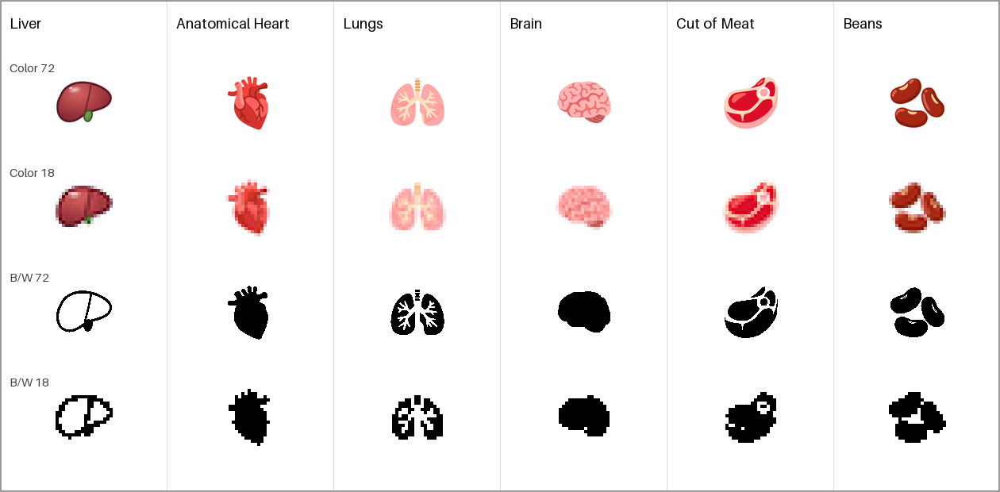
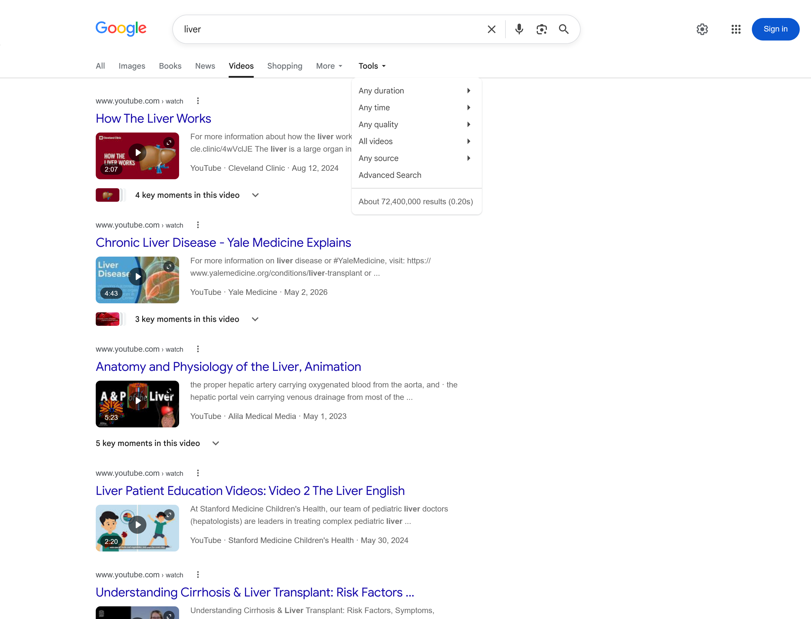
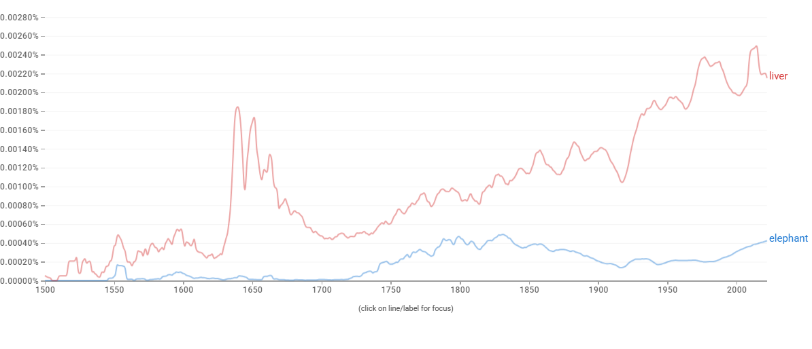

# Proposal for Emoji: Liver

**Submitter:** Shuhan He, MD 
**Main point of contact:** Shuhan He 
**Date:** 2026-07-26

## Identification

**Suggested name:** Liver 
**Suggested keywords:** hepatic; anatomy; organ; bile; metabolism; laboratory test; transplant; donation 
**Suggested category:** People & Body - body-parts 
**Suggested sort location:** Near Anatomical Heart, Lungs, and Brain in the body-parts subgroup.

## Required Example Images

| Size | Color | Black and white |
| --- | --- | --- |
| 18x18 |  |  |
| 72x72 |  |  |

The paradigm is a full, asymmetrical liver with a domed major lobe, a tapering lesser lobe, a visible lobe seam,
and an optional small gallbladder cue beneath the lower edge. Vendors may change the angle, shading, and color,
or omit the gallbladder, while preserving the broad lobed silhouette at emoji size.

I, Shuhan He, certify that these example images are original work created for this proposal, that I own all IP
Rights in them, and that they contain no third-party artwork, logo, trademark, or text. I release the images under
the CC0 1.0 Universal Public Domain Dedication and grant the rights required by the Unicode Emoji Proposal
Agreement and License.

CC0 1.0: https://creativecommons.org/publicdomain/zero/1.0/

## Factors for Inclusion

### A. Multiple meanings

Not applicable. The proposal relies on the direct literal meaning of the liver.

### B. Use in sequences

Liver can combine with existing emoji to create distinct messages:

- Liver + Test Tube or Bar Chart: a liver function test or result.
- Liver + Pill or Warning: medicine-related liver monitoring or a liver safety warning.
- Liver + Hospital or People: liver transplantation, donation, follow-up, or support.

These are established organ-specific contexts. MedlinePlus describes liver function tests, including their use in
monitoring medicine effects, and NIDDK describes liver transplantation and living-donor transplantation.

Sources:

- https://medlineplus.gov/lab-tests/liver-function-tests/
- https://www.niddk.nih.gov/health-information/liver-disease/liver-transplant

### C. Breaks new ground

**Yes.** No current emoji or reliable emoji sequence identifies the liver. Anatomical Heart, Lungs, and Brain
identify different body parts; Cut of Meat and Beans do not reliably identify a liver; and general medical emoji
can express testing, treatment, or care without supplying the missing body-site term. Liver therefore adds a
distinct literal semantic building block for ordinary messages that explicitly identify the organ.

Current Unicode emoji list: https://www.unicode.org/emoji/charts/full-emoji-list.html

### D. Distinctiveness

The liver's broad, low, asymmetrical silhouette separates it from the taller Anatomical Heart, paired Lungs, and
rounded Brain. Unequal lobes and a visible lobe seam remain present in both 18x18 versions; the color design adds
an optional green gallbladder cue. Against the closest object confusers, the form is a single full organ rather
than a food cut or a pair of seeds. The black-and-white design uses a white interior and strong outline instead of
a featureless filled shape.

### E. Expected usage level

Liver is used directly in general anatomy, laboratory testing, medication monitoring, transplantation, donation,
food, and education. MedlinePlus maintains dedicated pages for liver diseases and liver function tests, while
NIDDK maintains patient guidance dedicated to liver transplantation. The five frequency figures below measure
the term directly; Google Trends and Google Books use Unicode's reference term `elephant` for comparison.

Sources:

- https://medlineplus.gov/liverdiseases.html
- https://medlineplus.gov/lab-tests/liver-function-tests/
- https://www.niddk.nih.gov/health-information/liver-disease/liver-transplant

#### Google Search

Captured 2026-07-26. With Tools open, Google reports about 183,000 results for the unquoted term `liver`.

Reproducible query: https://www.google.com/search?q=liver&hl=en&num=10&pws=0

#### Google Video Search

Captured 2026-07-26. With Tools open, Google Video Search reports about 72,400,000 results.

Reproducible query: https://www.google.com/search?tbm=vid&q=liver&hl=en&num=10&pws=0

#### Google Trends - Web Search

Captured 2026-07-26 using Worldwide, 2004-present, and Web Search. Liver and elephant have comparable average
interest across the full period, and liver exceeds elephant in the most recent portion of the graph.

Reproducible query: https://trends.google.com/trends/explore?date=all&q=elephant,liver

#### Google Trends - Image Search

Captured 2026-07-26 using Worldwide, 2008-present, and Image Search. Liver remains below elephant in average
image-search interest while showing sustained worldwide use throughout the period and a pronounced recent
peak.

Reproducible query: https://trends.google.com/trends/explore?date=all_2008&gprop=images&q=elephant,liver

#### Google Books Ngram Viewer

Captured 2026-07-09 using the English corpus, 1500-2022, and smoothing 3. Liver substantially exceeds elephant
in recent published-book usage. Reproducible query:
https://books.google.com/ngrams/graph?content=elephant%2Cliver&year_start=1500&year_end=2022&corpus=en&smoothing=3

### F. Completeness

Not applicable. Liver is independently useful and is not proposed to complete an anatomy set.

### G. Compatibility

Not applicable. This proposal does not rely on a legacy carrier emoji or a high-frequency pictograph in another
system.

## Factors for Exclusion

### A. Already represented

The strongest substitute is a short sequence such as Hospital + Test Tube, but that sequence means medical
testing generally and cannot identify which body site is being discussed. Cut of Meat and Beans are also
ambiguous substitutes because they primarily encode food. No current emoji or short sequence supplies the
literal liver term.

### B. Overly specific

Liver is a broad anatomical entity used across everyday health, laboratory, transplant, donation, food, and
education messages. It is not a disease, procedure, specialty, campaign, organization, or brand.

### C. Open-ended

Liver stands on its own direct usage, recognizable paradigm, and missing semantic function. Encoding it would
not require Unicode to continue a series or complete an anatomy taxonomy.

### D. Transient

Liver is a durable term rather than a temporary event or campaign. The embedded Ngram covers 1500-2022, and the
current MedlinePlus and NIDDK resources document continuing laboratory and transplant uses.

### E. Faulty comparison

The case does not depend on the existence, importance, or acceptance of another emoji. Existing anatomical emoji
are used only as visual and semantic comparisons; Liver is supported by its own usage and its own expressive gap.

## Other Information

Essential design cues are one broad asymmetrical silhouette, unequal lobes, and a lobe seam that remains visible
at 18x18. A small gallbladder, shading, highlight, angle, and exact red-brown tone are optional vendor choices and
must not carry the meaning alone. Vendors should avoid a generic rectangular food cut or a featureless filled
oval.

Official Unicode proposal guidance:

https://www.unicode.org/emoji/proposals.html
