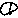
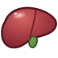
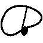

# Proposal for Emoji: Liver

**Authors:** Shuhan He, MD; David Rhew, MD; Heena Purohit; Adrienne Balk 
**Affiliations:** David Rhew, MD - Global Chief Medical Officer & VP Healthcare, Microsoft; Heena Purohit - Director of AI Startups, Microsoft for Startups 
**Submitter:** Shuhan He, MD 
**Main point of contact:** Shuhan He 
**Date:** 2026-07-26

## Identification

**Suggested name:** Liver 
**Suggested keywords:** hepatic; anatomy; organ; bile; metabolism; laboratory test; transplant; donation 
**Suggested category:** People & Body - body-parts 
**Suggested sort location:** Near Anatomical Heart, Lungs, and Brain in the body-parts subgroup.

## Required Example Images

| Size | Color | Black and white |
| --- | --- | --- |
| 18x18 |  |  |
| 72x72 |  |  |

The proposed image shows a full, asymmetrical liver with a domed major lobe, a tapering lesser lobe, a visible lobe seam,
and an optional small gallbladder cue beneath the lower edge. Vendors may change the angle, shading, and color,
or omit the gallbladder, while preserving the broad lobed silhouette at emoji size.

I, Shuhan He, certify that these example images are original work created for this proposal, that I own all IP
Rights in them, and that they contain no third-party artwork, logo, trademark, or text. I release the images under
the CC0 1.0 Universal Public Domain Dedication and grant the rights required by the Unicode Emoji Proposal
Agreement and License.

CC0 1.0: https://creativecommons.org/publicdomain/zero/1.0/

## Factors for Inclusion

### A. Multiple meanings

Not applicable. The proposal relies on the direct literal meaning of the liver.

### B. Use in sequences

Liver can combine with existing emoji to say what the current symbols cannot say alone:

- Liver + Test Tube: a liver function test or liver-enzyme result.
- Liver + Pill + Warning: medicine-related liver monitoring or a liver safety warning.
- Liver + Hospital + People: liver transplantation, living donation, or transplant support.

These are established organ-specific contexts. MedlinePlus describes liver function tests, including their use in
monitoring medicine effects, and NIDDK describes liver transplantation and living-donor transplantation.

Sources:

- https://medlineplus.gov/lab-tests/liver-function-tests/
- https://www.niddk.nih.gov/health-information/liver-disease/liver-transplant

### C. Breaks new ground

**Yes.** Hospital + Test Tube can say "medical test," Pill + Warning can say "medicine risk," and Cut of Meat can
say "food," but none identifies the liver. A Liver emoji supplies the missing body-site word in messages about
liver-test results, medicine safety, transplantation and donation, anatomy, and food.

Current Unicode emoji list: https://www.unicode.org/emoji/charts/full-emoji-list.html

### D. Distinctiveness

The image is broad and low, with one large domed lobe, one smaller tapering lobe, and a diagonal seam. At 18x18,
those three cues separate it from the tall Anatomical Heart, paired Lungs, round Brain, marbled Cut of Meat, and
multiple Beans. The green gallbladder helps in color but is optional; the outline and unequal lobes carry the
identity in both color and black and white.

### E. Expected usage level

Liver is a common standalone term across anatomy, laboratory results, medicine monitoring, transplantation,
living donation, education, and food. That range is reflected in dedicated MedlinePlus pages for liver diseases
and liver function tests and NIDDK guidance for liver transplantation. The five frequency figures below measure
`liver` directly: worldwide Web interest is comparable to `elephant`, image interest is lower but sustained, and
recent published-book usage is substantially higher.

Sources:

- https://medlineplus.gov/liverdiseases.html
- https://medlineplus.gov/lab-tests/liver-function-tests/
- https://www.niddk.nih.gov/health-information/liver-disease/liver-transplant

#### Google Search

Captured 2026-07-26. With Tools open, Google reports about 183,000 results for the unquoted term `liver`.

Reproducible query: https://www.google.com/search?q=liver&hl=en&num=10&pws=0

#### Google Video Search

Captured 2026-07-26. With Tools open, Google Video Search reports about 72,400,000 results.

Reproducible query: https://www.google.com/search?tbm=vid&q=liver&hl=en&num=10&pws=0

#### Google Trends - Web Search

Captured 2026-07-26 using Worldwide, 2004-present, and Web Search. Liver and elephant have comparable average
interest across the full period, and liver exceeds elephant in the most recent portion of the graph.

Reproducible query: https://trends.google.com/trends/explore?date=all&q=elephant,liver

#### Google Trends - Image Search

Captured 2026-07-26 using Worldwide, 2008-present, and Image Search. Liver remains below elephant in average
image-search interest while showing sustained worldwide use throughout the period and a pronounced recent
peak.

Reproducible query: https://trends.google.com/trends/explore?date=all_2008&gprop=images&q=elephant,liver

#### Google Books Ngram Viewer

Captured 2026-07-09 using the English corpus, 1500-2022, and smoothing 3. Liver substantially exceeds elephant
in recent published-book usage. Reproducible query:
https://books.google.com/ngrams/graph?content=elephant%2Cliver&year_start=1500&year_end=2022&corpus=en&smoothing=3

### F. Completeness

Not applicable. Liver is independently useful and is not proposed to complete an anatomy set.

### G. Compatibility

Not applicable. This proposal does not rely on a legacy carrier emoji or a high-frequency pictograph in another
system.

## Factors for Exclusion

### A. Already represented

Hospital + Test Tube identifies testing, not the liver. Cut of Meat identifies food; Beans identifies beans.
None can carry the organ name across medical and nonmedical messages.

### B. Overly specific

The proposal is for the whole liver, not a lobe, disease, test, transplant procedure, specialty, or campaign.
The same image can label anatomy, test results, medicine effects, donation and transplantation, and food.

### C. Open-ended

Liver's case rests on a specific combination: high standalone term use; recurring messages about liver tests,
medicine safety, transplantation and donation, anatomy, and food; and a compact two-lobe silhouette that remains
distinct at 18x18. Those facts support Liver itself and do not establish an anatomy-series rule.

### D. Transient

Liver is not tied to a campaign, event, or temporary technology. The embedded English-language Ngram traces the
word through 1500-2022, while current MedlinePlus and NIDDK resources show continuing use in testing, medicine
monitoring, transplantation, and donation.

### E. Faulty comparison

Anatomical Heart, Lungs, and Brain appear only to show what Liver is not and where it would sort; their encoding
is not evidence for this proposal. The case rests on Liver's own frequency results, organ-specific messages, and
recognizable 18x18 design.

## Other Information

Essential design cues are one broad asymmetrical silhouette, unequal lobes, and a lobe seam that remains visible
at 18x18. A small gallbladder, shading, highlight, angle, and exact red-brown tone are optional vendor choices and
must not carry the meaning alone. Vendors should avoid a generic rectangular food cut or a featureless filled
oval.

Official Unicode proposal guidance:

https://www.unicode.org/emoji/proposals.html
