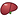
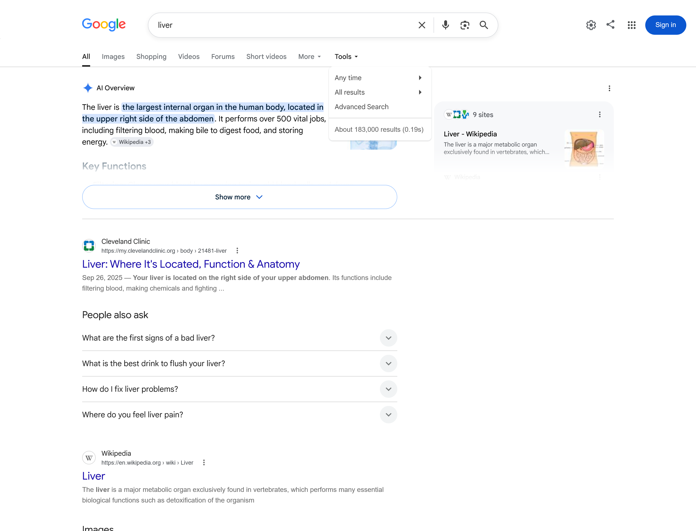
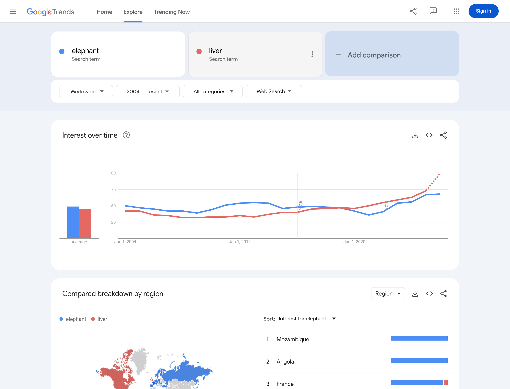
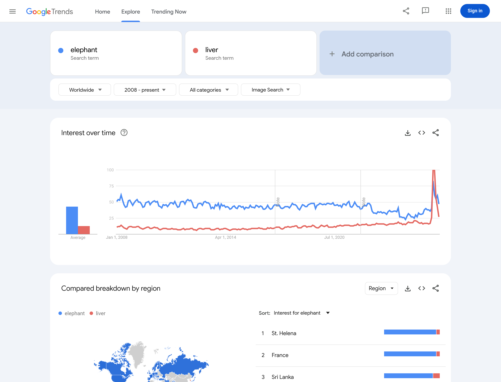

# Proposal for Emoji: Liver

**Authors:** Shuhan He, MD; David Rhew, MD; Heena Purohit; Adrienne Balk 
**Affiliations:** David Rhew, MD - Global Chief Medical Officer & VP Healthcare, Microsoft; Heena Purohit - Director of AI Startups, Microsoft for Startups 
**Submitter:** Shuhan He, MD 
**Main point of contact:** Shuhan He 
**Date:** 2026-07-26

## Identification

**Suggested name:** Liver 
**Suggested keywords:** hepatic; anatomy; organ; laboratory test; medicine safety; transplant; donation 
**Suggested category:** People & Body - body-parts 
**Suggested sort location:** Near Anatomical Heart, Lungs, and Brain in the body-parts subgroup.

## Required Example Images

| Size | Color | Black and white |
| --- | --- | --- |
| 18x18 |  |  |
| 72x72 |  |  |

The proposed image shows a full, asymmetrical liver with a larger rounded side, a smaller tapered side, a
visible diagonal dividing line, and an optional small gallbladder beneath the lower edge. Vendors may change
the angle, shading, and color, or omit the gallbladder, while preserving the broad unequal outline at emoji size.

I, Shuhan He, certify that these example images are original work created for this proposal, that I own all IP
Rights in them, and that they contain no third-party artwork, logo, trademark, or text. I release the images under
the CC0 1.0 Universal Public Domain Dedication and grant the rights required by the Unicode Emoji Proposal
Agreement and License.

License: [CC0 1.0 Universal Public Domain Dedication](https://creativecommons.org/publicdomain/zero/1.0/)

## Factors for Inclusion

### A. Multiple meanings

Not applicable. The proposal relies on the direct literal meaning of the liver.

### B. Use in sequences

Liver can combine with existing emoji to make two concise messages:

- Liver + Test Tube: “My liver-test results.”
- Liver + Pill + Warning: “This medicine may affect my liver.”

MedlinePlus uses the term “liver function tests” and explains that these tests can check for side effects of
medicines that affect the liver.

Source: [MedlinePlus: Liver Function Tests](https://medlineplus.gov/lab-tests/liver-function-tests/)

### C. Breaks new ground

**Yes.** Test Tube can say “test,” and Pill + Warning can say “medicine risk,” but neither can say which organ.
Liver supplies the missing literal word in “my liver-test results” and “this medicine may affect my liver.”

Reference: [Current Unicode emoji list](https://www.unicode.org/emoji/charts/full-emoji-list.html)

### D. Distinctiveness

The image is broad and low, with a larger rounded side, a smaller tapered side, and a diagonal dividing line.
At 18x18, those cues separate it from the tall Anatomical Heart, paired Lungs, round Brain, marbled Cut of Meat,
and multiple Beans. The green gallbladder helps in color but is optional; the outline and unequal sides carry
the identity in both color and black and white.

### E. Expected usage level

Liver is a common standalone term with established uses in liver function testing, checking how medicine
affects the liver, transplantation, and living donation. MedlinePlus documents the first two contexts, and
NIDDK documents liver transplantation and living donors. The five required figures below show worldwide Web
interest comparable to `elephant`, lower but sustained worldwide Image Search interest, and substantially
higher recent English-language published-word frequency.

Sources:

- [MedlinePlus: Liver Function Tests](https://medlineplus.gov/lab-tests/liver-function-tests/)
- [NIDDK: Liver Transplant](https://www.niddk.nih.gov/health-information/liver-disease/liver-transplant)

#### Google Search

Captured 2026-07-26. With Tools open, Google reports about 183,000 results for the unquoted term `liver`.

[Open the reproducible Google Search query](https://www.google.com/search?q=liver&hl=en&num=10&pws=0)

#### Google Video Search

Captured 2026-07-26. With Tools open, Google Video Search reports about 72,400,000 results.

[Open the reproducible Google Video Search query](https://www.google.com/search?tbm=vid&q=liver&hl=en&num=10&pws=0)

#### Google Trends - Web Search

Captured 2026-07-26 using Worldwide, 2004-present, and Web Search. Liver and elephant have comparable average
interest across the full period, and liver exceeds elephant in the most recent portion of the graph.

[Open the reproducible Worldwide Web Search comparison](https://trends.google.com/trends/explore?date=all&q=elephant,liver)

#### Google Trends - Image Search

Captured 2026-07-26 using Worldwide, 2008-present, and Image Search. Liver remains below elephant in average
image-search interest while remaining present across the full period.

[Open the reproducible Worldwide Image Search comparison](https://trends.google.com/trends/explore?date=all_2008&gprop=images&q=elephant,liver)

#### Google Books Ngram Viewer

Captured 2026-07-09 using the English corpus, 1500-2022, and smoothing 3. Liver substantially exceeds elephant
in recent published-word frequency.

[Open the reproducible Google Books Ngram comparison](https://books.google.com/ngrams/graph?content=elephant%2Cliver&year_start=1500&year_end=2022&corpus=en&smoothing=3)

### F. Completeness

Not applicable. Anatomy is not a fixed set for this factor.

### G. Compatibility

Not applicable. No qualifying popular-system pictograph is claimed.

## Factors for Exclusion

### A. Already represented

Test Tube can say “test,” and Pill + Warning can say “medicine risk.” Neither can say liver directly, so both
lose the precise organ in the two cited messages.

### B. Overly specific

The proposal is for the whole liver, not a lobe, disease, test result, transplant procedure, specialty, or
campaign. It names the organ in anatomy, test results, medicine effects, transplantation, and donation.

### C. Open-ended

Liver appears in three established uses documented above: liver function tests, checking whether medicines
affect the liver, and liver transplantation. The same image identifies the organ in each use. This proposal
concerns that whole organ, not every related test, disease, medicine effect, or procedure, and it does not
depend on completing an anatomy set.

### D. Transient

Liver is not tied to a campaign, event, or temporary technology. The English-language Ngram tracks the word
through 1500-2022; MedlinePlus and NIDDK use it in guidance on tests, medicine effects, and transplantation.

### E. Faulty comparison

Anatomical Heart, Lungs, and Brain are shown only as visual and sorting references. Liver is proposed for the
sourced messages and frequency evidence above, not because those emoji already exist.

## Other Information

Essential design cues are a broad asymmetrical outline, a larger rounded side, a smaller tapered side, and a
diagonal dividing line visible at 18x18. The gallbladder, shading, angle, and exact color are optional. Vendors
should avoid a rectangular food cut or a featureless filled oval.

[Official Unicode proposal guidance](https://www.unicode.org/emoji/proposals.html)
