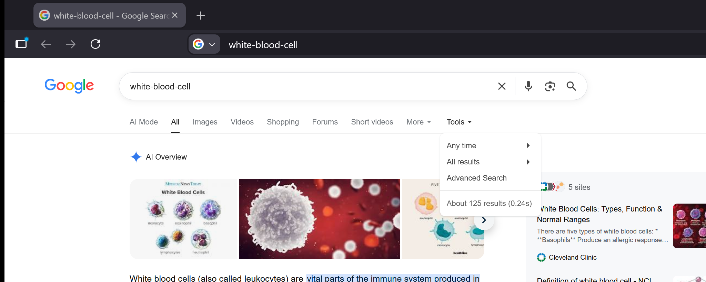
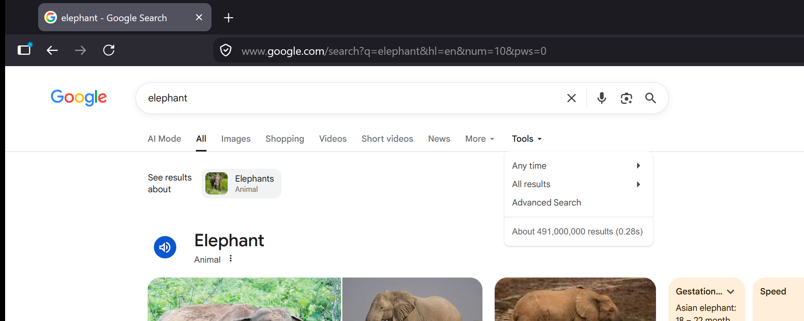
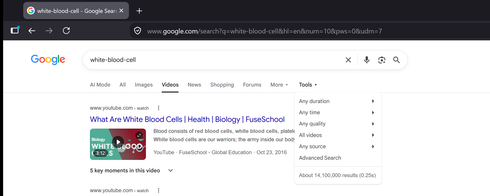
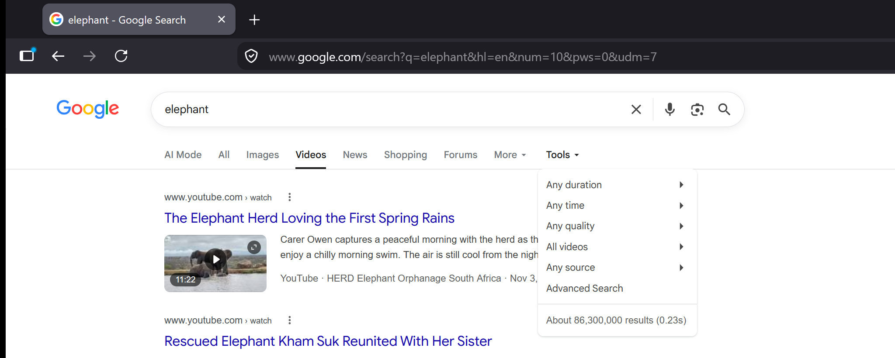
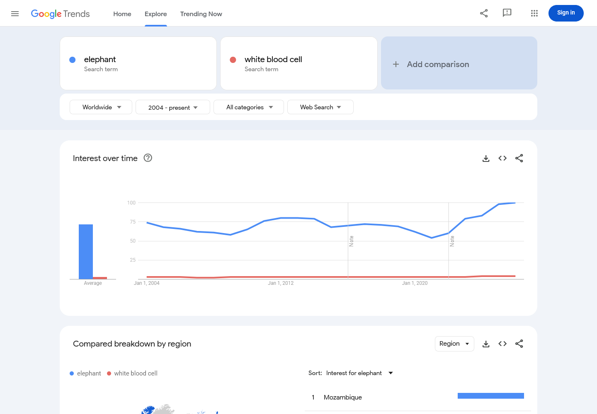
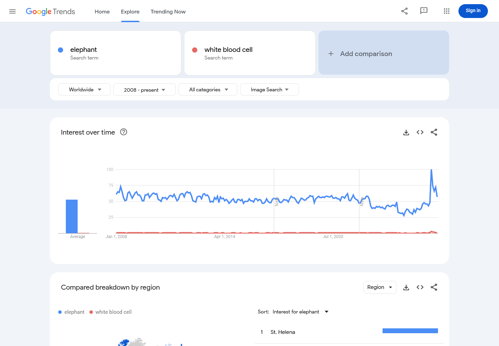
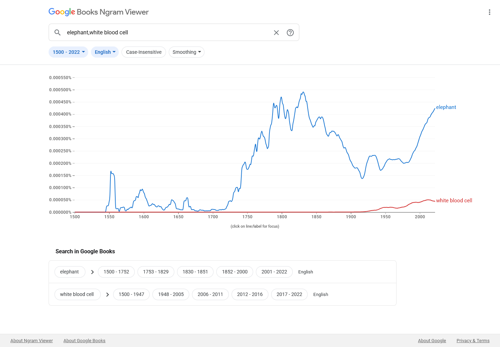

# Proposal for Emoji: White Blood Cell

**Submitters:** Shuhan He, MD; David Rhew, MD (Global Chief Medical Officer and Vice President of Healthcare,
Microsoft); Heena Purohit (Director, AI Startups, Microsoft) 
**Main point of contact:** Shuhan He 
**Date:** 2026-07-26

## 1. Identification

**Keywords:** immunity; defense; infection; health; leukocyte 
**Category:** People & Body body-parts

## 2. Images

|  | 18x18 | 72x72 |
| --- | --- | --- |
| **Colour** |  |  |
| **Black and white** |  |  |

The image uses the standard [neutrophil form](https://www.ncbi.nlm.nih.gov/books/NBK563148/) as the visual model
for the broader white-blood-cell category. The pale folded membrane first establishes one cell, while the single
connected segmented nucleus supplies the characteristic white-blood-cell cue. These features remain legible at
actual keyboard size and separate the image from a spiked microbe, a teardrop-shaped Drop of Blood, and a generic
cell diagram with a round center.

I, Shuhan He, certify that these example images are original Medical Emoji artwork, that I own or control all
IP Rights in them, and that they contain no third-party artwork, logo, trademark, text, digit, or barcode. I
release the images under the CC0 1.0 Universal Public Domain Dedication and grant the rights required by the
Unicode Emoji Proposal Agreement and License.

[CC0 1.0 Universal Public Domain Dedication](https://creativecommons.org/publicdomain/zero/1.0/)

## 3. Factors for inclusion

### a. Multiple meanings

Not applicable.

### b. Use in sequences

White Blood Cell can combine with existing emoji to express messages about the body's defenses:

- White Blood Cell + Microbe: the body fighting or responding to an infection.
- White Blood Cell + Shield: the immune system or the body's defenses.
- White Blood Cell + down arrow or up arrow: a low, high, or recovering white-cell count.

### c. Breaks new ground

**Yes.** The current Unicode emoji vocabulary can show a germ with Microbe, blood as a fluid with Drop of Blood,
and a laboratory activity with Test Tube, but it cannot show the body's defense cell. White Blood Cell adds the
positive counterpart to Microbe: the body responding to the germ. It lets users express the immune system
itself, the body fighting infection, or a white-cell count without substituting the threat for the response.

[Current Unicode Emoji List](https://www.unicode.org/emoji/charts/full-emoji-list.html)

### d. Distinctiveness

At 18 pixels, the enclosing pale membrane first establishes one cell. Inside it, a single connected, asymmetric
three-lobed nucleus supplies the white-blood-cell cue and distinguishes the image from a generic cell's round
center. The folded outline has neither Microbe's spiked edge nor Drop of Blood's teardrop point. These cues remain
clear in colour and black and white. Vendors may vary the outline, lobe count, colour, and shading while
preserving the enclosing pale cell body and single connected lobed center.

The design uses neutrophil morphology because neutrophils are the most numerous circulating white blood cells;
the name and intended meaning remain the broad White Blood Cell category.

[NCBI Bookshelf: Histology, White Blood Cell](https://www.ncbi.nlm.nih.gov/books/NBK563148/)

All artwork displayed in this proposal as proposed emoji artwork is the original work identified in Section 2.

### e. Usage level

The clearest everyday meaning is the body's defense cell. White Blood Cell can express messages such as "my
body is fighting an infection," "my immune defenses are low," or "my white-cell count is recovering." It also
lets people discuss immunity without using Microbe, which represents the germ rather than the body's response.

These messages apply to personal health updates, conversations about getting sick or recovering, and plain
explanations of how the immune system works. Biology education and research are secondary uses. The required
five-source evidence below shows current Search and Video results, recurring Web and Image search interest,
and durable published-book usage. Its relative Trends and Ngram levels are below `elephant`, while the term
remains present across the modern record.

White blood cells [help the body fight infection](https://www.cancer.gov/publications/dictionaries/cancer-terms/def/white-blood-cell),
and [white-cell counts](https://medlineplus.gov/lab-tests/white-blood-count-wbc/) are routinely used to monitor
health. Search and Video figures below are indexed-result estimates, not counts of individual users or direct
measures of emoji demand.

### f. Completeness

Not applicable.

### g. Compatibility

Not applicable.

## 4. Counterarguments to factors for exclusion

### a. Already represented

**No.** Microbe represents the germ, and Drop of Blood represents blood as a fluid. In a message such as "my
white-cell count is recovering," Microbe would name the germ rather than the immune cell being measured. Adding
Shield or laboratory emoji still cannot supply that missing subject.

### b. Overly specific

White Blood Cell is the broad leukocyte category, not a particular subtype, disease, procedure, specialty,
treatment, or campaign. Routine white blood counts group five major cell types under this umbrella term. The
artwork uses one representative form for legibility, while the character name and intended meaning remain
White Blood Cell.

### c. Open-ended

Red Blood Cell, Platelet, a generic Cell, and individual leukocyte subtypes are the most likely follow-on
candidates. White Blood Cell has a specific boundary: it is the upper-level concept for the body's defense
cells, the host-cell counterpart to Microbe, and the familiar umbrella term used when discussing immunity and
white-cell counts.
Individual leukocyte types are narrower members of this proposed category, while a generic Cell would not
convey immune defense or a white-cell count. Red Blood Cell and Platelet would present different semantic and
substitute questions and are not implied by this proposal. Selection of White Blood Cell therefore stops at
the broad leukocyte category rather than beginning a series of blood components or human cells.

### d. Transient

White blood cells are a durable biological and everyday health concept. The Google Books record below extends through
2022 and shows increasing modern published use, while the current Search and Trends evidence documents ongoing
use across web, image, and video formats.

### e. Faulty comparison

The `elephant` comparisons measure relative frequency only; they do not claim that another emoji creates a
precedent. White Blood Cell addresses the specific gap between the body's immune cell and the Microbe it
responds to.

## 5. Other information

At 18x18, fine microscopic detail should yield to legibility. Keep a visible band of pale cytoplasm around the
nucleus so the enclosing membrane and segmented center remain separate cues. Radiating spikes should be avoided
because they imply Microbe, and the nucleus should remain a single connected feature rather than a face-like
arrangement. The character name should remain White Blood Cell rather than a leukocyte subtype.

## 6. Evidence of frequency

All data are from July 2026 and were obtained in a Firefox Private Browsing window. Search queries disable
personalized results. Trends use Worldwide, all categories, and the full available period. Books uses the
English corpus, 1500-2022, and smoothing 3.

### Google Search

Captured 2026-07-26 using the required grouped term `white-blood-cell`. The result page reports about 125
results, compared with about 491,000,000 for `elephant` under the same settings.

[Open the reproducible Google Search query](https://www.google.com/search?q=white-blood-cell&hl=en&num=10&pws=0)

### Google Video Search

Captured 2026-07-26 using the required grouped term `white-blood-cell`. The video result page reports about
14,100,000 results, compared with about 86,300,000 for `elephant` under the same settings.

[Open the reproducible Google Video Search query](https://www.google.com/search?tbm=vid&q=white-blood-cell&hl=en&num=10&pws=0)

### Google Trends - Web Search

Captured 2026-07-26 using Worldwide, 2004-present, all categories, and Web Search. Average indexed interest was
72 for `elephant` and 3 for `white blood cell`; the white-blood-cell series reaches 4 in 2024, 2025, and 2026.

[Open the Google Trends Web Search comparison](https://trends.google.com/trends/explore?date=all&q=elephant%2Cwhite%20blood%20cell)

### Google Trends - Image Search

Captured 2026-07-26 using Worldwide, 2008-present, all categories, and Image Search. Average indexed interest
was 53 for `elephant` and 1 for `white blood cell`, with recurring white-blood-cell interest across the period.

[Open the Google Trends Image Search comparison](https://trends.google.com/trends/explore?date=all_2008&gprop=images&q=elephant%2Cwhite%20blood%20cell)

### Google Books Ngram Viewer

Captured 2026-07-26 using the English corpus, 1500-2022, and smoothing 3. In 2022, the frequency of `white blood
cell` was approximately 10.13% of `elephant`, with an increasing modern series.

[Open the Google Books Ngram comparison](https://books.google.com/ngrams/graph?content=elephant%2Cwhite%20blood%20cell&year_start=1500&year_end=2022&corpus=en&smoothing=3)

