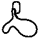
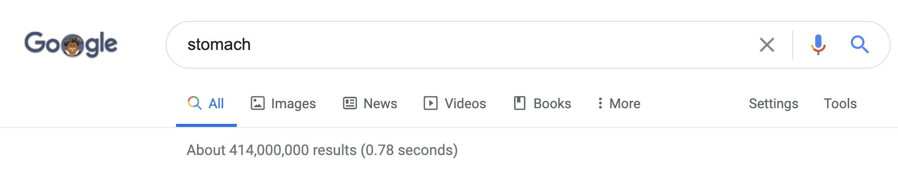
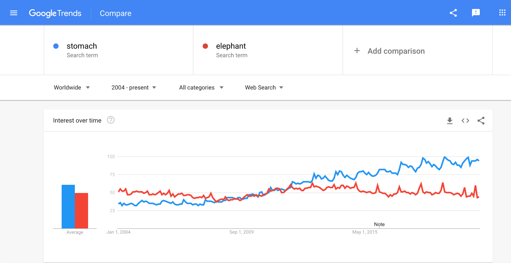

# Proposal for Emoji: Stomach

**Submitter:** Shuhan He, MD  
**Main point of contact:** Shuhan He  
**Date:** 2026-07-09

## Identification

**Suggested name:** Stomach  
**Suggested keywords:** digestion; gut; belly; abdomen; hunger; appetite; fullness; nausea; indigestion; reflux  
**Suggested category:** People & Body - body-parts  
**Suggested sort location:** Near anatomical heart, lungs, and brain in the body-parts subgroup.

## Required Example Images

| Size | Color | Black and white |
| --- | --- | --- |
| 18x18 |  |  |
| 72x72 |  |  |

The paradigm uses the stomach's curved hollow-organ body with a visible inlet and outlet. These cues distinguish it from food, a generic blob, or another solid organ. Vendors may simplify the inlet and outlet if the characteristic curved silhouette remains recognizable.

The example images are original vector artwork created for this proposal and released under CC0 1.0. Editable SVG sources and the license are included in the public packet:

https://github.com/ShuhanCS/medicalemoji/tree/feat/microsoft-round-strategy/submissions/v1.2.0/stomach/images

https://github.com/ShuhanCS/medicalemoji/blob/feat/microsoft-round-strategy/submissions/v1.2.0/ARTWORK-LICENSE.md

## Factors for Inclusion

### A. Multiple usages

Stomach has broad everyday, anatomical, nutritional, emotional, and clinical meanings. It supports messages about digestion, eating, hunger, appetite, fullness, nausea, stomach ache, indigestion, reflux, endoscopy, medication, and family health. It also appears in familiar expressions such as butterflies in the stomach, a nervous stomach, an empty stomach, a strong stomach, and being unable to stomach something.

These uses extend well beyond a single illness or medical specialty. People discuss stomachs while choosing meals, describing how they feel, caring for children, learning anatomy, reporting symptoms, and expressing intuition or anxiety. A stomach pictograph can make the intended body context explicit where food, nauseated face, or hospital emoji remain indirect.

### B. Use in sequences

Stomach can combine with existing emoji to create messages without standardized sequences:

- Stomach + fork and knife: hunger, meals, appetite, digestion, or fullness.
- Stomach + nauseated face: nausea, stomach bug, or upset stomach.
- Stomach + warning: stomach pain, food reaction, or urgent symptom.
- Stomach + pill or hospital: antacid, treatment, endoscopy, or digestive care.
- Stomach + butterfly: nervous anticipation or butterflies in the stomach.
- Stomach + brain or thought bubble: gut feeling or intuition.

### C. Breaks new ground

No current emoji represents the stomach or digestion as an organ process. Food emoji show what is eaten; nauseated face shows a feeling; and hospital, pill, and syringe show care or treatment. None identifies the stomach itself. The proposal therefore adds a distinct digestive-organ concept with ordinary uses in food, sensation, emotion, education, and health.

### D. Distinctiveness

The stomach's asymmetrical curved form, narrow inlet, rounded body, and outlet are recognizable in school diagrams and public health illustration. The example remains distinguishable in black and white and at 18x18 because recognition rests on silhouette rather than color or fine internal texture. It does not resemble anatomical heart, lungs, or brain.

### E. Expected usage level

The required evidence covers general web results, video results, long-term web interest, image-search interest, and published-book usage. Google Trends and Google Books compare `stomach` with Unicode's reference term `elephant`.

| Evidence | Result in included capture | Reproducible URL |
| --- | --- | --- |
| Google Search | About 414,000,000 results; captured 2020-08-31 | https://www.google.com/search?q=stomach&hl=en&num=10&pws=0 |
| Google Video Search | About 160,000,000 results; captured 2020-08-31 | https://www.google.com/search?tbm=vid&q=stomach&hl=en&num=10&pws=0 |
| Google Trends Web Search | Worldwide, 2004-present; stomach exceeds elephant in average interest and rises substantially over the captured period; captured 2020-08-31 | https://trends.google.com/trends/explore?date=all&q=stomach,elephant |
| Google Trends Image Search | Worldwide, 2008-present; sustained stomach image-search interest; captured 2020-08-31 | https://trends.google.com/trends/explore?date=all_2008&gprop=images&q=stomach,elephant |
| Google Books Ngram Viewer | English, 1500-2022; stomach substantially exceeds elephant in recent published-book usage; captured 2026-07-09 | https://books.google.com/ngrams/graph?content=elephant%2Cstomach&year_start=1500&year_end=2022&corpus=en&smoothing=3 |

**Google Search**

**Google Video Search**

**Google Trends - Web Search**

**Google Trends - Image Search**

**Google Books Ngram Viewer**

### F. Completeness

Not applicable. Stomach is independently useful and is not proposed merely to complete a set of organs.

### G. Compatibility

Not applicable. This proposal does not rely on a legacy carrier emoji or another encoded pictograph.

## Factors for Exclusion

### A. Already represented

Stomach is not represented by an existing emoji. Food, nauseated face, hospital, and pill can imply related circumstances but cannot identify the organ, distinguish hunger from nausea, or express stomach-specific anatomy and care.

### B. Overly specific

Stomach is a primary organ and an everyday concept, not a particular disease, procedure, specialty, organization, campaign, or brand. It covers digestion, hunger, fullness, symptoms, emotion, education, nutrition, and health.

### C. Open-ended

This proposal does not request a complete anatomy taxonomy. Stomach is supported by its own frequency, multiple usages, visual distinctiveness, and lack of an adequate substitute. Other organs can be judged independently on the same criteria.

### D. Transient

Digestion, hunger, fullness, nausea, abdominal discomfort, and stomach-related expressions are durable across generations and are not tied to a temporary event or trend.

### E. Justified only by existing emoji

The proposal does not argue that stomach should be encoded merely because other organs exist. Its case rests on its own expected usage, broad meanings, recognizable silhouette, and expressive gap.

## Other Information

The singular common name `Stomach` is concise and searchable. Essential design cues are an asymmetrical curved hollow-organ body and at least a suggestion of the inlet or outlet. Fine anatomical detail is optional and should yield to legibility at 18x18. Vendors should avoid a form that reads primarily as food or a generic pink shape.

Official Unicode proposal guidance:

https://www.unicode.org/emoji/proposals.html
