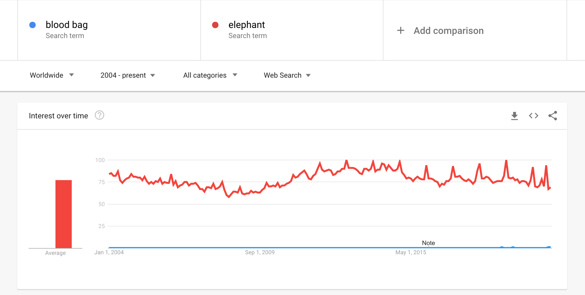
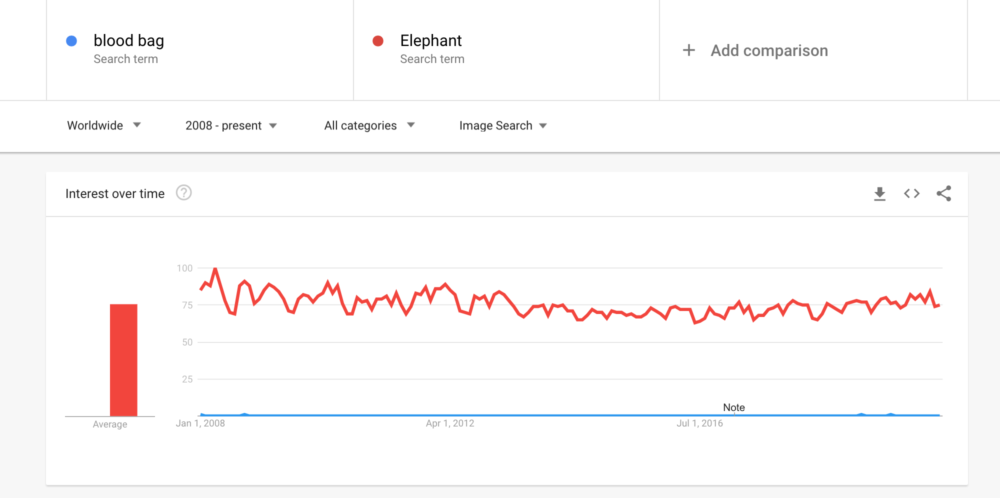
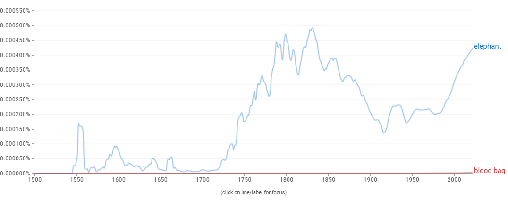

# Proposal for Emoji: Blood Bag

**Submitter:** Shuhan He, MD 
**Main point of contact:** Shuhan He 
**Date:** 2026-07-10

## Identification

**Suggested name:** Blood Bag 
**Suggested keywords:** transfusion; donation; donor; blood bank; plasma; infusion; hospital; supply; type; lifesaving 
**Suggested category:** Objects - medical 
**Suggested sort location:** Near Syringe and Drop of Blood in the medical objects subgroup.

## Required Example Images

| Size | Color | Black and white |
| --- | --- | --- |
| 18x18 |  |  |
| 72x72 |  |  |

The paradigm is a hanging medical bag filled with dark red fluid, with a short outlet tube and a simple droplet-shaped highlight. It contains no label, number, barcode, logo, or blood type, leaving vendors free to adapt detail while preserving the transfusion-bag silhouette.

The example images are original vector artwork created for this proposal and released under CC0 1.0. Editable SVG sources and the license are included in the public packet:

https://github.com/ShuhanCS/medicalemoji/tree/codex/eligible-2026-slate/submissions/v1.3.0/blood-bag/images

https://github.com/ShuhanCS/medicalemoji/blob/codex/eligible-2026-slate/submissions/v1.3.0/ARTWORK-LICENSE.md

## Factors for Inclusion

### A. Multiple usages

Blood Bag represents a familiar object used in blood donation, transfusion, hospital care, blood banking, emergency preparedness, and discussions of blood supply. Donors can use it to say they gave blood; recipients and families can use it to discuss a transfusion; hospitals and communities can use it in messages about blood-bank availability without naming an organization or campaign.

The object also covers related blood components when context supplies the distinction, including plasma and platelets. It communicates stored or transfused blood, which is different from a single Drop of Blood and different from a Syringe used to draw or inject fluid.

### B. Use in sequences

- Blood Bag + heart: blood donation, gratitude, or support for a recipient.
- Blood Bag + hospital: transfusion, blood bank, or hospital supply.
- Blood Bag + person: donor, recipient, or transfusion appointment.
- Blood Bag + warning: low supply, urgent need, or transfusion concern.
- Blood Bag + calendar: donation date or scheduled treatment.
- Blood Bag + Drop of Blood: blood type, blood component, or collection context.

### C. Breaks new ground

No current emoji represents a stored unit of blood or a transfusion. Drop of Blood identifies blood itself but not donation inventory, blood banking, or transfusion; Syringe represents a tool for injection or withdrawal. Blood Bag adds an object with its own roles, verbs, and settings.

### D. Distinctiveness

The hanging rectangular bag, visible liquid level, lower port, and short tube form a recognizable silhouette. The red fill and droplet cue strengthen recognition in color, while the bag outline, liquid boundary, port, and droplet-shaped negative space remain readable in black-and-white. The artwork deliberately omits tiny labels that would fail at emoji size.

### E. Expected usage level

The required evidence covers general web results, video results, long-term Web and Image Trends interest, and published-book usage. The archived Google Trends captures compare `blood bag` with Unicode's reference term `elephant`.

| Evidence | Result in included capture | Reproducible URL |
| --- | --- | --- |
| Google Search | About 574,000,000 results; captured 2020-12-18 | https://www.google.com/search?q=blood+bag&hl=en&num=10&pws=0 |
| Google Video Search | About 10,800,000 results; captured 2020-12-18 | https://www.google.com/search?tbm=vid&q=blood+bag&hl=en&num=10&pws=0 |
| Google Trends Web Search | Worldwide, 2004-present; persistent interest below `elephant`; captured 2020-12-18 | https://trends.google.com/trends/explore?date=all&q=elephant,blood%20bag |
| Google Trends Image Search | Worldwide, 2008-present; persistent image-search interest below `elephant`; captured 2020-12-18 | https://trends.google.com/trends/explore?date=all_2008&gprop=images&q=elephant,blood%20bag |
| Google Books Ngram Viewer | English, 1500-2022; established but substantially lower published-book usage than `elephant`; captured 2026-07-10 | https://books.google.com/ngrams/graph?content=elephant%2Cblood%20bag&year_start=1500&year_end=2022&corpus=en&smoothing=3 |

**Google Search**

**Google Video Search**

**Google Trends - Web Search**

**Google Trends - Image Search**

**Google Books Ngram Viewer**

### F. Completeness

Not applicable. Blood Bag is independently useful and is not proposed merely to complete a set of hospital equipment or blood-related symbols.

### G. Compatibility

Not applicable. This proposal does not rely on a legacy carrier emoji or another encoded pictograph.

## Factors for Exclusion

### A. Already represented

Blood Bag is not adequately represented by Drop of Blood or Syringe. A droplet cannot express a stored unit, blood inventory, blood bank, donor collection, or transfusion, and a syringe is a different object with broader injection meanings.

### B. Overly specific

The proposal represents the general blood-bag object rather than a blood type, branded donation service, particular blood component, condition, or procedure. It supports donation, transfusion, inventory, and care across many settings.

### C. Open-ended

This proposal does not ask for every medical container or piece of hospital equipment. Blood Bag is supported by its own familiar form, multiple uses, frequency evidence, and lack of a clear substitute.

### D. Transient

Blood collection, storage, donation, and transfusion are enduring practices. The concept does not depend on a campaign, event, shortage, or temporary technology.

### E. Justified only by existing emoji

The proposal does not argue for Blood Bag merely because Drop of Blood and Syringe exist. Those emoji clarify the semantic gap, while the proposal rests on the object's independent uses and evidence.

## Other Information

The design should avoid text, blood-type letters, numbers, barcodes, and institutional marks. A visible liquid level and lower port are more useful at emoji scale. Blood Bag and IV Bag are related but semantically different proposals; if only one infusion-container concept advances, user evidence and small-size differentiation should decide between them.

Official Unicode proposal guidance:

https://www.unicode.org/emoji/proposals.html
