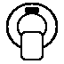
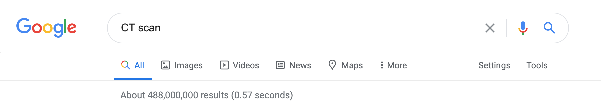
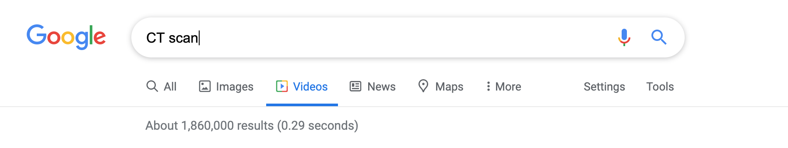
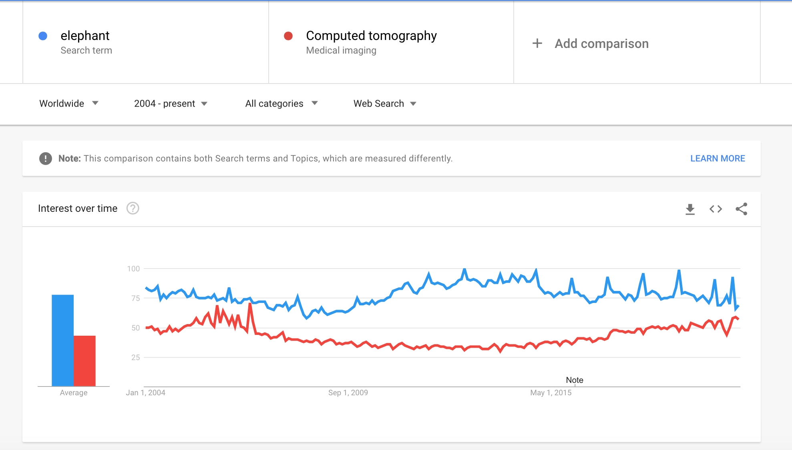
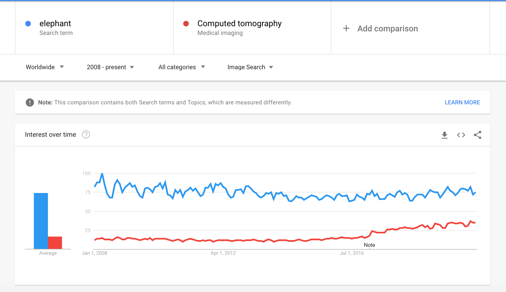
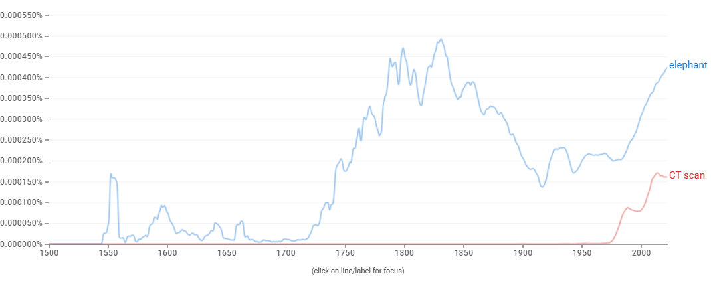

# Proposal for Emoji: CT Scan

**Submitter:** Shuhan He, MD 
**Main point of contact:** Shuhan He 
**Date:** 2026-07-10

## Identification

**Suggested name:** CT Scan 
**Suggested keywords:** computed tomography; imaging; scanner; radiology; scan; hospital; exam; diagnostic; machine; contrast 
**Suggested category:** Objects - medical 
**Suggested sort location:** Near X-Ray in the medical objects subgroup.

## Required Example Images

| Size | Color | Black and white |
| --- | --- | --- |
| 18x18 |  |  |
| 72x72 |  |  |

The paradigm is a circular gantry with an open center and a patient table entering the opening. These structural cues identify a medical scanner without a patient, screen, written control, logo, or facility mark.

The example images are original vector artwork created for this proposal and released under CC0 1.0. Editable SVG sources and the license are included in the public packet:

https://github.com/ShuhanCS/medicalemoji/tree/codex/eligible-2026-slate/submissions/v1.3.0/ct-scan/images

https://github.com/ShuhanCS/medicalemoji/blob/codex/eligible-2026-slate/submissions/v1.3.0/ARTWORK-LICENSE.md

## Factors for Inclusion

### A. Multiple usages

CT Scan supports conversations about medical imaging, an upcoming scan, waiting for results, radiology, emergency evaluation, follow-up, contrast preparation, and diagnostic testing. Patients, families, clinicians, researchers, and students use `CT` and `computed tomography` in both routine and urgent contexts.

The scanner can also represent cross-sectional imaging and radiology more generally when the exact modality is clear from context. It communicates the procedure and machine, which is different from sharing or discussing the resulting image.

### B. Use in sequences

- CT Scan + calendar: scheduled scan or appointment.
- CT Scan + hourglass: waiting for imaging or results.
- CT Scan + hospital: radiology department or emergency imaging.
- CT Scan + warning: urgent scan or preparation concern.
- CT Scan + brain, lungs, or another body part: region being scanned.
- CT Scan + document or check mark: report available or results reviewed.

### C. Breaks new ground

X-Ray represents a radiographic image, not a CT scanner or tomographic examination. Hospital identifies a place, and Camera does not convey medical imaging. CT Scan would add a recognizable diagnostic machine and an action commonly discussed as an appointment, procedure, and result-producing event.

### D. Distinctiveness

The large circular gantry and narrow table form a strong front-facing silhouette. It differs from X-Ray's flat radiograph and from household appliances with circular doors because the table visibly enters the central opening. The same features remain legible in black-and-white and at 18x18.

### E. Expected usage level

The required evidence covers general web results, video results, long-term Web and Image Trends interest, and published-book usage. The archived Trends captures use the formal synonym `computed tomography` and compare it with Unicode's reference term `elephant`.

| Evidence | Result in included capture | Reproducible URL |
| --- | --- | --- |
| Google Search | About 488,000,000 results for `CT scan`; captured 2020-12-18 | https://www.google.com/search?q=CT+scan&hl=en&num=10&pws=0 |
| Google Video Search | About 1,860,000 results for `CT scan`; captured 2020-12-18 | https://www.google.com/search?tbm=vid&q=CT+scan&hl=en&num=10&pws=0 |
| Google Trends Web Search | Worldwide, 2004-present; sustained `computed tomography` interest below `elephant`; captured 2020-12-18 | https://trends.google.com/trends/explore?date=all&q=elephant,computed%20tomography |
| Google Trends Image Search | Worldwide, 2008-present; sustained image-search interest below `elephant`; captured 2020-12-18 | https://trends.google.com/trends/explore?date=all_2008&gprop=images&q=elephant,computed%20tomography |
| Google Books Ngram Viewer | English, 1500-2022; recent `CT scan` usage is substantial and below but of the same order as `elephant`; captured 2026-07-10 | https://books.google.com/ngrams/graph?content=elephant%2CCT%20scan&year_start=1500&year_end=2022&corpus=en&smoothing=3 |

**Google Search**

**Google Video Search**

**Google Trends - Web Search**

**Google Trends - Image Search**

**Google Books Ngram Viewer**

### F. Completeness

Not applicable. CT Scan is independently useful and is not proposed merely to complete a set of imaging modalities or medical devices.

### G. Compatibility

Not applicable. This proposal does not rely on a legacy carrier emoji or another encoded pictograph.

## Factors for Exclusion

### A. Already represented

CT Scan is not adequately represented by X-Ray. X-Ray shows a resulting two-dimensional radiograph; CT Scan represents a different machine, procedure, appointment, and cross-sectional imaging method. General hospital and camera emoji do not resolve that distinction.

### B. Overly specific

Computed tomography is a widely used class of diagnostic imaging rather than a particular scan protocol, body region, disease, manufacturer, facility, or device model. The proposal is for the general scanner and examination.

### C. Open-ended

This proposal does not request every imaging modality. CT Scan is supported by its own frequency, everyday appointment and results language, distinct visual form, and lack of an adequate substitute. Other modalities can be judged independently.

### D. Transient

Computed tomography has been a durable part of medical imaging for decades. The recognizable gantry-and-table form is stable even as scanner technology changes.

### E. Justified only by existing emoji

The proposal does not depend on X-Ray being encoded. X-Ray clarifies a semantic difference; CT Scan's case rests on its own expected usage and expressive gap.

## Other Information

The name `CT Scan` is shorter and more familiar in everyday English than `Computed Tomography Scanner`; the formal term should remain a keyword. Vendors should preserve a visibly open gantry and entering table and should avoid depicting a patient, radiation symbol, or diagnostic result inside the glyph.

Official Unicode proposal guidance:

https://www.unicode.org/emoji/proposals.html
