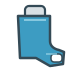
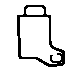
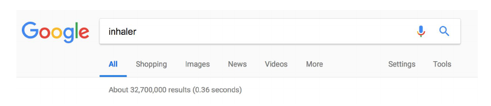
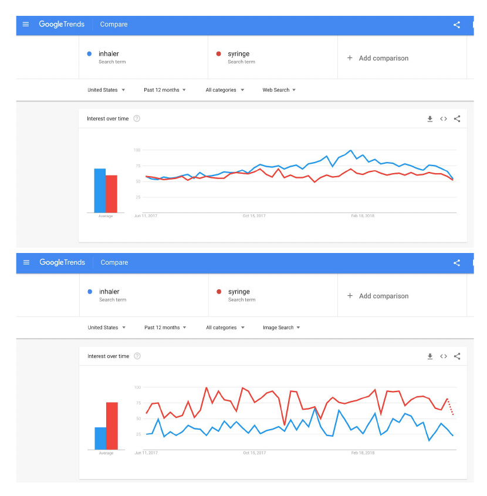
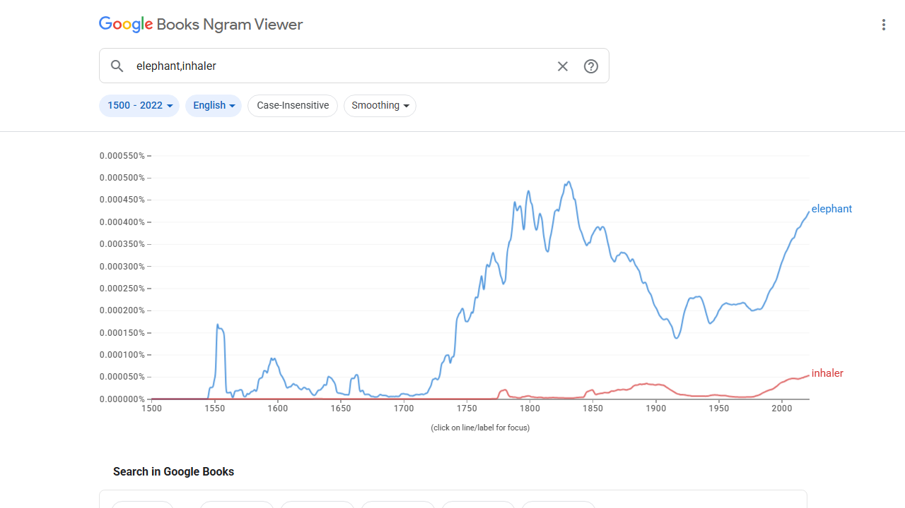

# Proposal for Emoji: Inhaler

**Submitter:** Shuhan He, MD 
**Main point of contact:** Shuhan He 
**Date:** 2026-07-10

## Identification

**Suggested name:** Inhaler 
**Suggested keywords:** puffer; metered dose; medicine; medication; breathing; asthma; COPD; respiratory; rescue; aerosol 
**Suggested category:** Objects - medical 
**Suggested sort location:** Near Pill and Syringe in the medical objects subgroup.

## Required Example Images

| Size | Color | Black and white |
| --- | --- | --- |
| 18x18 |  |  |
| 72x72 |  |  |

The paradigm is a generic metered-dose inhaler with a metal canister projecting above an L-shaped plastic housing and a small mouthpiece opening. It contains no label, dose counter, number, medicine name, logo, or brand-specific detail.

The example images are original vector artwork created for this proposal and released under CC0 1.0. Editable SVG sources and the license are included in the public packet:

https://github.com/ShuhanCS/medicalemoji/tree/codex/eligible-2026-slate/submissions/v1.3.0/inhaler/images

https://github.com/ShuhanCS/medicalemoji/blob/codex/eligible-2026-slate/submissions/v1.3.0/ARTWORK-LICENSE.md

## Factors for Inclusion

### A. Multiple usages

Inhaler supports everyday messages about carrying or finding an inhaler, taking an inhaled medicine, a rescue dose, a routine controller dose, a refill, breathing symptoms, school or sports preparation, travel, and respiratory care. A person can say that an inhaler was forgotten, used, empty, replaced, needed nearby, or packed without naming a disease or drug.

The object is used in home, school, work, exercise, travel, pharmacy, clinic, and emergency contexts. It can refer broadly to inhaled medicine and breathing support while the surrounding text or emoji supplies whether the situation involves asthma, COPD, another respiratory condition, or a general reminder.

### B. Use in sequences

- Inhaler + backpack or briefcase: packed for school or work.
- Inhaler + running person or ball: sports preparation or exercise symptoms.
- Inhaler + airplane or suitcase: travel medication.
- Inhaler + bell or calendar: dose reminder or refill date.
- Inhaler + warning: rescue inhaler needed, empty device, or breathing concern.
- Inhaler + lungs, face exhaling, or hospital: respiratory treatment or care context.

### C. Breaks new ground

No current emoji represents an inhaler or inhaled medicine. Lungs represent anatomy, Face Exhaling represents an action or feeling, Syringe represents injection, and Pill represents swallowed medicine. Inhaler would add a familiar handheld object and a distinct route of medication use without encoding a particular drug or condition.

### D. Distinctiveness

The projecting canister, tall actuator body, bent lower housing, and short mouthpiece form a recognizable L-shaped silhouette. It differs from Syringe's long needle and barrel and from Pill's capsule form. Those structural cues remain visible in the black-and-white and 18x18 examples; color is not required for identification.

### E. Expected usage level

The recovered 2018 proposal provides a traceable Google Search snapshot and archived Web and Image Trends comparisons with `syringe`. The prior Trends scope was United States and twelve months, not the current Worldwide and `elephant` methodology. A fresh Google Video capture and fresh Web and Image Trends captures against `elephant` are therefore required before filing. A new Google Books Ngram comparison is included.

| Evidence | Result in included capture | Reproducible URL |
| --- | --- | --- |
| Google Search | About 32,700,000 results; captured by 2018-06-07 | https://www.google.com/search?q=inhaler&hl=en&num=10&pws=0 |
| Google Video Search | Fresh capture required before filing | https://www.google.com/search?tbm=vid&q=inhaler&hl=en&num=10&pws=0 |
| Google Trends Web Search | Archived United States, 12-month comparison with `syringe`; fresh Worldwide `elephant` comparison required | https://trends.google.com/trends/explore?date=all&q=elephant,inhaler |
| Google Trends Image Search | Archived United States, 12-month comparison with `syringe`; fresh Worldwide `elephant` comparison required | https://trends.google.com/trends/explore?date=all_2008&gprop=images&q=elephant,inhaler |
| Google Books Ngram Viewer | English, 1500-2022; sustained and increasing recent published-book usage below `elephant`; captured 2026-07-10 | https://books.google.com/ngrams/graph?content=elephant%2Cinhaler&year_start=1500&year_end=2022&corpus=en&smoothing=3 |

**Google Search**

**Archived Google Trends - Web and Image Search (reference only; comparator and scope must be replaced)**

**Google Books Ngram Viewer**

### F. Completeness

Not applicable. Inhaler is independently useful and is not proposed merely to complete a set of medication routes, respiratory devices, or medical objects.

### G. Compatibility

Not applicable. This proposal does not rely on a legacy carrier emoji or another encoded pictograph.

## Factors for Exclusion

### A. Already represented

Inhaler is not adequately represented by Lungs, Face Exhaling, Syringe, Pill, or Hospital. Those emoji can provide anatomy, symptom, medicine, or care context but cannot identify the device, carrying it, using it, forgetting it, or refilling it.

### B. Overly specific

The proposal represents the general metered-dose inhaler rather than a particular medicine, dose, brand, device model, disease, or treatment plan. The same recognizable object supports routine, rescue, reminder, travel, pharmacy, and breathing-related uses.

### C. Open-ended

This proposal does not request every respiratory device or medicine-delivery system. The metered-dose inhaler is evaluated on its own recognition, everyday actions, frequency evidence, visual form, and lack of an adequate substitute. Nebulizers, dry-powder devices, and other equipment can be judged independently.

### D. Transient

Metered-dose inhalers have retained the same basic canister, actuator, and mouthpiece form for decades. The proposed generic silhouette does not depend on a temporary product, interface, campaign, or treatment trend.

### E. Justified only by existing emoji

The proposal does not argue that Inhaler should be encoded merely because Pill or Syringe exists. Those emoji clarify distinct routes and uses; Inhaler's case rests on the actions and messages enabled by the device itself.

## Other Information

The earlier public proposal, L2/18-215, was reviewed in 2018 and did not advance. The recorded concern was uncertainty about worldwide recognition and usage. This draft replaces the earlier `Multiple usages: None known` answer with concrete everyday uses, supplies new textless artwork, and identifies the exact global evidence still required before resubmission. The design should remain a generic metered-dose inhaler and should not show a person, face, medicine label, dose counter, or branded color pattern.

Earlier public proposal:

https://www.unicode.org/L2/L2018/18215-inhaler-emoji.pdf

UTC 156 minutes:

https://www.unicode.org/L2/L2018/18183.htm

Official Unicode proposal guidance:

https://www.unicode.org/emoji/proposals.html
