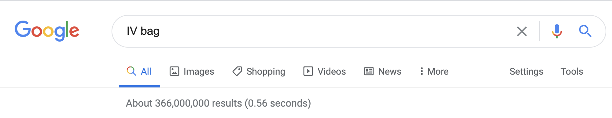
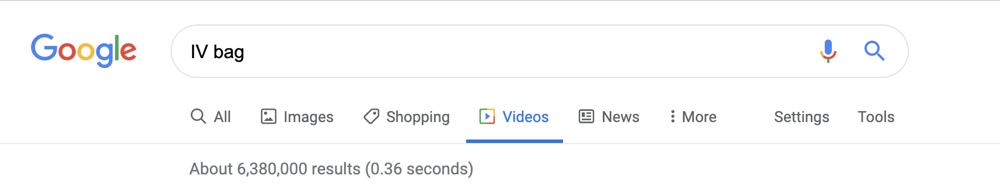
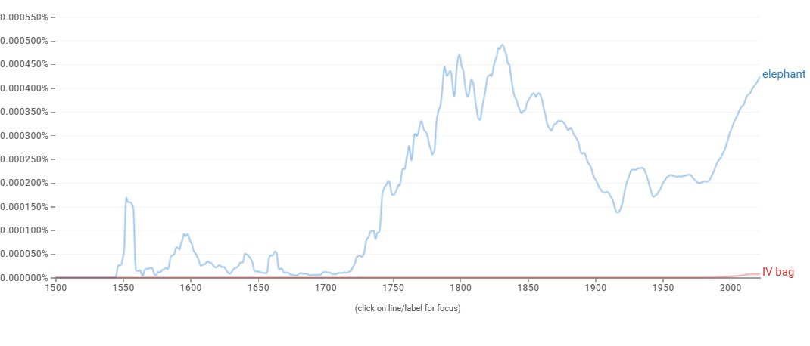

# Proposal for Emoji: IV Bag

**Submitter:** Shuhan He, MD 
**Main point of contact:** Shuhan He 
**Date:** 2026-07-10

## Identification

**Suggested name:** IV Bag 
**Suggested keywords:** intravenous; infusion; drip; fluids; hydration; medicine; hospital; therapy; saline; treatment 
**Suggested category:** Objects - medical 
**Suggested sort location:** Near Syringe in the medical objects subgroup.

## Required Example Images

| Size | Color | Black and white |
| --- | --- | --- |
| 18x18 |  |  |
| 72x72 |  |  |

The paradigm is a hanging clear medical bag with light blue fluid, a visible liquid level, and a short lower tube. It contains no label, number, dosage, logo, or barcode.

The example images are original vector artwork created for this proposal and released under CC0 1.0. Editable SVG sources and the license are included in the public packet:

https://github.com/ShuhanCS/medicalemoji/tree/codex/eligible-2026-slate/submissions/v1.3.0/iv-bag/images

https://github.com/ShuhanCS/medicalemoji/blob/codex/eligible-2026-slate/submissions/v1.3.0/ARTWORK-LICENSE.md

## Factors for Inclusion

### A. Multiple usages

IV Bag supports conversations about intravenous fluids, hydration, infusions, hospital or clinic treatment, medication delivery, an infusion appointment, recovery, and veterinary care. It can express the general experience of "being on an IV" without specifying a drug, diagnosis, or facility.

The concept appears across emergency care, surgery, outpatient infusion, home infusion, and routine fluid replacement. It is also understood as a drip or infusion bag. A general bag allows context to supply whether the contents are saline, medication, nutrition, or another non-blood fluid.

### B. Use in sequences

- IV Bag + droplet: intravenous fluids or hydration.
- IV Bag + hospital: inpatient care or treatment.
- IV Bag + calendar: infusion appointment or treatment schedule.
- IV Bag + pill or syringe: medication infusion.
- IV Bag + person: receiving an IV or supporting a patient.
- IV Bag + pet: veterinary infusion or fluid care.

### C. Breaks new ground

Syringe represents injection or withdrawal with a handheld instrument, not a bag delivering fluid over time. Droplet represents liquid but not intravenous treatment. IV Bag would add infusion as a distinct object and mode of care.

### D. Distinctiveness

The hanging bag, horizontal fluid level, lower port, and tube create a compact medical silhouette. A light or clear fluid differentiates it from Blood Bag in color. In monochrome, Blood Bag's droplet emblem provides the primary distinction, while IV Bag remains unmarked. Vendors may use subtle chamber or tubing cues but should avoid text and tiny measurement scales.

### E. Expected usage level

The recovered evidence documents substantial general-web and video result counts, and the included Ngram documents published-book use. No compliant archived Web or Image Trends captures were recovered, so fresh comparisons with Unicode's `elephant` reference term are required before filing.

| Evidence | Result in included capture | Reproducible URL |
| --- | --- | --- |
| Google Search | About 366,000,000 results; captured 2020-12-18 | https://www.google.com/search?q=IV+bag&hl=en&num=10&pws=0 |
| Google Video Search | About 6,380,000 results; captured 2020-12-18 | https://www.google.com/search?tbm=vid&q=IV+bag&hl=en&num=10&pws=0 |
| Google Trends Web Search | Fresh capture required before filing | https://trends.google.com/trends/explore?date=all&q=elephant,IV%20bag |
| Google Trends Image Search | Fresh capture required before filing | https://trends.google.com/trends/explore?date=all_2008&gprop=images&q=elephant,IV%20bag |
| Google Books Ngram Viewer | English, 1500-2022; established but substantially lower published-book usage than `elephant`; captured 2026-07-10 | https://books.google.com/ngrams/graph?content=elephant%2CIV%20bag&year_start=1500&year_end=2022&corpus=en&smoothing=3 |

**Google Search**

**Google Video Search**

**Google Books Ngram Viewer**

### F. Completeness

Not applicable. IV Bag is independently useful and is not proposed merely to complete a set of hospital equipment or infusion containers.

### G. Compatibility

Not applicable. This proposal does not rely on a legacy carrier emoji or another encoded pictograph.

## Factors for Exclusion

### A. Already represented

IV Bag is not adequately represented by Syringe, Droplet, Hospital, or Pill. Those emoji can supply context but do not identify a hanging infusion, intravenous fluids, or treatment delivered over time.

### B. Overly specific

The concept is a general infusion bag, not a particular medicine, fluid composition, procedure, device manufacturer, or care setting. Its uses span hydration, medication, treatment, and veterinary care.

### C. Open-ended

This proposal does not request every medical container or piece of hospital equipment. IV Bag is supported independently by its familiar form, multiple uses, search evidence, and expressive gap.

### D. Transient

Intravenous infusion is a longstanding and durable form of care. The concept is not tied to a temporary treatment, product, event, or campaign.

### E. Justified only by existing emoji

The proposal does not argue for IV Bag merely because Syringe exists. Syringe clarifies a different treatment mode; IV Bag's case rests on its own uses and evidence.

## Other Information

The artwork should remain generic and text-free. A clear or light blue fluid is a useful default but should not imply a specific solution. IV Bag and Blood Bag are related shapes; they should not both be filed without a deliberate portfolio decision and a small-size distinction test.

Official Unicode proposal guidance:

https://www.unicode.org/emoji/proposals.html
