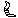
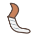
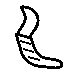
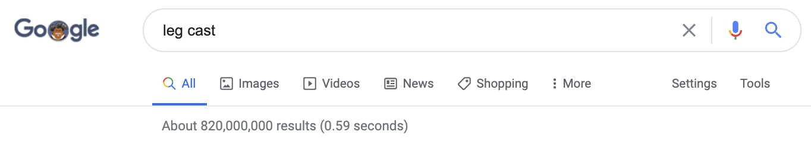
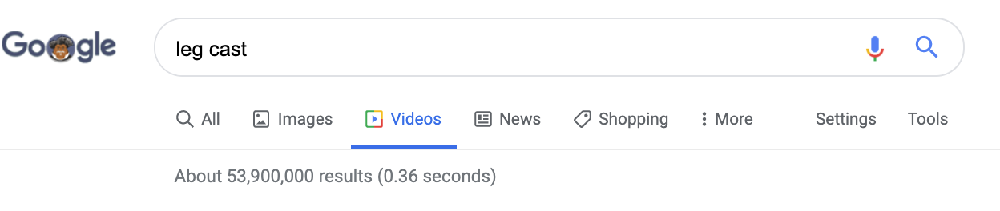
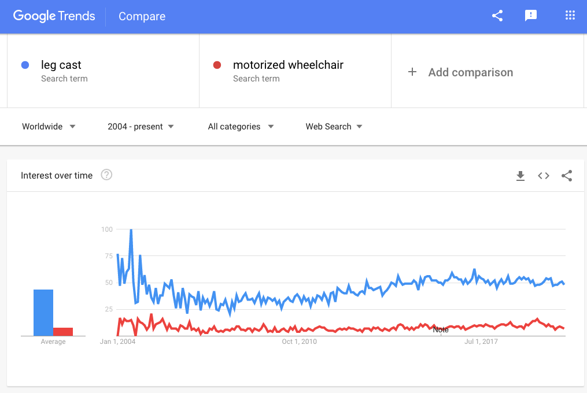
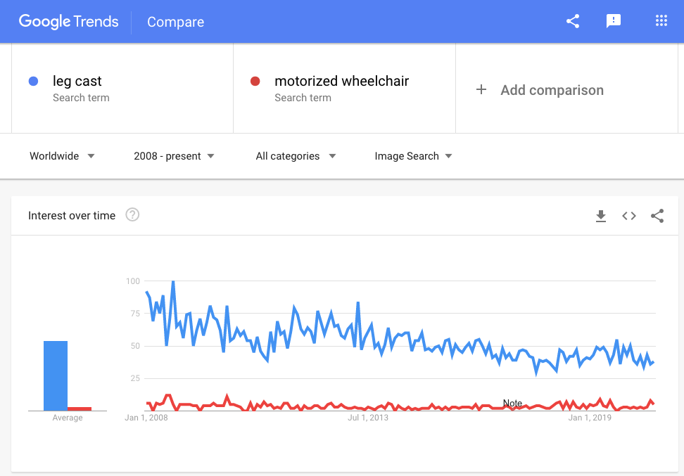
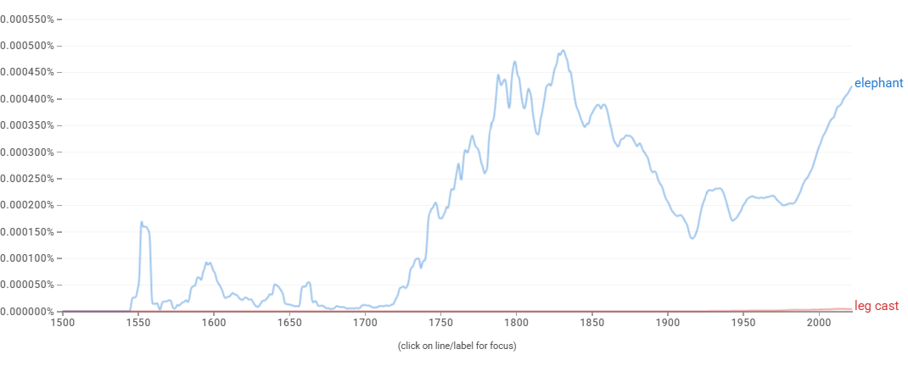

# Proposal for Emoji: Leg Cast

**Submitter:** Shuhan He, MD 
**Main point of contact:** Shuhan He 
**Date:** 2026-07-10

## Identification

**Suggested name:** Leg Cast 
**Suggested keywords:** cast; broken leg; fracture; injury; recovery; orthopedic; plaster; splint; healing; mobility 
**Suggested category:** People & Body - body-parts 
**Suggested sort location:** Near Leg in the body-parts subgroup.

## Required Example Images

| Size | Color | Black and white |
| --- | --- | --- |
| 18x18 |  |  |
| 72x72 |  |  |

The paradigm is a bent lower leg with a white cast wrapping the shin, ankle, and foot. A few diagonal wrap lines clarify the rigid covering without adding text, signatures, or decoration.

The example images are original vector artwork created for this proposal and released under CC0 1.0. Editable SVG sources and the license are included in the public packet:

https://github.com/ShuhanCS/medicalemoji/tree/codex/eligible-2026-slate/submissions/v1.3.0/leg-cast/images

https://github.com/ShuhanCS/medicalemoji/blob/codex/eligible-2026-slate/submissions/v1.3.0/ARTWORK-LICENSE.md

## Factors for Inclusion

### A. Multiple usages

Leg Cast supports conversations about a broken leg, fracture, orthopedic treatment, injury, recovery, follow-up appointments, mobility restrictions, returning to school or work, and the period until a cast is removed. It can express both the physical object and the temporary condition of having one's leg immobilized.

The concept is used in everyday messages among patients, families, classmates, teammates, and coworkers. It is not limited to a particular sport, accident, bone, procedure, or diagnosis. The familiar cast silhouette communicates recovery and restricted movement even when the cause is not specified.

### B. Use in sequences

- Leg Cast + warning: broken leg or acute injury.
- Leg Cast + calendar: healing time, follow-up, or cast-removal date.
- Leg Cast + school or briefcase: returning with a cast or needing accommodation.
- Leg Cast + wheelchair or crutch context: restricted mobility.
- Leg Cast + hospital: orthopedic treatment or follow-up.
- Leg Cast + sparkles or check mark: healing or cast removed.

### C. Breaks new ground

Leg shows an uninjured limb, and Adhesive Bandage represents a small wound covering rather than rigid immobilization. A sequence of Leg plus Adhesive Bandage remains ambiguous and cannot reproduce the full lower-leg cast silhouette. Leg Cast would add a common temporary injury and recovery state.

### D. Distinctiveness

The cast's bright, thick covering around the shin and foot creates a silhouette distinct from the existing bare Leg. Sparse wrap lines remain visible in black-and-white and at 18x18. The design avoids crutches, a wheelchair, or an injury symbol inside the glyph, allowing those ideas to be added in sequences.

### E. Expected usage level

The included evidence documents general-web, video, Web Trends, Image Trends, and published-book use. The archived Trends captures compare `leg cast` with `motorized wheelchair`, not Unicode's `elephant` reference term. Fresh Web and Image Trends captures with `elephant` are required before filing.

| Evidence | Result in included capture | Reproducible URL |
| --- | --- | --- |
| Google Search | About 82,000,000 results; captured 2020-12-18 | https://www.google.com/search?q=leg+cast&hl=en&num=10&pws=0 |
| Google Video Search | About 53,900,000 results; captured 2020-12-18 | https://www.google.com/search?tbm=vid&q=leg+cast&hl=en&num=10&pws=0 |
| Google Trends Web Search | Archived comparison with `motorized wheelchair`; fresh `elephant` comparison required before filing | https://trends.google.com/trends/explore?date=all&q=elephant,leg%20cast |
| Google Trends Image Search | Archived comparison with `motorized wheelchair`; fresh `elephant` comparison required before filing | https://trends.google.com/trends/explore?date=all_2008&gprop=images&q=elephant,leg%20cast |
| Google Books Ngram Viewer | English, 1500-2022; established but substantially lower published-book usage than `elephant`; captured 2026-07-10 | https://books.google.com/ngrams/graph?content=elephant%2Cleg%20cast&year_start=1500&year_end=2022&corpus=en&smoothing=3 |

**Google Search**

**Google Video Search**

**Archived Google Trends - Web Search (reference only; comparator must be replaced)**

**Archived Google Trends - Image Search (reference only; comparator must be replaced)**

**Google Books Ngram Viewer**

### F. Completeness

The exposed skin should support the standard emoji skin-tone modifiers if the character is encoded as a body part. The cast itself should remain neutral in color. This is a defined modifier behavior, not a request for separate cast variants.

### G. Compatibility

Not applicable. This proposal does not rely on a legacy carrier emoji or another encoded pictograph.

## Factors for Exclusion

### A. Already represented

Leg plus Adhesive Bandage does not clearly communicate a rigid cast, fracture recovery, or immobilization. The proposed glyph encodes a single recognizable condition rather than relying on an ambiguous sequence.

### B. Overly specific

Leg Cast represents a common class of orthopedic injury and recovery, not a particular bone, fracture pattern, cast material, accident, sport, or medical service.

### C. Open-ended

This proposal does not request every injury or orthopedic device. Leg Cast is evaluated on its own recognition, everyday use, frequency evidence, and expressive gap.

### D. Transient

Casts and fracture recovery are enduring concepts. An individual's cast is temporary, but the represented idea is no more transient than other encoded states, activities, or medical objects.

### E. Justified only by existing emoji

The proposal does not depend on Leg or Adhesive Bandage being encoded. Those characters demonstrate why an existing sequence is unclear; Leg Cast has independent uses and evidence.

## Other Information

The paradigm should show enough uncovered leg for the anatomy to read while keeping the cast visually dominant. Vendors should avoid written names, signatures, or decorative messages on the cast. The skin-tone requirement and likely similarity to Leg make this a higher-complexity candidate than a standalone medical object.

Official Unicode proposal guidance:

https://www.unicode.org/emoji/proposals.html
