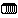
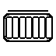
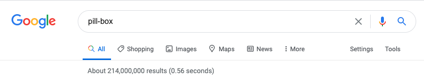
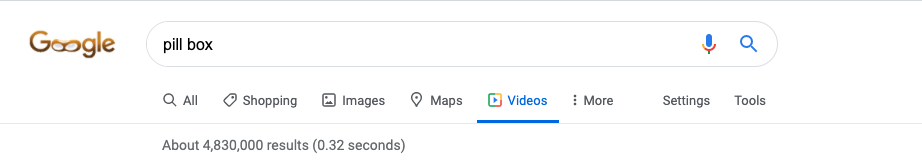
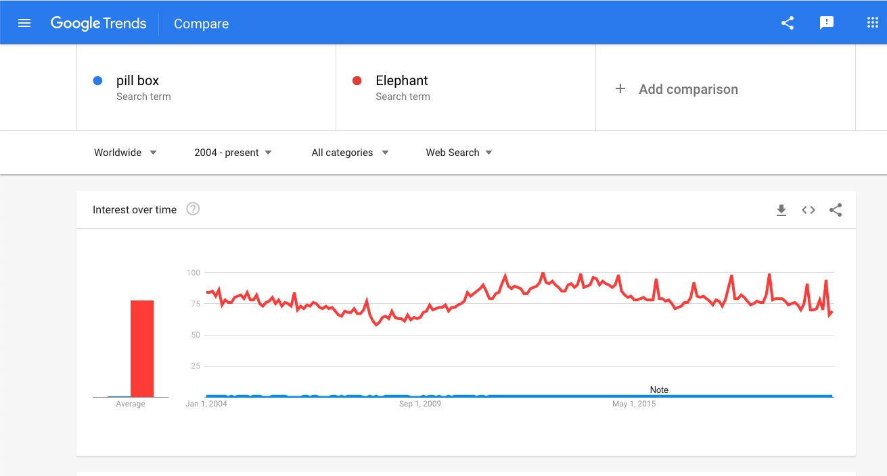
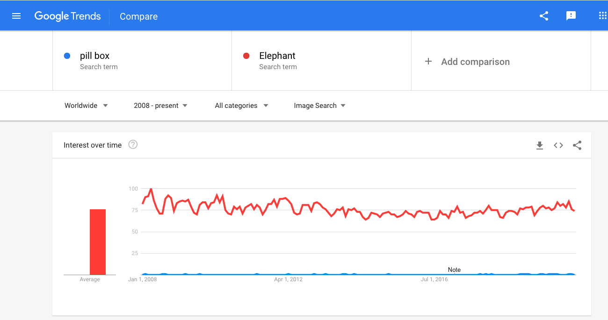
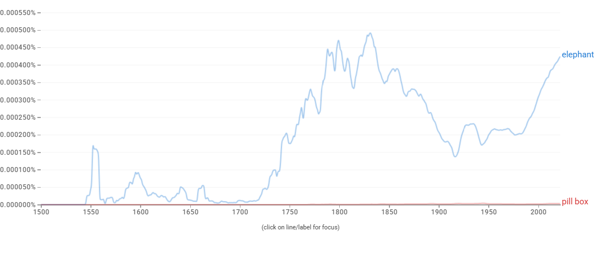

# Proposal for Emoji: Pill Box

**Submitter:** Shuhan He, MD 
**Main point of contact:** Shuhan He 
**Date:** 2026-07-10

## Identification

**Suggested name:** Pill Box 
**Suggested keywords:** pill organizer; medication; medicine; dose; schedule; adherence; weekly; compartments; reminder; prescription 
**Suggested category:** Objects - medical 
**Suggested sort location:** Near Pill in the medical objects subgroup.

## Required Example Images

| Size | Color | Black and white |
| --- | --- | --- |
| 18x18 |  |  |
| 72x72 |  |  |

The paradigm is a reusable organizer with seven adjacent colored compartments and a simple lid line. It contains no day initials, language, numbers, drug labels, logo, or written dosage.

The example images are original vector artwork created for this proposal and released under CC0 1.0. Editable SVG sources and the license are included in the public packet:

https://github.com/ShuhanCS/medicalemoji/tree/codex/eligible-2026-slate/submissions/v1.3.0/pill-box/images

https://github.com/ShuhanCS/medicalemoji/blob/codex/eligible-2026-slate/submissions/v1.3.0/ARTWORK-LICENSE.md

## Factors for Inclusion

### A. Multiple usages

Pill Box represents organizing and remembering medication over time. It supports conversations about preparing doses, checking whether medicine was taken, weekly routines, refilling compartments, helping a family member, packing medicine for travel, and managing more than one daily medication.

The concept is useful to patients, caregivers, families, pharmacists, and anyone using a recurring medicine or supplement. Unlike a particular prescription or condition, the organizer is neutral about what is inside and why it is used.

### B. Use in sequences

- Pill Box + calendar: weekly medication plan or refill day.
- Pill Box + check mark: doses organized or medication taken.
- Pill Box + question mark: uncertain or missed dose.
- Pill Box + person or family: caregiver support or medication setup.
- Pill Box + suitcase or airplane: travel medication organizer.
- Pill Box + bell: medication reminder.

### C. Breaks new ground

Pill represents medicine generally but does not show a recurring schedule, multiple compartments, or organization. Calendar and Bell can add timing but do not identify medication. Pill Box would add the durable concepts of sorting, preparing, and remembering doses.

### D. Distinctiveness

Seven adjacent lidded compartments create a recognizable horizontal organizer in both color and black-and-white. The repeated dividers distinguish it from the single capsule of Pill and from the sealed circular wells of a Pill Pack. The use of seven colors is illustrative only; the form does not depend on day letters or a particular language.

### E. Expected usage level

The required evidence covers general web results, video results, long-term Web and Image Trends interest, and published-book usage. The archived Google Trends captures compare `pill box` with Unicode's reference term `elephant`.

| Evidence | Result in included capture | Reproducible URL |
| --- | --- | --- |
| Google Search | About 214,000,000 results; captured 2020-10-27 | https://www.google.com/search?q=pill+box&hl=en&num=10&pws=0 |
| Google Video Search | About 4,830,000 results; captured 2020-10-27 | https://www.google.com/search?tbm=vid&q=pill+box&hl=en&num=10&pws=0 |
| Google Trends Web Search | Worldwide, 2004-present; persistent interest below `elephant`; captured 2020-10-27 | https://trends.google.com/trends/explore?date=all&q=elephant,pill%20box |
| Google Trends Image Search | Worldwide, 2008-present; persistent image-search interest below `elephant`; captured 2020-10-27 | https://trends.google.com/trends/explore?date=all_2008&gprop=images&q=elephant,pill%20box |
| Google Books Ngram Viewer | English, 1500-2022; established but substantially lower published-book usage than `elephant`; captured 2026-07-10 | https://books.google.com/ngrams/graph?content=elephant%2Cpill%20box&year_start=1500&year_end=2022&corpus=en&smoothing=3 |

**Google Search**

**Google Video Search**

**Google Trends - Web Search**

**Google Trends - Image Search**

**Google Books Ngram Viewer**

### F. Completeness

Not applicable. Pill Box is independently useful and is not proposed merely to complete a set of medication containers.

### G. Compatibility

Not applicable. This proposal does not rely on a legacy carrier emoji or another encoded pictograph.

## Factors for Exclusion

### A. Already represented

Pill cannot clearly express organizing doses, a weekly medication routine, filled compartments, or checking whether a dose was taken. Pill Box supplies a different object and set of actions. Pill Pack overlaps partly and should be compared directly before either is filed.

### B. Overly specific

Pill Box is a common medication organizer, not a particular drug, dosage, prescription, condition, brand, or caregiver service. Its compartments are generic and language-neutral.

### C. Open-ended

This proposal does not request every medicine container. Pill Box is supported independently by its recurring organizational uses, familiar form, frequency evidence, and lack of a clear substitute.

### D. Transient

Reusable pill organizers and medication schedules are durable concepts. The design does not depend on a particular organizer model or temporary technology.

### E. Justified only by existing emoji

The proposal does not argue for Pill Box merely because Pill exists. Pill clarifies the semantic gap; Pill Box's case rests on its own uses and evidence.

## Other Information

The name `Pill Box` is concise, while `pill organizer` should be a primary keyword to disambiguate it from a decorative box. Vendors should preserve multiple compartments and avoid day initials, which would create language and layout problems. Pill Box and Pill Pack should not both be filed in the same round without first choosing the stronger medication-management concept.

Official Unicode proposal guidance:

https://www.unicode.org/emoji/proposals.html
