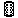
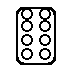
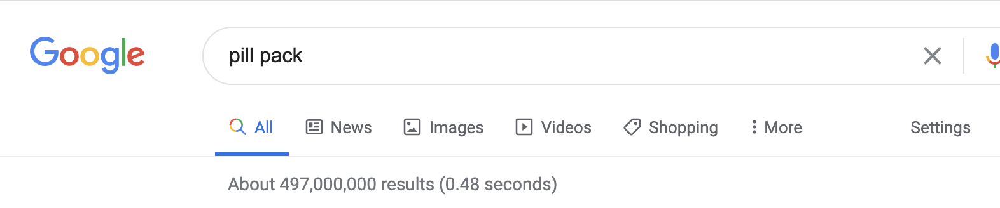
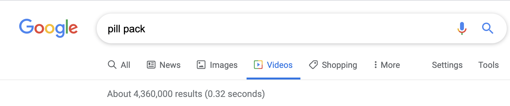
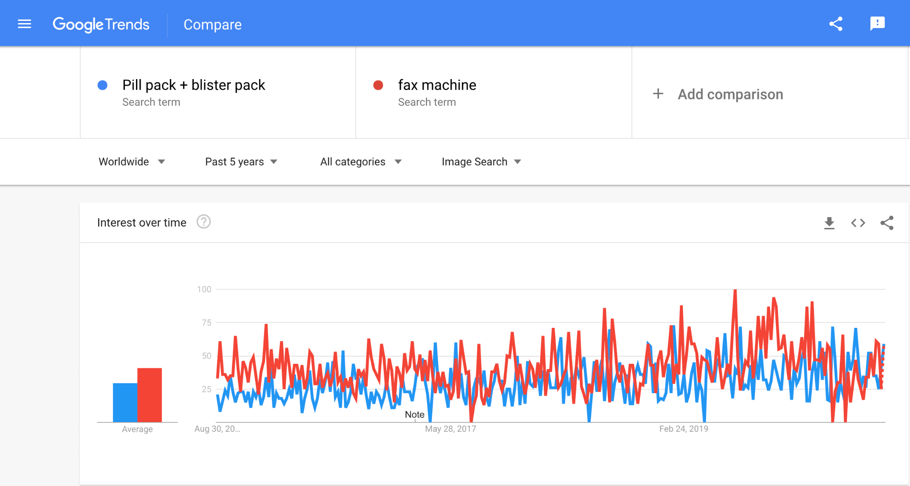
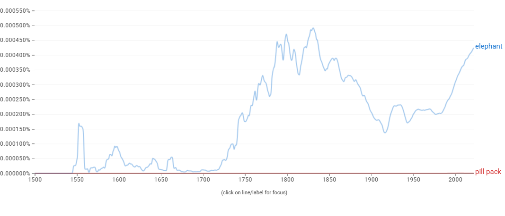

# Proposal for Emoji: Pill Pack

**Submitter:** Shuhan He, MD 
**Main point of contact:** Shuhan He 
**Date:** 2026-07-10

## Identification

**Suggested name:** Pill Pack 
**Suggested keywords:** blister pack; medication; medicine; dose; pharmacy; tablets; prescription; schedule; packaging; treatment 
**Suggested category:** Objects - medical 
**Suggested sort location:** Near Pill in the medical objects subgroup.

## Required Example Images

| Size | Color | Black and white |
| --- | --- | --- |
| 18x18 |  |  |
| 72x72 |  |  |

The paradigm is a silver rectangular blister strip with eight round tablets. It contains no label, number, logo, or written dosage, and the repeated cavities remain legible in monochrome.

The example images are original vector artwork created for this proposal and released under CC0 1.0. Editable SVG sources and the license are included in the public packet:

https://github.com/ShuhanCS/medicalemoji/tree/codex/eligible-2026-slate/submissions/v1.3.0/pill-pack/images

https://github.com/ShuhanCS/medicalemoji/blob/codex/eligible-2026-slate/submissions/v1.3.0/ARTWORK-LICENSE.md

## Factors for Inclusion

### A. Multiple usages

Pill Pack represents medication as a packaged course or set of doses. It supports conversations about starting or finishing a course, remembering whether a dose was taken, refilling medicine, pharmacy dispensing, packing medication for travel, and counting remaining tablets. These uses differ from referring to medicine in the abstract.

Blister packaging is used for prescription and nonprescription products in many countries. The repeated sealed doses visually communicate quantity, sequence, and remaining supply without requiring a specific drug, language, brand, or dosage.

### B. Use in sequences

- Pill Pack + calendar: medication schedule or course of treatment.
- Pill Pack + check mark: dose taken or course completed.
- Pill Pack + question mark: missed dose or uncertainty about medication.
- Pill Pack + airplane or suitcase: travel medication.
- Pill Pack + hospital or pharmacy context: dispensing or refill.
- Pill Pack + warning: packaging problem, interaction concern, or medication caution.

### C. Breaks new ground

Pill represents one capsule or tablet and does not show a packaged sequence of doses. Pill Box represents reusable organization by time or day. Pill Pack would add sealed medication packaging, supporting messages about remaining supply, adherence, dispensing, and a finite course of treatment.

### D. Distinctiveness

The rounded rectangular foil strip and repeated circular cavities form a clear grid at small sizes. The silhouette differs from the single two-color capsule of Pill and from the compartmented, hinged form of a Pill Box. Color is optional; the black-and-white version retains the border and eight raised tablets.

### E. Expected usage level

The included evidence documents general-web, video, image-search, and published-book use. The archived Image Trends chart compares `pill pack` with `fax machine`, not Unicode's `elephant` reference term, and no archived Web Trends chart was recovered. Fresh Web and Image Trends captures with `elephant` are required before filing.

| Evidence | Result in included capture | Reproducible URL |
| --- | --- | --- |
| Google Search | About 497,000,000 results; captured 2020-12-18 | https://www.google.com/search?q=pill+pack&hl=en&num=10&pws=0 |
| Google Video Search | About 4,360,000 results; captured 2020-12-18 | https://www.google.com/search?tbm=vid&q=pill+pack&hl=en&num=10&pws=0 |
| Google Trends Web Search | Fresh capture required before filing | https://trends.google.com/trends/explore?date=all&q=elephant,pill%20pack |
| Google Trends Image Search | Archived comparison with `fax machine`; fresh `elephant` comparison required before filing | https://trends.google.com/trends/explore?date=all_2008&gprop=images&q=elephant,pill%20pack |
| Google Books Ngram Viewer | English, 1500-2022; established but substantially lower published-book usage than `elephant`; captured 2026-07-10 | https://books.google.com/ngrams/graph?content=elephant%2Cpill%20pack&year_start=1500&year_end=2022&corpus=en&smoothing=3 |

**Google Search**

**Google Video Search**

**Archived Google Trends - Image Search (reference only; comparator must be replaced)**

**Google Books Ngram Viewer**

### F. Completeness

Not applicable. Pill Pack is independently useful and is not proposed merely to complete a set of medication containers.

### G. Compatibility

Not applicable. This proposal does not rely on a legacy carrier emoji or another encoded pictograph.

## Factors for Exclusion

### A. Already represented

Pill can represent medicine generally, but it cannot clearly express a blister strip, remaining packaged doses, or a course with multiple sealed units. Pill Pack and Pill Box should nevertheless be compared directly before filing because both compete for some medication-management uses.

### B. Overly specific

The concept is a common medication package, not a particular drug, dose, manufacturer, prescription, or market. The design intentionally omits written information and branding.

### C. Open-ended

This proposal does not request every form of pharmaceutical packaging. The blister strip is evaluated on its own recognition, uses, frequency evidence, and distinction from existing emoji.

### D. Transient

Blister packs are a longstanding form of medication packaging used across languages and health systems. The concept is not tied to a temporary product or campaign.

### E. Justified only by existing emoji

The proposal is not based on the existence of Pill. Pill helps define the expressive gap; Pill Pack's case rests on packaged-course and dose-management uses that a single capsule does not carry.

## Other Information

The artwork should use a compact strip with repeated sealed units and no text. A mix of capsule shapes or colors is unnecessary and could imply multiple drugs. This proposal should not be filed in the same round as Pill Box without first choosing which medication-container concept has the stronger independent demand.

Official Unicode proposal guidance:

https://www.unicode.org/emoji/proposals.html
