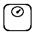
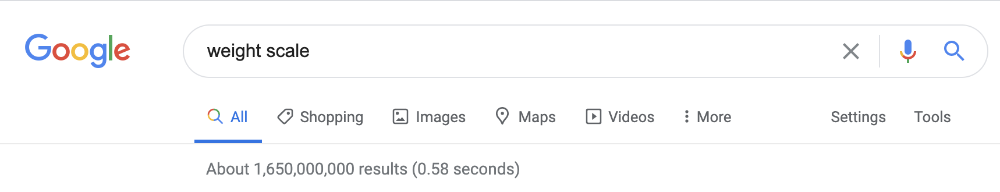
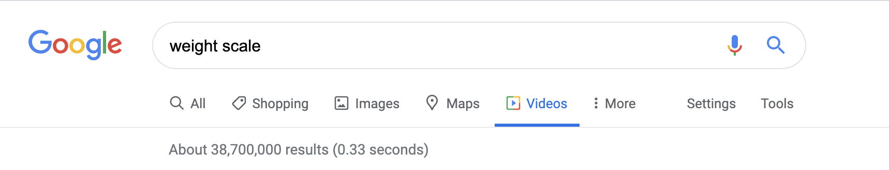
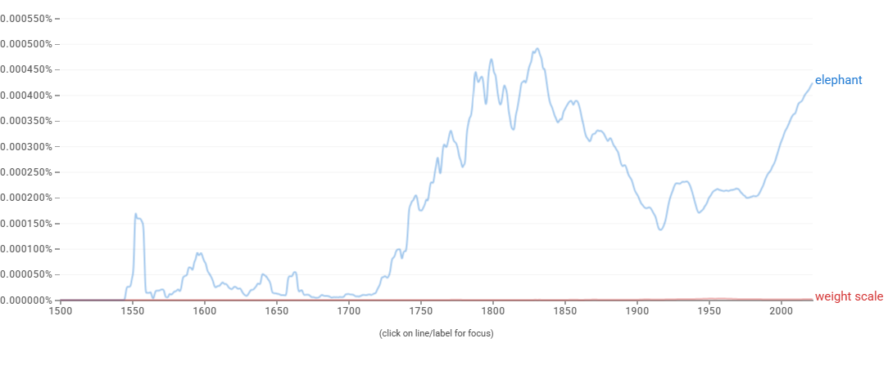

# Proposal for Emoji: Weight Scale

**Submitter:** Shuhan He, MD 
**Main point of contact:** Shuhan He 
**Date:** 2026-07-10

## Identification

**Suggested name:** Weight Scale 
**Suggested keywords:** weighing scale; bathroom scale; body weight; measurement; weigh; fitness; luggage; check-in; tracking; mass 
**Suggested category:** Objects - household 
**Suggested sort location:** Near household measurement objects, distinct from Balance Scale.

## Required Example Images

| Size | Color | Black and white |
| --- | --- | --- |
| 18x18 |  |  |
| 72x72 |  |  |

The paradigm is a low rectangular platform with rounded corners and a circular dial. A pointer rather than a number communicates measurement without embedding a unit, digit, or locale-specific display.

The example images are original vector artwork created for this proposal and released under CC0 1.0. Editable SVG sources and the license are included in the public packet:

https://github.com/ShuhanCS/medicalemoji/tree/codex/eligible-2026-slate/submissions/v1.3.0/weight-scale/images

https://github.com/ShuhanCS/medicalemoji/blob/codex/eligible-2026-slate/submissions/v1.3.0/ARTWORK-LICENSE.md

## Factors for Inclusion

### A. Multiple usages

Weight Scale supports everyday messages about weighing oneself, tracking body weight, a routine checkup, fitness, growth, nutrition, luggage limits, shipping, and whether an object is too heavy. It can stand for the action `weigh`, the measurement `weight`, or the physical appliance.

The concept is not limited to medicine. People use platform scales at home, in gyms, clinics, veterinary settings, travel preparation, and shipping. Context can distinguish body weight from baggage or another measured object without placing a person or number in the emoji itself.

### B. Use in sequences

- Weight Scale + person: weighing oneself or a weight check.
- Weight Scale + chart: tracking change over time.
- Weight Scale + suitcase or airplane: luggage weight or check-in limit.
- Weight Scale + package: shipping weight.
- Weight Scale + hospital: clinical measurement or checkup.
- Weight Scale + pet: veterinary weighing.

### C. Breaks new ground

Balance Scale represents justice, comparison, and a two-pan instrument, not a platform used to measure body or object weight. Chart and ruler emoji do not identify weight. Weight Scale would add the common act of weighing and a familiar household measurement device.

### D. Distinctiveness

The broad floor platform and top dial distinguish the paradigm from Balance Scale's central beam and hanging pans. The shape remains recognizable without a displayed number, so the design avoids units, decimal conventions, and unreadable detail. The circular gauge and pointer survive in the 18x18 and black-and-white examples.

### E. Expected usage level

The recovered evidence documents very large general-web and video result counts, and the included Ngram documents long-term published-book usage. No compliant archived Web or Image Trends captures were recovered, so fresh comparisons with Unicode's `elephant` reference term are required before filing.

| Evidence | Result in included capture | Reproducible URL |
| --- | --- | --- |
| Google Search | About 1,650,000,000 results; captured 2020-12-18 | https://www.google.com/search?q=weight+scale&hl=en&num=10&pws=0 |
| Google Video Search | About 387,000,000 results; captured 2020-12-18 | https://www.google.com/search?tbm=vid&q=weight+scale&hl=en&num=10&pws=0 |
| Google Trends Web Search | Fresh capture required before filing | https://trends.google.com/trends/explore?date=all&q=elephant,weight%20scale |
| Google Trends Image Search | Fresh capture required before filing | https://trends.google.com/trends/explore?date=all_2008&gprop=images&q=elephant,weight%20scale |
| Google Books Ngram Viewer | English, 1500-2022; established but substantially lower published-book usage than `elephant`; captured 2026-07-10 | https://books.google.com/ngrams/graph?content=elephant%2Cweight%20scale&year_start=1500&year_end=2022&corpus=en&smoothing=3 |

**Google Search**

**Google Video Search**

**Google Books Ngram Viewer**

### F. Completeness

Not applicable. Weight Scale is independently useful and is not proposed merely to complete a set of measuring tools.

### G. Compatibility

Not applicable. This proposal does not rely on a legacy carrier emoji or another encoded pictograph.

## Factors for Exclusion

### A. Already represented

Balance Scale is not an adequate substitute. It conventionally represents justice, fairness, and comparison and has a different silhouette. It does not communicate stepping on a scale, checking body weight, or weighing luggage.

### B. Overly specific

Weight Scale is a common household and measurement object with health, fitness, travel, shipping, and veterinary uses. It is not a specific device model, measurement unit, target number, diet, or medical condition.

### C. Open-ended

This proposal does not request every measurement instrument. Weight Scale is supported independently by broad uses, strong search evidence, visual recognition, and a gap not filled by Balance Scale.

### D. Transient

People have used platform scales for routine weighing for generations. The concept is stable even as mechanical dials and digital displays change.

### E. Justified only by existing emoji

The proposal does not depend on Balance Scale's encoding. That emoji clarifies why the two concepts are not interchangeable; Weight Scale's case rests on its own everyday uses and evidence.

## Other Information

The paradigm should remain unit-neutral and number-free. A top dial or a small display area is useful for recognition, but vendors should avoid a specific weight, unit, or health judgment. The name `Weight Scale` avoids confusion with musical scales and Balance Scale.

Official Unicode proposal guidance:

https://www.unicode.org/emoji/proposals.html
