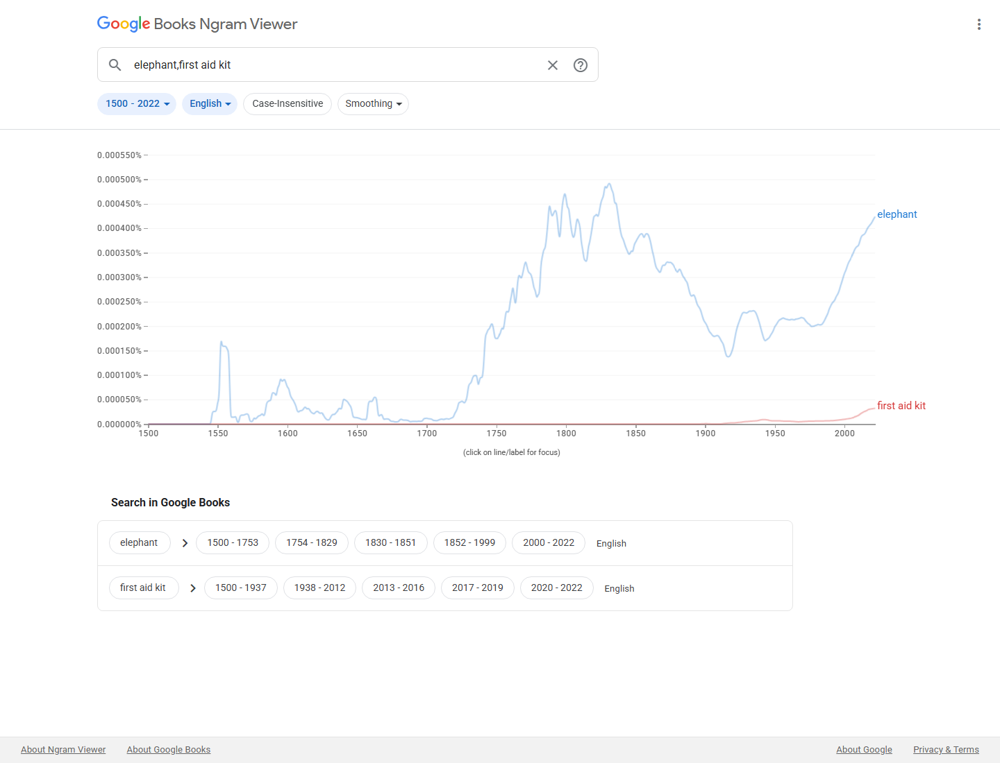

# Proposal for Emoji: First Aid Kit

**Submitter:** Shuhan He, MD 
**Main point of contact:** Shuhan He 
**Date:** 2026-07-10

## Identification

**Suggested name:** First Aid Kit 
**Suggested keywords:** emergency; supplies; care; injury; safety; preparedness; bandage; medicine; kit; rescue 
**Suggested category:** Objects - medical 
**Suggested sort location:** Near Adhesive Bandage in the medical objects subgroup.

## Required Example Images

| Size | Color | Black and white |
| --- | --- | --- |
| 18x18 |  |  |
| 72x72 |  |  |

The paradigm is a portable green handled case with a generic white safety cross. It represents a container of
basic care supplies without showing a protected red cross or red crescent emblem, written label, company
mark, specific product, medicine brand, or exact required contents.

The example images are original vector artwork created for this proposal and released under CC0 1.0.
Editable SVG sources and the license are included in the public packet:

https://github.com/ShuhanCS/medicalemoji/tree/codex/eligible-2026-slate/submissions/v1.4.0/first-aid-kit/images

https://github.com/ShuhanCS/medicalemoji/blob/codex/eligible-2026-slate/submissions/v1.4.0/ARTWORK-LICENSE.md

## Factors for Inclusion

### A. Multiple meanings and usages

First Aid Kit represents immediate basic care, a prepared set of supplies, emergency readiness, workplace
safety, travel preparation, sports and outdoor safety, school and household supplies, disaster kits, field
care, and help available nearby. In conversation it can mean `bring the kit`, `where are the supplies`, `we
are prepared`, `minor injury`, `basic care needed`, or `help is on the way`.

The kit also works figuratively as a compact set of remedies or tools for handling a problem. It is the broad
container-and-supplies concept, not one medication, wound, protocol, or institution.

### B. Use in sequences

- First Aid Kit + warning: emergency supplies or safety alert.
- First Aid Kit + house, school, or office: kit location.
- First Aid Kit + car or airplane: travel safety supplies.
- First Aid Kit + hiking boot or tent: outdoor preparedness.
- First Aid Kit + sports ball: team or event first aid.
- First Aid Kit + check mark: stocked, inspected, or ready.

These are ordinary emoji combinations; no standardized sequence is requested.

### C. Breaks new ground

**Yes.** Adhesive Bandage represents one treatment item, Pill and Syringe represent individual medical
products, and Toolbox represents general repair tools. First Aid Kit adds the distinct concept of a portable,
prepared collection of basic care supplies and supports safety, readiness, location, and response meanings
that no single existing emoji carries.

### D. Distinctiveness

The handled rectangular case and centered cross create a compact, recognizable silhouette. The broad handle,
case outline, and cross remain legible at 18x18 and in true black-and-white. The green-and-white color scheme
separates the concept from an ordinary luggage case while avoiding the protected red cross emblem.

### E. Expected usage level

For 2018-2022, the smoothed English Google Books average for `first aid kit` is approximately `3.13e-7`,
about 7.5 percent of `elephant` (`4.14e-6`). The curve rises over the twentieth century and ends at its highest
level. Because it is below the comparator, the missing Search, Video, and Trends evidence is especially
important to the filing decision.

**Evidence completion notice:** This draft must not be filed until fresh screenshots are inserted for Google
Search, Google Video Search, Google Trends Web Search, and Google Trends Image Search. The current automated
Google session was blocked by a CAPTCHA/rate limit; no result count or chart has been invented.

| Evidence | Current packet result | Reproducible URL |
| --- | --- | --- |
| Google Search | Fresh screenshot and visible result count required; use the grouped multiword query | https://www.google.com/search?q=first-aid-kit&hl=en&num=10&pws=0 |
| Google Video Search | Fresh screenshot and visible result count required; use the grouped multiword query | https://www.google.com/search?tbm=vid&q=first-aid-kit&hl=en&num=10&pws=0 |
| Google Trends Web Search | Fresh Worldwide, 2004-present screenshot against `elephant` required | https://trends.google.com/trends/explore?date=all&q=elephant,first%20aid%20kit |
| Google Trends Image Search | Fresh Worldwide, 2008-present screenshot against `elephant` required | https://trends.google.com/trends/explore?date=all_2008&gprop=images&q=elephant,first%20aid%20kit |
| Google Books Ngram Viewer | Included; `first aid kit` is approximately 0.075x `elephant` in the 2018-2022 smoothed English average | https://books.google.com/ngrams/graph?content=elephant%2Cfirst%20aid%20kit&year_start=1500&year_end=2022&corpus=en&smoothing=3 |

**Google Books Ngram Viewer**

### F. Completeness

Not applicable. First Aid Kit is independently useful and is not proposed to complete an inventory of
medical supplies, emergency equipment, containers, workplace-safety items, or treatments.

### G. Compatibility

Not applicable. This proposal does not depend on a legacy carrier emoji or a high-frequency pictograph in a
particular existing service.

## Factors for Exclusion

### A. Already represented

No existing emoji reliably means a prepared first aid kit. Adhesive Bandage communicates one item or an
injury, while Toolbox ordinarily means mechanical repair. Medical Symbol identifies medicine or health in
general and does not show a portable supply container. Combining these characters still does not provide the
recognizable handled-kit paradigm or the concise meanings `supplies ready` and `first aid here`.

### B. Overly specific

The proposal covers first aid kits across homes, workplaces, schools, vehicles, travel, sports, outdoor
activities, and emergency preparation. It does not prescribe the case, contents, standard, protocol,
organization, manufacturer, or injury.

### C. Open-ended

First Aid Kit is an iconic bundle: one container stands for a broad set of basic care supplies. Its inclusion
would reduce, rather than create, pressure to encode each bandage, wipe, gauze pad, glove, tape roll, cold
pack, or other component. Other specialized medical bags or emergency devices can be assessed independently.

### D. Transient

Portable first aid kits are a durable safety object used across changing products and standards. The handled
case paradigm and readiness meaning do not depend on a current campaign, disaster, brand, app, or short-lived
practice.

### E. Justified only by existing emoji

The proposal does not argue that Adhesive Bandage or Medical Symbol justifies another medical character.
Those comparisons identify the semantic gap; First Aid Kit stands on its own broad uses, distinct container
form, preparedness meaning, and durable role.

## Other Information

The public status sheet has no matching `First Aid Kit` entry as of 2026-07-10. `First Aid Ointment` expired
on 2017-11-30, but ointment is a substance; a kit is a supply container. The International Committee of the
Red Cross explains that its red cross, red crescent, and red crystal emblems are legally protected. This
example therefore uses a generic white cross on green:

https://www.icrc.org/en/law-and-policy/use-emblems

Vendors can vary the green, handle, latches, and proportions while retaining a handled case and generic
non-red safety cross. They should avoid text, a commercial design, or tiny visible contents.

Official Unicode proposal guidance:

https://www.unicode.org/emoji/proposals.html
