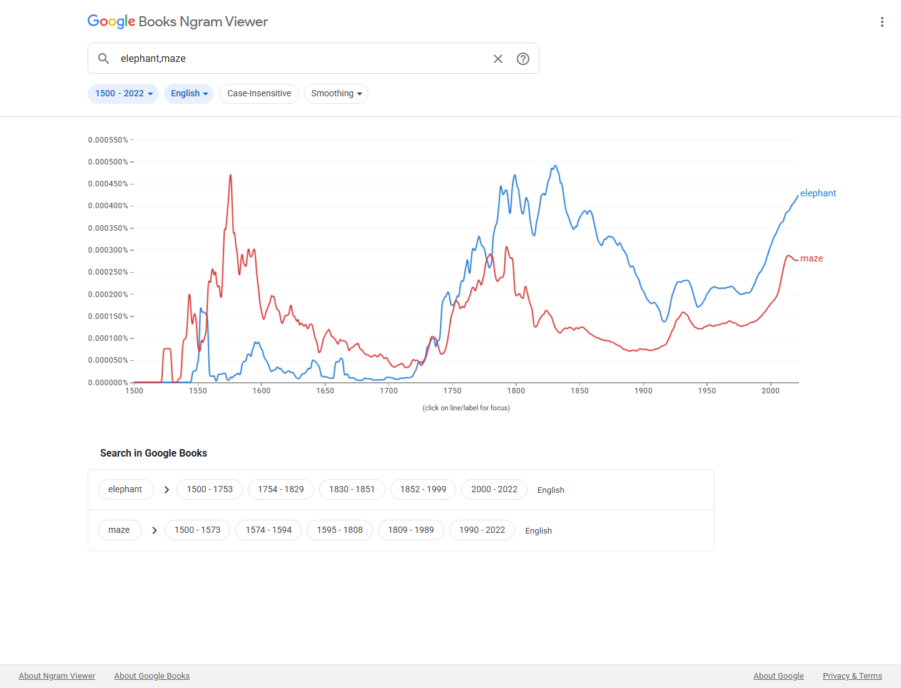

# Proposal for Emoji: Maze

**Submitter:** Shuhan He, MD 
**Main point of contact:** Shuhan He 
**Date:** 2026-07-10

## Identification

**Suggested name:** Maze 
**Suggested keywords:** labyrinth; puzzle; path; route; navigation; choice; complexity; confusion; escape; problem-solving 
**Suggested category:** Activities - game 
**Suggested sort location:** Near Puzzle Piece in the game subgroup.

## Required Example Images

| Size | Color | Black and white |
| --- | --- | --- |
| 18x18 |  |  |
| 72x72 |  |  |

The paradigm is a square labyrinth with broad corridors, a visible entrance, and a visible exit. It is an
ordinary maze rather than a map, floor plan, research apparatus, user-interface icon, logo, or exact puzzle.

The example images are original vector artwork created for this proposal and released under CC0 1.0.
Editable SVG sources and the license are included in the public packet:

https://github.com/ShuhanCS/medicalemoji/tree/codex/eligible-2026-slate/submissions/v1.4.0/maze/images

https://github.com/ShuhanCS/medicalemoji/blob/codex/eligible-2026-slate/submissions/v1.4.0/ARTWORK-LICENSE.md

## Factors for Inclusion

### A. Multiple meanings and usages

Maze names both a physical puzzle and a common metaphor for complexity, confusion, difficult navigation,
and searching for a way through a problem. It can represent paper and book puzzles, garden and hedge mazes,
corn mazes, escape games, level design, route planning, problem-solving exercises, and the experience of
being lost in an unfamiliar place or process.

The same image also supports learning, memory, and decision-making contexts. Those secondary uses do not
limit the proposal to neuroscience or laboratory research; the proposed character is the general maze
paradigm used across recreation, education, navigation, and figurative communication.

### B. Use in sequences

- Maze + thinking face: working through a difficult problem.
- Maze + map or compass: finding a route or navigating a confusing place.
- Maze + person running: maze race, escape game, or obstacle challenge.
- Maze + mouse: behavioral experiment or classic mouse-maze story.
- Maze + school: classroom puzzle or learning exercise.
- Maze + check mark: puzzle solved or way out found.

These are ordinary emoji combinations; no standardized sequence is requested.

### C. Breaks new ground

**Yes.** Puzzle Piece represents one interlocking piece, not a navigable network with multiple routes and dead
ends. Map represents geography, and Compass represents orientation. Maze adds the distinct ideas of a
bounded path puzzle, choosing among alternatives, encountering dead ends, and finding a way through
complexity.

### D. Distinctiveness

The enclosing square, thick right-angle walls, entrance gap, and exit gap produce a recognizable silhouette at
18x18. The corridors remain open enough to survive vendor simplification. The image differs from a QR code
because it uses a small number of broad continuous walls rather than a dense field of modules, and it differs
from Map because it has no folds, roads, labels, or location marks.

### E. Expected usage level

The Google Books comparison provides a durable historical signal. For 2018-2022, the smoothed English corpus
average for `maze` is approximately `2.77e-6`, about 67 percent of `elephant` (`4.14e-6`). The curve shows
sustained use over centuries and a pronounced rise in the late twentieth and early twenty-first centuries.

**Evidence completion notice:** This draft must not be filed until fresh screenshots are inserted for Google
Search, Google Video Search, Google Trends Web Search, and Google Trends Image Search. The current automated
Google session was blocked by a CAPTCHA/rate limit; no result count or chart has been invented.

| Evidence | Current packet result | Reproducible URL |
| --- | --- | --- |
| Google Search | Fresh screenshot and visible result count required | https://www.google.com/search?q=maze&hl=en&num=10&pws=0 |
| Google Video Search | Fresh screenshot and visible result count required | https://www.google.com/search?tbm=vid&q=maze&hl=en&num=10&pws=0 |
| Google Trends Web Search | Fresh Worldwide, 2004-present screenshot against `elephant` required | https://trends.google.com/trends/explore?date=all&q=elephant,maze |
| Google Trends Image Search | Fresh Worldwide, 2008-present screenshot against `elephant` required | https://trends.google.com/trends/explore?date=all_2008&gprop=images&q=elephant,maze |
| Google Books Ngram Viewer | Included; `maze` is approximately 0.67x `elephant` in the 2018-2022 smoothed English average | https://books.google.com/ngrams/graph?content=elephant%2Cmaze&year_start=1500&year_end=2022&corpus=en&smoothing=3 |

**Google Books Ngram Viewer**

### F. Completeness

Not applicable. Maze is independently useful and is not proposed to complete a fixed collection of games,
puzzles, navigation tools, educational activities, or research apparatuses.

### G. Compatibility

Not applicable. The proposal does not depend on a legacy carrier emoji or a high-frequency pictograph in a
particular existing service.

## Factors for Exclusion

### A. Already represented

No existing emoji expresses a bounded network of branching paths, dead ends, and an exit. Puzzle Piece does
not carry navigation or route choice. Map and Compass do not carry puzzle, dead-end, or complexity meanings.
A sequence of those characters asks the reader to infer a maze and cannot show the unifying labyrinth form.

### B. Overly specific

The proposal covers mazes and labyrinths as a broad visual class. It does not specify a named maze, building,
garden, game level, experimental apparatus, corridor count, solution, or cultural site. Vendors can vary the
route while preserving an enclosing form and open corridors.

### C. Open-ended

Maze is not one arbitrary puzzle design among many. Its branching-path structure supports navigation,
complexity, confusion, choice, and escape meanings that a crossword, jigsaw, riddle, or board game does not.
The proposal does not imply that each puzzle type or research apparatus should be encoded.

### D. Transient

Mazes and labyrinths have a long cultural history, and the Ngram curve demonstrates sustained published use.
Their physical and metaphorical meanings do not depend on a current app, game, campaign, or technology.

### E. Justified only by existing emoji

The case does not rest on Puzzle Piece, Map, or Compass already being encoded. Those comparisons define the
remaining semantic gap; Maze stands on its own multiple meanings, distinctive form, frequency evidence, and
durability.

## Other Information

The public status record lists declined Maze rows with `Date Submitted` values of 2018-04-12 and 2020-12-18.
The present proposal is outside the four-year resubmission period by the 2026-07-31 deadline. It uses new
original artwork and a broader general-purpose argument; it does not rely on neuroscience representation,
disease awareness, or another cause as a selection factor.

Vendors should keep the entrance and exit visibly open, use only a few broad corridors at small sizes, and
avoid including a mouse, brain, building, directional arrow, written label, or identifiable real-world maze.

Official Unicode proposal guidance:

https://www.unicode.org/emoji/proposals.html
