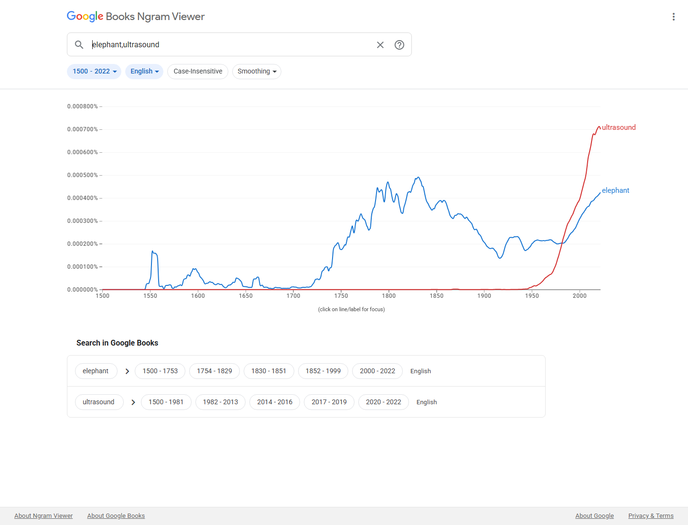

# Proposal for Emoji: Ultrasound

**Submitter:** Shuhan He, MD 
**Main point of contact:** Shuhan He 
**Date:** 2026-07-10

## Identification

**Suggested name:** Ultrasound 
**Suggested keywords:** sonogram; imaging; scan; probe; diagnostic; pregnancy; cardiac; abdomen; point-of-care; echo 
**Suggested category:** Objects - medical 
**Suggested sort location:** Near X-Ray in the medical objects subgroup.

## Required Example Images

| Size | Color | Black and white |
| --- | --- | --- |
| 18x18 |  |  |
| 72x72 |  |  |

The paradigm is a mobile ultrasound monitor with a fan-shaped scan field and a connected handheld probe. It
represents the imaging method and examination without depicting a fetus, patient, body part, diagnosis,
manufacturer, facility, written control, or user-interface screen.

The example images are original vector artwork created for this proposal and released under CC0 1.0.
Editable SVG sources and the license are included in the public packet:

https://github.com/ShuhanCS/medicalemoji/tree/codex/eligible-2026-slate/submissions/v1.5.0/ultrasound/images

https://github.com/ShuhanCS/medicalemoji/blob/codex/eligible-2026-slate/submissions/v1.5.0/ARTWORK-LICENSE.md

## Factors for Inclusion

### A. Multiple meanings and usages

Ultrasound is used for diagnostic imaging, real-time bedside examination, pregnancy and fetal imaging,
cardiac imaging, abdominal and vascular assessment, musculoskeletal imaging, procedural guidance, and
veterinary care. In ordinary conversation it can refer to the appointment, the examination, the machine, the
resulting sonogram, or the act of scanning.

The character would support both clinical and personal messages: scheduling or attending a scan, sharing
that imaging is underway, waiting for a result, discussing a sonogram, teaching imaging, or identifying
ultrasound-guided care. The generic monitor-and-probe paradigm is not limited to pregnancy and does not imply
a particular finding.

### B. Use in sequences

- Ultrasound + calendar: scheduled scan or appointment.
- Ultrasound + pregnant person: prenatal ultrasound.
- Ultrasound + heart: echocardiography or cardiac ultrasound.
- Ultrasound + hospital: hospital or emergency imaging.
- Ultrasound + eyes: looking beneath the surface or examining something not externally visible.
- Ultrasound + document or check mark: report available or result reviewed.

These are ordinary emoji combinations; no standardized sequence is requested.

### C. Breaks new ground

**Yes.** Ultrasound adds the broadly recognized method of real-time imaging with a handheld probe. X-Ray
represents a radiographic image; it does not represent the probe, scanning action, live examination, sonogram
appointment, or procedure guidance. Pregnant Person represents a person or state, not an examination, and
Hospital represents a place rather than an imaging method.

### D. Distinctiveness

The combination of a monitor, fan-shaped scan field, cable, and handheld probe is visually distinctive. The
probe separates the image from an ordinary computer or bedside monitor, while the scan sector separates it
from a television. The same structural cues remain present at 18x18 and in true black-and-white.

### E. Expected usage level

The Google Books comparison supplies a strong durable signal. For 2018-2022, the smoothed English corpus
average for `ultrasound` is approximately `7.05e-6`, about 1.70 times the `elephant` average of `4.14e-6`.
The curve rises sharply after the technology entered widespread use and remains above the comparator at the
end of the available series.

**Evidence completion notice:** This draft must not be filed until fresh screenshots are inserted for Google
Search, Google Video Search, Google Trends Web Search, and Google Trends Image Search. The current automated
Google session was blocked by a CAPTCHA/rate limit; no result count or chart has been invented.

| Evidence | Current packet result | Reproducible URL |
| --- | --- | --- |
| Google Search | Fresh screenshot and visible result count required | https://www.google.com/search?q=ultrasound&hl=en&num=10&pws=0 |
| Google Video Search | Fresh screenshot and visible result count required | https://www.google.com/search?tbm=vid&q=ultrasound&hl=en&num=10&pws=0 |
| Google Trends Web Search | Fresh Worldwide, 2004-present screenshot against `elephant` required | https://trends.google.com/trends/explore?date=all&q=elephant,ultrasound |
| Google Trends Image Search | Fresh Worldwide, 2008-present screenshot against `elephant` required | https://trends.google.com/trends/explore?date=all_2008&gprop=images&q=elephant,ultrasound |
| Google Books Ngram Viewer | Included; `ultrasound` is approximately 1.70x `elephant` in the 2018-2022 smoothed English average | https://books.google.com/ngrams/graph?content=elephant%2Cultrasound&year_start=1500&year_end=2022&corpus=en&smoothing=3 |

**Google Books Ngram Viewer**

### F. Completeness

Not applicable. Ultrasound is independently useful and is not proposed merely to complete a set of medical
imaging modalities, diagnostic tools, or pregnancy-related emoji.

### G. Compatibility

Not applicable. This proposal does not depend on a legacy carrier emoji or an existing proprietary
pictograph.

## Factors for Exclusion

### A. Already represented

Ultrasound is not adequately represented by X-Ray, Hospital, Pregnant Person, or a camera. These characters
can communicate anatomy, a location, pregnancy, or a generic image, but none carries the distinctive
handheld scanning action or the familiar meanings `ultrasound`, `sonogram`, and `echo`. A multi-emoji sequence
also cannot reliably distinguish the imaging method from other appointments or tests.

### B. Overly specific

The proposal covers ultrasound imaging as a broad diagnostic and procedural method. It does not request a
specific probe type, organ study, pregnancy stage, body region, specialty, manufacturer, machine, facility,
image finding, or diagnosis.

### C. Open-ended

The proposal does not argue that every imaging modality should be encoded. Ultrasound has its own high
frequency, real-time handheld scanning action, recognizable probe-and-monitor form, and widespread personal,
clinical, educational, and veterinary uses. CT, MRI, radiography, and other modalities can be evaluated
independently rather than following automatically from this proposal.

### D. Transient

Diagnostic ultrasound has been used for decades. Its monitor-and-handheld-probe paradigm is stable even as
machines become smaller and image quality improves. The Google Books curve shows sustained growth rather
than a short-lived event or campaign.

### E. Justified only by existing emoji

The proposal does not claim that X-Ray or Pregnant Person justifies another medical character. Those
comparisons identify the expressive gap; Ultrasound's case rests on its own usage, distinct action, broad
scope, recognizability, and durability.

## Other Information

The public Unicode proposal-status sheet and current released emoji data contain no matching `Ultrasound` or
`Sonogram` entry as of 2026-07-10. Because automatically declined requests are omitted from the public sheet,
this should be understood as the public-record result rather than proof that no incomplete request was ever
sent.

Vendors should preserve the connected handheld probe and a simple fan-shaped scan field. They should avoid
showing a fetus or other body part, because that would narrow the character to one use and could imply a
medical finding. They should also avoid diagnostic text, waveform labels, a manufacturer-specific console,
or a photorealistic sonogram.

Official Unicode proposal guidance:

https://www.unicode.org/emoji/proposals.html
