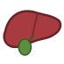
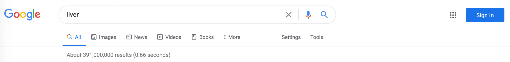
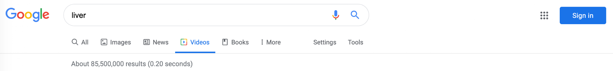
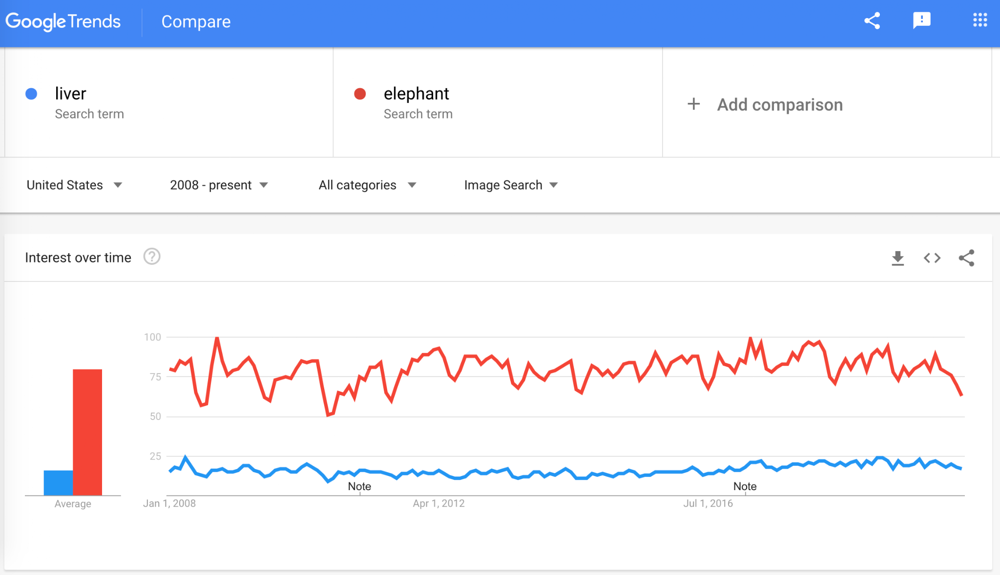

# Proposal for Emoji: Liver

**Submitter:** Shuhan He, MD 
**Main point of contact:** Shuhan He 
**Date:** 2026-07-12

## Identification

**Suggested name:** Liver 
**Suggested keywords:** hepatic; anatomy; organ; metabolism; digestion; bile; alcohol; hepatitis; transplant; donation 
**Suggested category:** People & Body - body-parts 
**Suggested sort location:** Near anatomical heart, lungs, and brain in the body-parts subgroup.

## Required Example Images

| Size | Color | Black and white |
| --- | --- | --- |
| 18x18 |  |  |
| 72x72 |  |  |

The paradigm uses the liver's broad, asymmetrical lobed silhouette with a small gallbladder cue. Vendors may omit the gallbladder if the liver remains recognizable. Fine surface anatomy is unnecessary at emoji scale.

I, Shuhan He, certify that these example images are original work created for this proposal, that I own all IP Rights in them, and that they contain no third-party artwork, logo, trademark, or text. I release the images under the CC0 1.0 Universal Public Domain Dedication and grant the rights required by the Unicode Emoji Proposal Agreement and License.

CC0 1.0: https://creativecommons.org/publicdomain/zero/1.0/

## Factors for Inclusion

### A. Multiple meanings

Not applicable. This proposal does not rely on a metaphorical or symbolic meaning. Its case rests on direct, high-frequency uses across anatomy, metabolism, digestion, testing, medication, donation, transplant, education, and food.

### B. Use in sequences

Liver can combine with existing emoji to create messages without standardized sequences:

- Liver + test tube or chart: liver function test or laboratory results.
- Liver + pill: medication processing, side effects, or treatment.
- Liver + warning or alcoholic drink: liver risk or alcohol-related concern.
- Liver + people or heart: donation, transplant, recipient, caregiver, or support.
- Liver + hospital: hepatology visit, procedure, or inpatient care.
- Liver + plate or cooking pot: liver as food or cooking context.
- Liver + book or microscope: anatomy, school science, or research.

### C. Breaks new ground

**Yes.** No current emoji represents the liver or hepatic anatomy. General medical emoji represent care, tests, or treatment; food and beverage emoji represent consumption; and anatomical heart, lungs, and brain represent different organs. None can identify liver function, liver testing, liver donation, transplant, or liver-specific health discussion. Liver therefore adds a distinct internal-organ concept.

### D. Distinctiveness

The liver has a broad, wedge-like, asymmetrical silhouette with unequal lobes. The proposed paradigm adds a small gallbladder cue in color and a simple lobe division in black and white. It is wider and flatter than the stomach, has no paired symmetry like kidneys or lungs, and does not resemble anatomical heart or brain. The silhouette remains legible at 18x18 without text.

### E. Expected usage level

Liver is used in ordinary conversations about anatomy, laboratory results, medication effects, alcohol, hepatitis, fatty liver, transplant, living donation, school science, animal liver as food, and family health. The five frequency screenshots required by Unicode are embedded below. The table records what each capture shows, its capture date, and its full reproducible URL. Google Trends and Google Books compare `liver` with Unicode's reference term `elephant`.

| Evidence | Result in included capture | Reproducible URL |
| --- | --- | --- |
| Google Search | About 391,000,000 results; captured 2020-07-12 | https://www.google.com/search?q=liver&hl=en&num=10&pws=0 |
| Google Video Search | About 85,500,000 results; captured 2020-07-12 | https://www.google.com/search?tbm=vid&q=liver&hl=en&num=10&pws=0 |
| Google Trends Web Search | United States, 2004 through the 2020 capture date; liver and elephant show comparable average interest in the captured period; captured 2020-07-12 | https://trends.google.com/trends/explore?date=all&geo=US&q=liver,elephant |
| Google Trends Image Search | United States, 2008 through the 2020 capture date; sustained liver image-search interest; captured 2020-07-12 | https://trends.google.com/trends/explore?date=all_2008&geo=US&gprop=images&q=liver,elephant |
| Google Books Ngram Viewer | English, 1500-2022; liver substantially exceeds elephant in recent published-book usage; captured 2026-07-09 | https://books.google.com/ngrams/graph?content=elephant%2Cliver&year_start=1500&year_end=2022&corpus=en&smoothing=3 |

**Google Search**

**Google Video Search**

**Google Trends - Web Search**

**Google Trends - Image Search**

**Google Books Ngram Viewer**

### F. Completeness

Not applicable. Liver is independently useful and is not proposed merely to complete a set of organs.

### G. Compatibility

Not applicable. This proposal does not rely on a legacy carrier emoji or another encoded pictograph.

## Factors for Exclusion

### A. Already representable

Liver is not represented by an existing emoji. Hospital, pill, test tube, warning, food, and beverage emoji can show surrounding contexts but cannot identify the organ or distinguish a liver-specific message.

### B. Overly specific

Liver is a primary organ and a broad everyday concept, not a particular disease, procedure, specialty, organization, campaign, or brand. Its uses span anatomy, metabolism, digestion, testing, medication, alcohol, donation, transplant, food, and education.

### C. Open-ended

This proposal does not request a complete anatomy taxonomy. Liver is supported by its own frequency, multiple usages, visual distinctiveness, and lack of an adequate substitute. Other organs can be judged independently on the same criteria.

### D. Transient

Liver anatomy, function, testing, medication effects, alcohol, disease, donation, transplant, and food uses are durable concepts rather than a temporary event or trend.

### E. Faulty comparison

The proposal does not argue that liver should be encoded merely because other organs exist. Its case rests on its own expected usage, multiple meanings, recognizable silhouette, and expressive gap.

## Other Information

The singular common name `Liver` is concise and searchable. Essential design cues are a broad, asymmetrical, lobed organ silhouette. A green gallbladder or lobe division can improve recognition but is optional. Vendors should avoid excessive realism and preserve a clear outline at 18x18.

Official Unicode proposal guidance:

https://www.unicode.org/emoji/proposals.html
