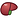
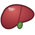
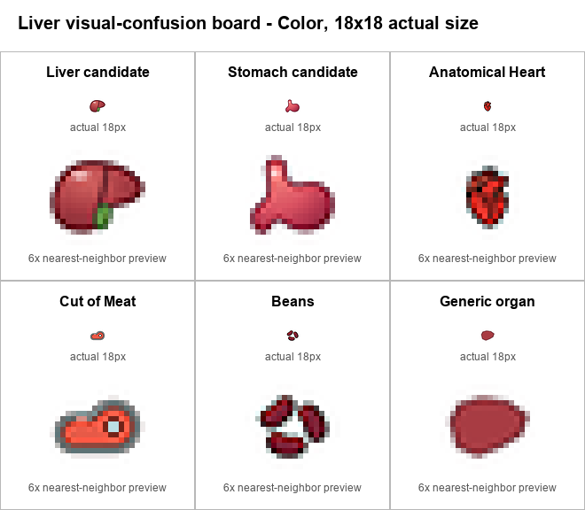
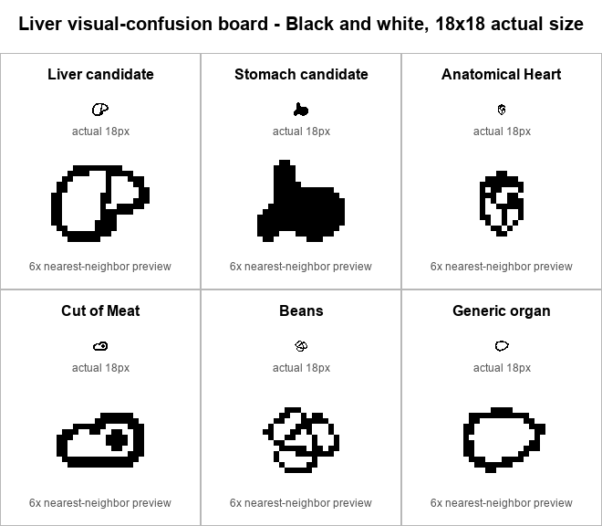
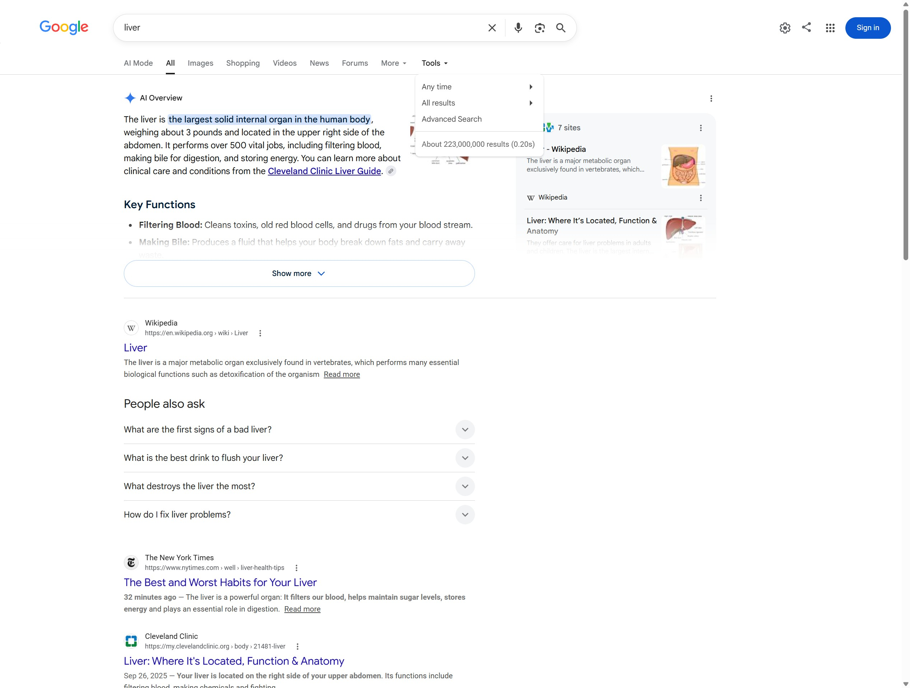
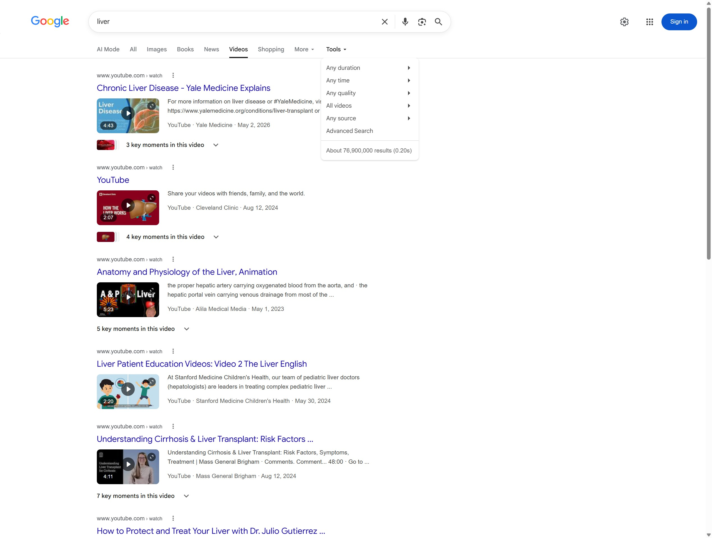
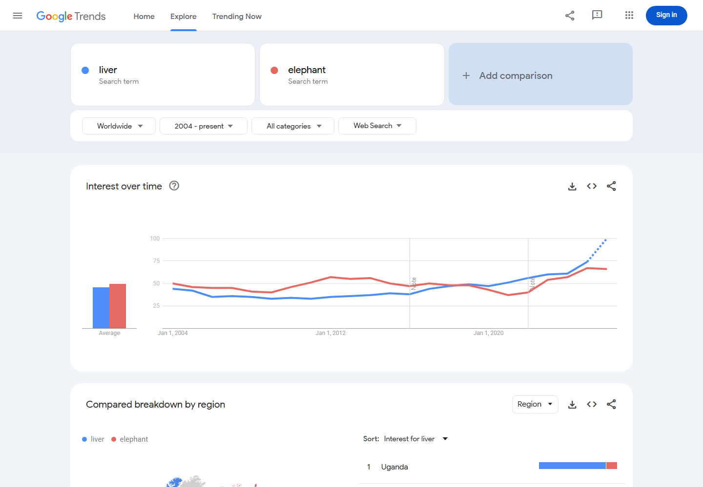
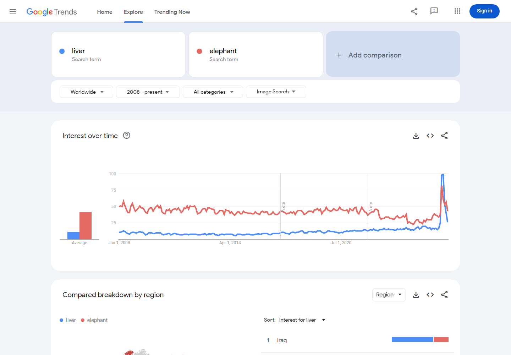
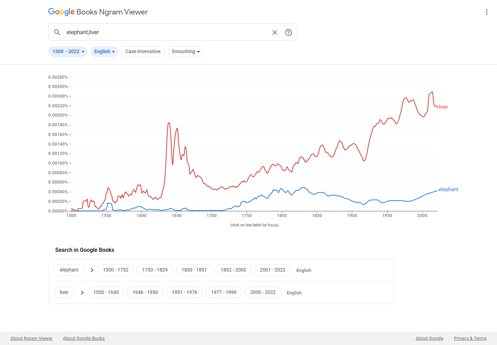

# Proposal for Emoji: Liver

**Submitter:** Shuhan He 
**Main point of contact:** Shuhan He 
**Date:** 2026-07-24

## Identification

**Suggested name:** Liver 
**Suggested keywords:** hepatic; anatomy; organ; bile; digestion; abdomen; lobes 
**Suggested category:** People & Body body-parts 
**Suggested sort location:** Near Anatomical Heart, Lungs, and Brain in the body-parts subgroup.

## Required Example Images

| Size | Color | Black and white |
| --- | --- | --- |
| 18x18 |  |  |
| 72x72 |  |  |

The paradigm uses a broad asymmetric outline, unequal lobes, and a gallbladder cue beneath the inferior edge.
The 18x18 versions strengthen the lobe boundary and gallbladder/notch rather than relying on fine anatomy that
disappears at emoji size. Vendors may vary color and surface detail while preserving those cues.

I, Shuhan He, certify that these example images are original work created for this proposal, that I own all IP
Rights in them, and that they contain no third-party artwork, logo, trademark, or text. I release the images
under the CC0 1.0 Universal Public Domain Dedication and grant the rights required by the Unicode Emoji
Proposal Agreement and License.

CC0 1.0: https://creativecommons.org/publicdomain/zero/1.0/

## Factors for Inclusion

### A. Multiple meanings

Not applicable. The proposal relies on the literal organ, not an uncited metaphorical, cultural, or symbolic
meaning.

### B. Use in sequences

Not applicable. This proposal does not claim positive weight for speculative or uncited sequences.

### C. Breaks new ground

**Yes.** No current emoji identifies the liver. Anatomical Heart and Stomach represent different organs. Cut
of Meat and Beans represent food categories and do not identify anatomy. Hospital, pill, test tube, warning,
and beverage sequences can show surrounding contexts but cannot specify which organ is meant. Liver therefore
adds a distinct literal building block rather than a directional, stylistic, or subtype variant.

The gap is concrete in ordinary literal messages: “my liver tests were abnormal,” “the scan found a liver
lesion,” and “liver anatomy homework.” A test tube, warning, scan, book, or generic medical symbol can convey
part of each context, but none identifies the organ being discussed. The candidate supplies that missing
body-site reference without purporting to encode the test result, diagnosis, or school subject.

The National Cancer Institute defines the liver as a large organ in the upper abdomen and describes its right
and left lobes:
https://www.cancer.gov/publications/dictionaries/cancer-terms/def/liver

### D. Distinctiveness

The candidate uses a wide asymmetric body, a strong division between unequal lobes, and a lower gallbladder
cue. Those features separate it from the J-shaped Stomach, the vessel-bearing Anatomical Heart, the bordered
Cut of Meat, clustered Beans, and a generic organ blob. The following unprompted-test boards show every target
at actual 18x18 size with a nearest-neighbor enlargement for pixel inspection.

The package also contains color and black-and-white 72x72 boards. Human recognition results are not claimed;
the prepared unprompted protocol remains an internal gate before publication.

Anatomical Heart, Cut of Meat, and Beans comparison glyphs are designed by OpenMoji and used under CC BY-SA
4.0: https://openmoji.org/ and https://creativecommons.org/licenses/by-sa/4.0/

### E. Expected usage level

The five required sources are presented below with their exact settings and limitations. The current Worldwide
Trends captures, current Ngram capture, current Google Search capture, and current Google Video Search capture
establish a complete current frequency package for the literal word.

#### Google Search

Captured 2026-07-24 using Google's Web-results view. Google’s rendered **Tools** control is open in the
unmodified screenshot and visibly shows its native total: `About 223,000,000 results (0.20s)`. This volatile
count is a dated query snapshot, not a durable usage metric.

Query: https://www.google.com/search?q=liver&hl=en&num=10&pws=0

#### Google Video Search

Captured 2026-07-24 using Google's Video-results view. Google’s rendered **Tools** control is open in the
unmodified screenshot and visibly shows its native total: `About 76,900,000 results (0.20s)`. This volatile
count is a dated query snapshot, not a durable usage metric.

Query: https://www.google.com/search?udm=7&q=liver&hl=en&num=10&pws=0

#### Google Trends - Web Search

Captured 2026-07-21 using Worldwide, 2004-present, All categories, and Web Search. The chart's long-run average
is 46 for liver and 50 for elephant; liver remains in the same broad range while trailing the comparator
slightly over the full period.

Query: https://trends.google.com/trends/explore?date=all&q=liver%2Celephant

#### Google Trends - Image Search

Captured 2026-07-21 using Worldwide, 2008-present, All categories, and Image Search. Liver trails elephant in
the chart's long-run relative search interest. The recent endpoint is provisional and is not used as a trend
claim.

Query: https://trends.google.com/trends/explore?date=all_2008&gprop=images&q=liver,elephant

#### Google Books Ngram Viewer

Captured 2026-07-21 using the English corpus, 1500-2022, case-sensitive matching, and smoothing 3. The widest
available range shows liver above elephant in recent published-book usage and a durable record across
centuries.

Query: https://books.google.com/ngrams/graph?content=elephant%2Cliver&year_start=1500&year_end=2022&corpus=en&smoothing=3

The 2026 captures were obtained in an unsigned browser session. Full URLs, dates, ranges, locations, modes,
filters, and visible result-count behavior are recorded above and in the evidence notes.

### F. Completeness

Not applicable. Liver is not offered to complete a finite anatomy set.

### G. Compatibility

Not applicable. No legacy-carrier or high-frequency system pictograph is claimed.

## Factors for Exclusion

### A. Already representable

**No existing emoji or sequence identifies the liver.** Stomach and Anatomical Heart name different organs.
Cut of Meat and Beans would shift the message toward food and remain visually and semantically ambiguous.
Generic medical or organ imagery cannot distinguish liver from another body part. A sequence can add context
only after the organ itself is identifiable.

### B. Overly specific

**No.** Liver names the whole organ category, not a disease, procedure, specialty, cell type, segment, campaign,
brand, or exact depiction. The proposal does not ask for liver disease, transplant, donation, cuisine, or any
other narrower context as a separate character.

### C. Open-ended

**No.** This proposal stands on the literal word's own frequency evidence, a distinct organ identity, and a
specific gap that existing emoji cannot fill. It does not claim that an anatomy set is incomplete, and it does
not treat Liver as precedent for adding every internal organ. A future organ candidate would need to establish
its own literal frequency, non-substitutability, and a recognizable visual paradigm; it cannot rely on Liver’s
case. This submission is limited to a whole-organ reference that resolves the concrete body-site ambiguity
described above, not to a taxonomy expansion.

### D. Transient

**No.** The 1500-2022 Ngram comparison provides a long historical record for the literal word rather than a
short-lived campaign or event. The proposal makes no claim based on a temporary disease, awareness drive, or
news cycle.

### E. Faulty comparison

**No.** The existence or importance of Anatomical Heart, Lungs, Brain, or any other emoji does not justify
Liver. The independent case is the literal term's frequency, the remaining semantic gap, and a testable visual
paradigm.

## Other Information

Vendors should preserve a wide asymmetric outline, unequal lobes, and either a visible lower notch or a small
gallbladder cue. Fine vessels, labels, and realistic surface anatomy are unnecessary and may reduce clarity at
18x18.

Official Unicode proposal guidance:
https://www.unicode.org/emoji/proposals.html
