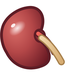
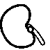
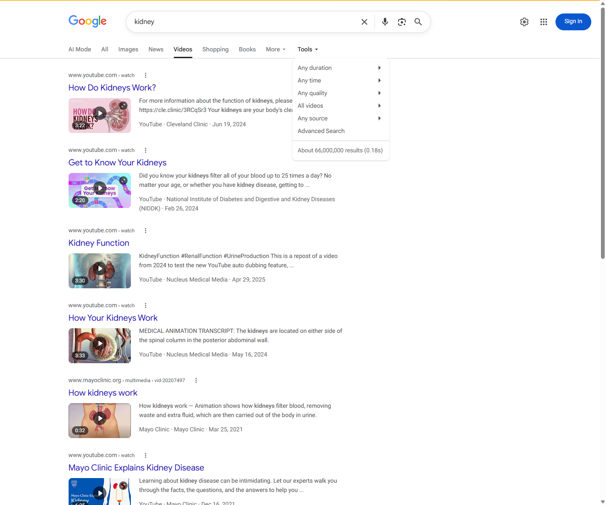
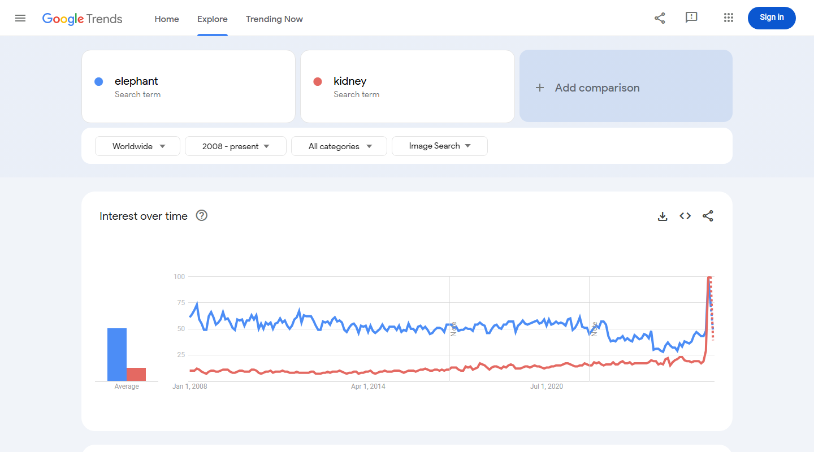

# Proposal for Emoji: Kidney

**Submitter:** Shuhan He; Edgar Lerma; Caitlyn Vlasschaert; Jade M. Teakell; Harish Seethapathy; Jarone Lee; Danielle Miller; Timur Erk; David Rhew; Heena Purohit 
**Main point of contact:** Shuhan He 
**Date:** 2026-07-26

## Identification

**Suggested name:** Kidney 
**Suggested keywords:** renal; anatomy; organ; filtration; urine; hydration; dialysis; transplant; donation; stone; bean-shaped 
**Suggested category:** People & Body - body-parts 
**Suggested sort location:** Near anatomical heart, lungs, and brain in the body-parts subgroup.

## Required Example Images

| Size | Color | Black and white |
| --- | --- | --- |
| 18x18 |  |  |
| 72x72 |  |  |

The paradigm shows one large kidney with a pronounced hilum, a short renal-vessel cue, and a tan ureter. The single bold specimen remains legible at small sizes, while the hilum and plumbing cues distinguish the organ from a food bean. Vendors may simplify shading but should preserve the medial notch and at least one short attached structure.

I, Shuhan He, certify that these example images are original work created for this proposal, that I own all IP Rights in them, and that they contain no third-party artwork, logo, trademark, or text. I release the images under the CC0 1.0 Universal Public Domain Dedication and grant the rights required by the Unicode Emoji Proposal Agreement and License.

CC0 1.0: https://creativecommons.org/publicdomain/zero/1.0/

## Factors for Inclusion

### A. Multiple meanings

Kidney has established meanings beyond a literal anatomical reference. Kidney names kidney beans and appears in the conventional descriptor kidney-shaped for pools, tables, dishes, and other objects. These extended meanings are familiar without depending on a pun or a temporary campaign.

Merriam-Webster records kidney-shaped as an adjective meaning shaped like a kidney: https://www.merriam-webster.com/dictionary/kidney-shaped

### B. Use in sequences

Kidney can combine with existing emoji to create messages without standardized sequences:

- Kidney + droplet: hydration, urine production, or filtration.
- Kidney + warning: kidney stone, abnormal result, or urgent kidney concern.
- Kidney + hospital or pill: kidney care, dialysis, treatment, or medication review.
- Kidney + people or heart: donation, transplant, recipient, caregiver, or support.
- Kidney + book or microscope: anatomy, school science, or laboratory testing.
- Kidney + bean or cooking pot: kidney beans or food context.

### C. Breaks new ground

**Yes.** No current emoji represents the kidneys or urinary-system anatomy. A bean primarily represents food; a droplet is ambiguous among water, sweat, tears, blood, and urine; and hospital, pill, and syringe represent places or interventions rather than the organ. Kidney would therefore add a distinct internal-organ concept and enable messages that cannot be expressed clearly with existing emoji.

### D. Distinctiveness

The large maroon organ body, medial hilum, and attached vessel or ureter make the proposed paradigm visually distinct from the existing beans emoji. Beans are presented as food and have no anatomical plumbing; the proposed image is one wet-organ specimen with a pronounced notch and a short tan ureter. The 18x18 versions preserve the dominant organ silhouette and attachment cue. Color is helpful but not required: the black-and-white example remains identifiable by structure.

### E. Expected usage level

Kidney is used in ordinary conversations about anatomy, hydration, urine, stones, laboratory results, dialysis, transplant, living donation, medication safety, school science, and family health. The five frequency screenshots required by Unicode are embedded below. Google Trends and Google Books compare kidney with Unicode's reference term elephant.

#### Google Search

Captured 2026-05-13. The result page reports about 211,000,000 results. Reproducible query: https://www.google.com/search?q=kidney&hl=en&num=10&pws=0

#### Google Video Search

Captured 2026-05-13. The result page reports about 66,000,000 results. Reproducible query: https://www.google.com/search?tbm=vid&q=kidney&hl=en&num=10&pws=0

#### Google Trends - Web Search

Captured 2026-05-13 using Worldwide and 2004-present. Kidney is of the same order as elephant and reaches comparable or greater recent interest. Reproducible query: https://trends.google.com/trends/explore?date=all&q=elephant,kidney

#### Google Trends - Image Search

Captured 2026-05-13 using Worldwide and 2008-present. The graph shows sustained kidney image-search interest against elephant. Reproducible query: https://trends.google.com/trends/explore?date=all_2008&gprop=images&q=elephant,kidney

#### Google Books Ngram Viewer

Captured 2026-07-09 using the English corpus, 1500-2022, and smoothing 3. Kidney exceeds elephant in recent published-book usage. Reproducible query: https://books.google.com/ngrams/graph?content=elephant%2Ckidney&year_start=1500&year_end=2022&corpus=en&smoothing=3

### F. Completeness

Not applicable. Kidney is independently useful and is not proposed merely to complete a set of organs.

### G. Compatibility

Not applicable. This proposal does not rely on a legacy carrier emoji or another encoded pictograph.

## Factors for Exclusion

### A. Already representable

Kidney is not represented by an existing emoji. Bean cannot serve as a clear substitute in anatomical, donation, transplant, dialysis, testing, or medication contexts. General medical emoji identify care but not the organ.

### B. Overly specific

Kidney is a primary organ and a broad everyday concept, not a particular disease, procedure, specialty, organization, campaign, or brand. Its uses span body anatomy, health, filtration, hydration, stones, donation, transplant, food language, and education.

### C. Open-ended

This proposal does not request a complete anatomy taxonomy. Kidney is supported by its own frequency, multiple meanings, visual distinctiveness, and lack of an adequate substitute. Other organs can be judged independently on the same criteria.

### D. Transient

Kidney anatomy, hydration, stones, disease, dialysis, transplant, donation, and kidney-shaped language are durable concepts rather than a temporary event or trend.

### E. Faulty comparison

The proposal does not argue that kidney should be encoded merely because heart, lungs, or brain exist. Those emoji only demonstrate that anatomical organs can be legible at emoji scale. Kidney's case rests on its own expected usage and expressive gap.

## Other Information

The singular name Kidney is concise and searchable. Essential design cues are one clearly organic maroon form, a medial indentation, and a short vessel or ureter cue that prevents the image from reading as food. Fine vascular detail is optional and should yield to legibility at 18x18.

Official Unicode proposal guidance:

https://www.unicode.org/emoji/proposals.html
