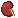
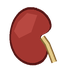
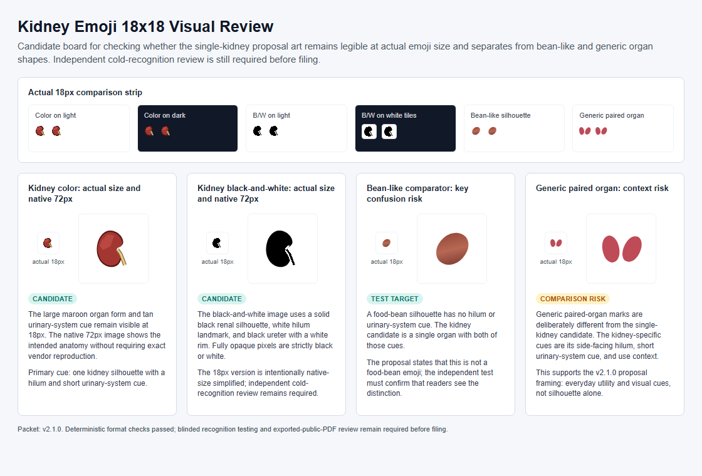
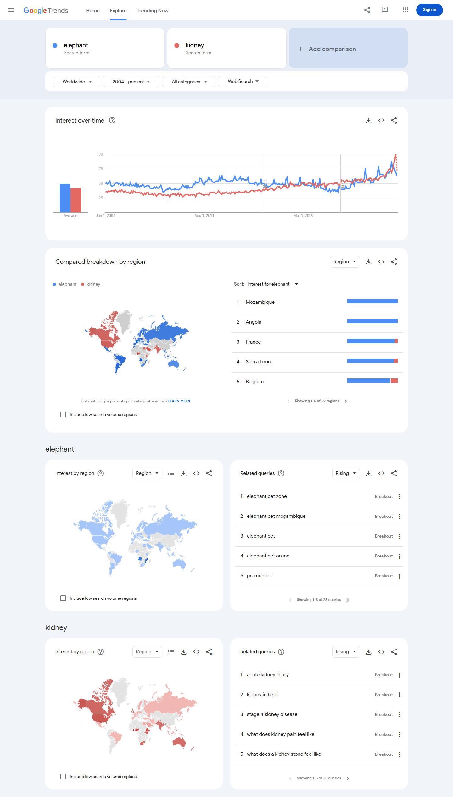
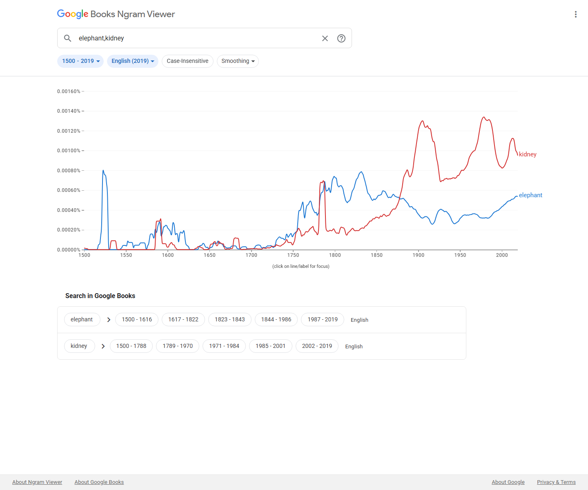

# Proposal for Emoji: Kidney

Title: Proposal for Emoji: Kidney

Submitter: Shuhan He; Edgar Lerma; Caitlyn Vlasschaert; Jade M. Teakell; Harish Seethapathy; Jarone Lee; Danielle Miller; Timur Erk

Main point of contact: Shuhan He

Date: 2026-07-24

### Required Example Images

Color 18x18:

Color 72x72:

Black-and-white 18x18:

Black-and-white 72x72:

### Image License And Rights

The color and black-and-white kidney example artwork was created for the Medical Emoji project from its original vector source. Conductscience Foundation owns the artwork and has granted the submitter the rights required to use it in this Unicode emoji proposal.

The example images are proposal reference artwork, not a request for exact vendor art. The submitter has authorization from Conductscience Foundation to provide the artwork under the Unicode Emoji Proposal Agreement and License:

https://www.unicode.org/emoji/emoji-proposal-agreement.pdf

## 1. Identification

Suggested name: Kidney

Suggested keywords: renal; organ; anatomy; body; urine; filtration; hydration; bean; bean-shaped; stone; health; nephrology; dialysis; transplant; donation; chronic disease; acute injury

Suggested category: People & Body, body-parts.

Suggested sort location: after `lungs` in the body-parts subgroup.

Unicode emoji list and ordering reference:
https://www.unicode.org/emoji/charts/emoji-list.html

The proposed name is `Kidney`. The singular name is the clearest ordinary-language label and is likely to match user search behavior better than `Kidneys`. The example image uses one kidney so its silhouette, hilum, and urinary-system cue remain readable at emoji size; the encoded name remains broad, concise, and easy to find.

## 2. Images

The proposal includes the required color and black-and-white example images at both 18x18 and 72x72 pixels at the top of the first page. The image represents one kidney with a curved organ silhouette, medial hilum, and simple urinary-system cue. This gives vendors a readable anatomical paradigm without requesting an exact rendering.

Artwork source and reproducible vector references are retained in the versioned submission packet. The illustrative images are not required vendor art.

### Essential Visual Cues

The example image is a paradigm image, not a request for exact vendor artwork. To remain recognizable at emoji size, vendor renderings should preserve a curved kidney shape, a visible medial indentation or hilum, and a simple vessel or ureter cue. The image should not read primarily as a food bean, a generic red organ, a logo, or a text-bearing medical icon.

Vendor variation is expected. Vendors may simplify internal details, adjust color, or vary the degree of anatomical realism as long as the result remains recognizably kidney-related at small sizes.

| Visual cue | Importance | Reason |
| --- | --- | --- |
| Single curved kidney with a medial hilum | Required | Carries the core anatomical silhouette without splitting the image into two small forms. |
| A short vessel or ureter cue | Strongly preferred | Signals urinary-system anatomy and distinguishes the image from a food bean. |
| Red, brown, or organ-like color | Optional | Vendors can vary palette if the shape remains legible. |
| Fine vascular detail | Optional | Can be simplified or removed at 18x18. |

## 3. Factors For Inclusion

### A. Multiple Concepts

Kidney is a broad, durable human concept, not a diagnosis, procedure, campaign, or profession. The ordinary-language case comes first: people encounter kidneys in body and school-science discussion, kidney beans and kidney-shaped objects, hydration and body-function discussion, family health updates, and donation or transplant conversations.

The proposal does not suggest that an anatomical kidney replaces the existing bean emoji for food. The contrast is useful precisely because the bean emoji is food-specific, while a kidney image can identify anatomy, body function, and kidney-specific communication. The word's ordinary reach is visible in familiar phrases including kidney bean, kidney-shaped, kidney stone, kidney donor, kidney function, and kidney health.

The proposed emoji supports messages that existing emoji make ambiguous: a kidney with a book can identify anatomy education; a kidney with a droplet can identify kidney function or urine production rather than water or tears; a kidney with a person or family can identify a kidney-specific health update; and a kidney with a hospital can identify donation, transplant, or care involving that organ. These are ordinary building-block uses, not requests for standardized sequences.

Current public-health sources support the durability of the concept without replacing the everyday usage case. WHO describes kidney disease as including acute kidney injury and chronic kidney disease, estimates that 674 million people have chronic kidney disease worldwide, and notes that kidney failure requires dialysis or kidney transplantation to sustain life:

https://www.who.int/news-room/fact-sheets/detail/kidney-disease

The 2025 Lancet Global Burden of Disease analysis estimated that, in 2023, 788 million adults aged 20 years and older had chronic kidney disease and that chronic kidney disease was the ninth leading cause of death globally:

https://doi.org/10.1016/S0140-6736(25)01853-7

CDC's 2026 United States summary estimates that more than 1 in 10 adults aged 18 or older, approximately 37 million people, have chronic kidney disease:

https://www.cdc.gov/kidney-disease/php/data-research/index.html

These health sources are not substitutes for Unicode's required frequency evidence. They explain durability; the emoji case rests on the separate everyday and communicative uses above.

### B. Use In Sequences

The kidney emoji would work as a building block with existing emoji to convey additional concepts without requiring new standardized sequences.

| Message context | Possible emoji composition |
| --- | --- |
| Anatomy class or school science | Kidney plus book, school, or microscope. |
| Hydration, urine production, or filtration | Kidney plus droplet. |
| Kidney-specific family or personal update | Kidney plus person or family. |
| Donation or transplant context | Kidney plus person and hospital. |
| Kidney-function monitoring or medication safety | Kidney plus pill. |

These are ordinary emoji-composition examples. This proposal does not request a standardized ZWJ sequence.

### C. Breaks New Ground

Kidney would add a distinct internal-organ concept that is not currently represented by existing emoji. Existing emoji can imply health care in general, such as hospital, pill, syringe, drop, anatomical heart, lungs, and brain, but none directly represents kidney anatomy, kidney function, kidney disease, dialysis, kidney transplant, living donation, kidney stones, acute kidney injury, or kidney-specific medication safety.

The proposal does not depend on the argument that heart, lungs, or brain already exist. Those emoji are useful context, but the kidney case stands on independent grounds: the kidney is a globally important organ concept with public-health salience, broad everyday and clinical uses, and several communication contexts that existing emoji cannot express clearly.

Current substitutes fail in concrete, predictable ways:

| Existing emoji or sequence | Why it is insufficient |
| --- | --- |
| Bean | Identifies food. It cannot tell a reader that an anatomy lesson, a donor update, or a transplant message concerns a kidney. |
| Droplet | Can mean water, sweat, tears, blood, or urine. It does not identify kidney anatomy or kidney function. |
| Hospital, pill, or syringe | Identifies a place, treatment, or procedure. None identifies the organ involved. |
| Anatomical heart, lungs, or brain | Different organs with different meanings; cannot substitute for kidney-specific communication. |
| Existing sequences | A droplet plus hospital or pill can signal health care, but leaves the reader to infer which organ or body function is being discussed. |

The global and universal case is functional and contextual. Across countries and health systems, kidneys are associated with filtering blood, producing urine, kidney-function testing, dialysis, transplantation, donation, kidney stones, diabetes, hypertension, medication safety, and chronic disease. Those concepts recur in patient education, public-health campaigns, clinical care, organ donation systems, and everyday health conversations even when the exact local illustration style varies.

### D. Distinctiveness

The kidney has a recognizable anatomical form: a curved organ shape, a medial indentation or hilum, and a vessel or ureter cue. The proposal does not claim that a kidney silhouette is as universally iconic as a heart. The example instead uses one large, simplified organ so the core silhouette and a non-food anatomical cue survive at 18x18.

The proposal includes an 18x18 visual review board comparing the kidney rendering against the bean emoji and current anatomical emoji.

The current single-kidney image is the preferred direction because it gives one organ most of the 18x18 frame. Its visible hilum and short ureter cue provide a testable distinction from a bean or generic red shape.

| Distinctiveness question | Proposal answer |
| --- | --- |
| Could it be confused with the bean emoji? | The single organ's hilum, vessel/ureter cue, organ color, and anatomy context distinguish it from a food bean. |
| Could it be confused with anatomical heart, lungs, or brain? | The curved kidney silhouette and side-facing urinary-system cue differ from their organ silhouettes. |
| Does it require exact vendor art? | No. Vendors may simplify the vessel, ureter, and color treatment if the kidney form remains clear. |
| Does it work at 18x18? | The included board shows the native-size candidate beside confusable forms. External cold-recognition review remains the final validation step. |

### E. Expected Usage Level

Expected usage is supported by public search-result, video-result, search-interest, image-search-interest, and corpus evidence. The Trends and Ngram figures compare `kidney` with `elephant`. This evidence establishes that *kidney* is a common, durable term; the preceding sections establish why the concept needs a distinct emoji rather than an existing substitute.

| Evidence source | Query | Captured result | Reproducible URL |
| --- | --- | --- | --- |
| Google Search | `kidney` | About 211,000,000 results | https://www.google.com/search?q=kidney&hl=en&num=10&pws=0 |
| Google Video Search | `kidney` | About 66,000,000 results | https://www.google.com/search?tbm=vid&q=kidney&hl=en&num=10&pws=0 |
| Google Trends Web Search | `elephant,kidney` | Screenshot included below | https://trends.google.com/trends/explore?date=all&q=elephant,kidney |
| Google Trends Image Search | `elephant,kidney` | Screenshot included below | https://trends.google.com/trends/explore?date=all_2008&gprop=images&q=elephant,kidney |
| Google Books Ngram Viewer | `elephant,kidney` | Screenshot included below | https://books.google.com/ngrams/graph?content=elephant%2Ckidney&year_start=1500&year_end=2019&corpus=en-2019&smoothing=3 |

Figure 1. Google Search results for `kidney`:

Figure 2. Google Video Search results for `kidney`:

Figure 3. Google Trends Web Search, `elephant` versus `kidney`:

Figure 4. Google Trends Image Search, `elephant` versus `kidney`:

Figure 5. Google Books Ngram Viewer, `elephant` versus `kidney`:

### F. Completeness

Kidney would fill a practical communication gap, but the proposal does not seek a complete anatomy taxonomy. It combines high term frequency, broad ordinary-language use, distinct body-function and health meaning, a visually testable paradigm, and a clear failure of existing substitutes.

### G. Compatibility

No compatibility claim is currently made. The proposal does not rely on an existing kidney pictograph in a legacy carrier set or another major communication system. If a documented high-usage kidney pictograph is found before submission, this section can be updated with the source and evidence. Otherwise, compatibility should be treated as not applicable.

## 4. Factors For Exclusion

### A. Already Represented

Kidney is not already represented by existing emoji. General medical emoji such as hospital, pill, syringe, and drop can support some kidney-related messages, but they do not identify the kidney. Anatomical heart, lungs, and brain represent different organs and cannot substitute for kidney-specific contexts. The bean emoji is also not an adequate substitute because it represents food and can cause ambiguity in clinical, transplant, donor, public-health, anatomy, and body-function communication.

### B. Overly Specific

Kidney is not overly specific. It is a primary human organ and a broad public-health concept. The proposal is not for a particular disease subtype, treatment brand, advocacy organization, medical specialty logo, campaign ribbon, or procedure. A kidney emoji would cover many contexts across anatomy, physiology, disease, treatment, symptoms, transplant, donation, and everyday health conversations.

### C. Open-Ended

Kidney is not proposed as one member of an organ list. It is proposed only because it combines high term frequency, broad ordinary-language use, distinct health and body-function meaning, a visually testable paradigm, and a clear failure of existing substitutes.

| Criterion | Kidney evidence |
| --- | --- |
| High public frequency | Google Search, Google Video Search, Google Trends Web Search, Google Trends Image Search, and Google Books Ngram Viewer evidence are included in this proposal. |
| Broad ordinary-language use | Kidney appears in body, school-science, food/shape, hydration, family-health, donation, and transplant contexts. |
| Global and durable concept | Kidney function, kidney disease, dialysis, transplantation, diabetes, hypertension, donation, and medication safety recur across countries and health systems. |
| Not clearly substitutable | Bean, droplet, hospital, pill, syringe, heart, lungs, and brain all fail in different contexts. |
| Visually testable | A single kidney shape, medial hilum, and short urinary-system cue are shown at 18x18 beside confusable forms. |

Future concepts would require their own high-frequency use, distinctive visual paradigm, expressive value, and failure of existing substitutes. This proposal does not argue that every organ should become an emoji.

### D. Transient

Kidney is not transient. Kidney health, kidney disease, kidney stones, kidney failure, dialysis, transplantation, living donation, diabetes, hypertension, medication safety, and acute kidney injury are enduring topics. The proposed emoji is not tied to a temporary event, a single campaign year, or a trend.

### E. Justified By An Existing Emoji

This proposal is not justified solely by comparison with existing emoji. The existence of anatomical heart, lungs, or brain can show that anatomical concepts can be represented as emoji, but it does not itself justify kidney. The kidney proposal is based on the organ's own broad meanings, expected usage, visual distinctiveness, public-health relevance, and inability to be represented clearly by existing emoji.

## 5. Other Information

### A. Public-Health And Clinical Context

Kidney-related communication often requires plain, patient-facing language. A simple kidney emoji could make kidney health, transplant, donation, dialysis, testing, hydration, urine, medication safety, and chronic disease messages easier to scan and recognize in ordinary digital communication. This is especially relevant because kidney disease may be asymptomatic until late stages and because kidney failure requires dialysis or transplantation to sustain life.

The proposal does not claim that an emoji will directly improve clinical outcomes. The more defensible claim is that the kidney is a high-utility concept in health communication, patient advocacy, public education, and everyday discussion.

### B. Coalition And Support Materials

The Medical Emoji project has recovered public support materials from nephrology, patient-advocacy, and kidney-health organizations, including a 2026 multi-specialty letter from the American College of Emergency Physicians. They are supplemental professional context only. The expected-usage case rests on public frequency evidence and the communication analysis in this proposal, not on support letters, petitions, hashtags, or social-media requests.

Supplemental support-letter links:

American Association of Kidney Patients:
https://medicalemoji.org/documents/AAKP-Kidney-Emoji-Letter-1.7.22.pdf

American Society of Nephrology:
https://medicalemoji.org/documents/kidney-support-letters/ASN_Long-2.pdf

American Society of Diagnostic and Interventional Nephrology:
https://medicalemoji.org/documents/kidney-support-letters/ASDIN.pdf

Canadian Society of Nephrology:
https://medicalemoji.org/documents/Kidney_Emoji_Letter-1.pdf

Glomerular Disease Study and Trial Consortium / GlomCon:
https://medicalemoji.org/documents/kidney-support-letters/Glomcon.pdf

International Society of Nephrology:
https://medicalemoji.org/documents/kidney-support-letters/ISN.pdf

Kidney Disease: Improving Global Outcomes:
https://medicalemoji.org/documents/The-Unicode-Consortium_Signed.pdf

National Kidney Foundation:
https://medicalemoji.org/documents/kidney-support-letters/NKF-1.pdf

NephJC:
https://medicalemoji.org/documents/NephJC_KidneyEmoji.pdf

Renal Physicians Association:
https://medicalemoji.org/documents/kidney-support-letters/RPA.pdf

Kidney Foundation of Western New York:
https://medicalemoji.org/documents/Kidney-Foundation-of-WNY-kidney-emoji-letter.pdf

Women Nephrology India:
https://medicalemoji.org/documents/Kidney-Emoji-WIN-Letter-Head-V4B-converted.docx

American College of Emergency Physicians (multi-specialty letter of support, 2026-06-05; names the kidney among ten medical concepts relevant to emergency care):
https://medicalemoji.org/documents/ACEP-Medical-Emoji-Support-Letter-2026.pdf
