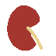
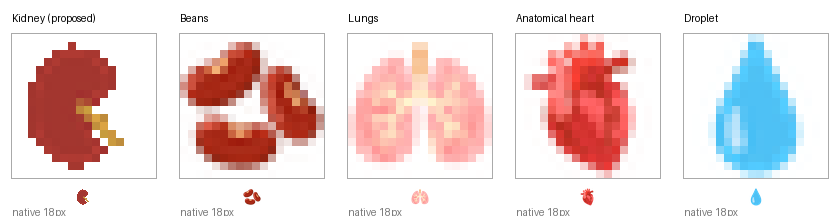
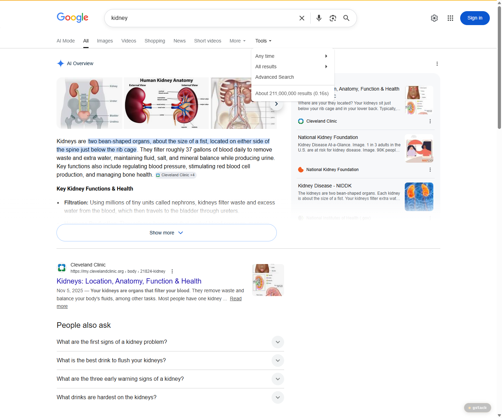

# Proposal for Emoji: Kidney

Submitter: Shuhan He; Edgar Lerma; Caitlyn Vlasschaert; Jade M. Teakell; Harish Seethapathy; Jarone Lee; Danielle Miller; Timur Erk

Main point of contact: Shuhan He

Date: 2026-07-27

## Required Example Images

| Size | Color | Black and white |
| --- | --- | --- |
| 18x18 |  |  |
| 72x72 |  |  |

### Image Rights

The color and black-and-white example artwork was created for this proposal from its original
vector source. It contains no third-party artwork, logo, trademark, or text.

## Identification

Suggested name: Kidney

Suggested keywords: renal; organ; anatomy; body; urine; filtration; bean-shaped; kidney-shaped; stone; dialysis; transplant; donation

Suggested category: People & Body, body-parts

Suggested sort location: after `lungs` in the body-parts subgroup

The singular name `Kidney` is the ordinary-language label and matches likely search behavior better
than `Kidneys`. The example image shows one kidney so that the silhouette, hilum, and urinary cue
stay readable at emoji size.

## Factors for Inclusion

### A. Multiple meanings

Kidney carries a literal organ sense and an established non-medical shape sense. `Kidney-shaped` is
ordinary design and retail vocabulary for kidney tables, kidney desks, kidney trays, and
kidney-shaped swimming pools, used as a product category rather than as a figure of speech. See
[1stDibs kidney-shaped tables](https://www.1stdibs.com/buy/kidney-shaped-table/) and
[Houzz kidney-shaped pools](https://www.houzz.com/photos/mid-century-modern-kidney-shaped-pool-ideas-phbr2-bp~t_727~s_2115~a_42-311).

The shape sense is not marginal. In the English Google Books corpus, `kidney-shaped` reaches a higher
historical peak than `kidney stone` and remains near two-thirds of it in 2022.
[Open the reproducible Ngram query](https://books.google.com/ngrams/graph?content=kidney-shaped%2Ckidney%20stone%2Ckidney%20bean&year_start=1900&year_end=2022&corpus=en&smoothing=3).

The organ sense reaches everyday messages about a stone, a test result, dialysis, a transplant, and
living donation. The shape sense is offered as an additional meaning, not as the basis for encoding.

### B. Use in sequences

Kidney works as a building block with existing emoji. This proposal does not request a standardized
sequence.

| Message context | Composition |
| --- | --- |
| Anatomy or school science | Kidney plus book or microscope |
| Filtration or urine production | Kidney plus droplet |
| A personal or family health update | Kidney plus person |
| Donation or transplant | Kidney plus person and hospital |

### C. Breaks new ground

The [current Unicode Emoji List](https://www.unicode.org/emoji/charts/full-emoji-list.html) has no
Kidney character. Beans is the closest encoded pictograph and Unicode includes `kidney` among its
search keywords, but its CLDR name is `beans` and it remains a Food & Drink pictograph. General
medical emoji add a place, a treatment, or a test without naming the organ.

| Existing emoji | Why it is insufficient |
| --- | --- |
| Beans | Displays and is named as food. It cannot tell a reader that a message concerns an organ. |
| Droplet | Reads as water, sweat, tears, or blood before it reads as urine or filtration. |
| Hospital, pill, syringe | Name a place, a treatment, or a procedure, not the organ involved. |

### D. Distinctiveness

The kidney has a distinctive form: a curved body, a medial hilum, and a short urinary cue. The
example gives one organ most of the frame so the silhouette and hilum survive at 18x18. Vendors may
vary color, shading, and anatomical detail while preserving the curved body, the hilum, and a short
vessel or ureter cue.

| Visual cue | Importance |
| --- | --- |
| Single curved body with a medial hilum | Required |
| A short vessel or ureter cue | Strongly preferred |
| Organ-like color | Optional |
| Fine vascular detail | Optional; removed at 18x18 |

The board below shows the proposed image at 18x18 beside Beans and the encoded organ pictographs it
is most likely to be confused with, each at the same size and again at native scale.

Beans renders as several separate small forms, Lungs as symmetric paired lobes with a top-entering
airway, and Droplet as a smooth teardrop. The single notched body with a short ureter is distinct
from each.

### E. Expected usage level

Writers already send a kidney pictograph. Lacking a Kidney character they substitute Beans:
third-party emoji reference sites index Beans combinations under kidney and nephrology headings.
See [Kidney emoji combinations](https://emojicombos.com/kidney). That is demand expressed
pictographically rather than inferred from word counts.

Kidney also supplies the missing noun in ordinary messages. U.S. patient guidance uses the exact
phrases `kidney stone`, `kidney tests`, `kidney transplant`, and `donate a kidney`; U.K. guidance
uses `kidney transplant tests` and explains dialysis when kidneys can no longer filter normally. See
[Kidney Stone Analysis](https://medlineplus.gov/lab-tests/kidney-stone-analysis/),
[Kidney Tests](https://medlineplus.gov/kidneytests.html),
[Kidney Transplant](https://www.niddk.nih.gov/health-information/kidney-disease/kidney-failure/kidney-transplant),
and [Living Donation](https://www.hrsa.gov/optn/patients/organ-donation/living-donation).

The five required exhibits below test the unfiltered term `kidney` against `elephant`. They are
supporting context, not the primary case. The unfiltered term also captures `kidney bean` and
disease pages, so these counts establish term visibility only.

| Source | Query | Captured result | Reproducible URL |
| --- | --- | --- | --- |
| Google Search | `kidney` | About 211,000,000 results | https://www.google.com/search?q=kidney&hl=en&num=10&pws=0 |
| Google Video Search | `kidney` | About 66,000,000 results | https://www.google.com/search?tbm=vid&q=kidney&hl=en&num=10&pws=0 |
| Google Trends Web | `elephant,kidney` | See Figure 3 | https://trends.google.com/trends/explore?date=all&q=elephant,kidney |
| Google Trends Image | `elephant,kidney` | See Figure 4 | https://trends.google.com/trends/explore?date=all_2008&gprop=images&q=elephant,kidney |
| Google Books Ngram | `elephant,kidney` | See Figure 5 | https://books.google.com/ngrams/graph?content=elephant%2Ckidney&year_start=1500&year_end=2019&corpus=en-2019&smoothing=3 |

Figure 1. Google Search results for `kidney`:

Figure 2. Google Video Search results for `kidney`:

Figure 3. Google Trends Web Search, `elephant` versus `kidney`:

Figure 4. Google Trends Image Search, `elephant` versus `kidney`. Kidney remains below elephant for
most of the displayed range:

Figure 5. Google Books Ngram Viewer, `elephant` versus `kidney`:

### F. Completeness

Not applicable. Internal organs are not a fixed set.

### G. Compatibility

Not applicable. This proposal does not rely on a legacy carrier emoji or another encoded pictograph.

## Factors for Exclusion

### A. Already representable

Beans is the strongest existing substitute and is already used this way, which is the substance of
this factor. The question is not whether a substitute can be improvised but whether it works. Beans
is named `beans`, is categorized under Food & Drink, and displays food. Beans plus Hospital can
suggest kidney care but reads equally as food, diet, or beans at a hospital. Beans plus Rock does
not name `kidney stone`. In each case the reader must first assume that Beans means an organ.

### B. Overly specific

Kidney represents the organ generally. The same noun spans stone analysis, testing, dialysis,
transplantation, and living donation. It is not a disease, procedure, campaign, organization, or
subtype.

### C. Open-ended

The closest unencoded neighbours are Liver, Stomach, Pancreas, and Spleen. This proposal does not
argue that any of them should follow, and it is not filed alongside them.

Kidney is proposed on a bounded rule: an established non-literal sense in ordinary English, a set of
named everyday messages, an existing substitute that demonstrably fails, and a silhouette that stays
legible at 18x18. Kidney is not the raw frequency leader among those neighbours; in English Books
for 2013-2022, `stomach` and `liver` both exceed `kidney`. That is a concession, not a reason to
reorder anything. Encoding Kidney would not establish that a neighbouring organ meets the same
evidence, and each would have to make its own case.

### D. Transient

Kidney is an established anatomical and everyday term rather than a campaign, event, or product.
The Books evidence spans centuries and current patient guidance uses the same noun throughout.

### E. Faulty comparison

Existing organ emoji do not create an entitlement to Kidney. Anatomical heart, lungs, and brain are
used here only as small-size legibility comparisons. The Kidney case rests on its own shape sense,
its named everyday messages, the failure of Beans, the frequency exhibits, and a pictograph that
holds together at 18x18.

## Other Information

The singular name Kidney identifies the organ concept while the example shows one kidney. This
proposal does not request separate singular and plural characters. Vascular detail is omitted at
18x18, where it does not survive, and retained at 72x72.

Official Unicode proposal guidance:

https://www.unicode.org/emoji/proposals.html
