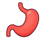
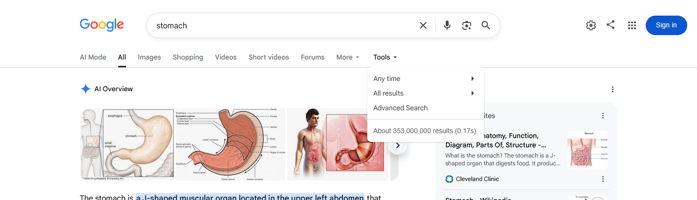
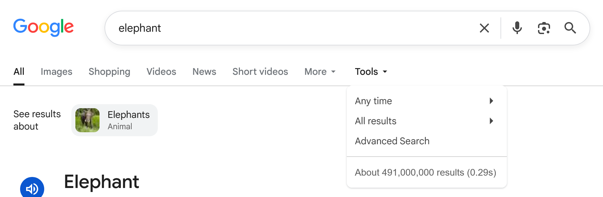
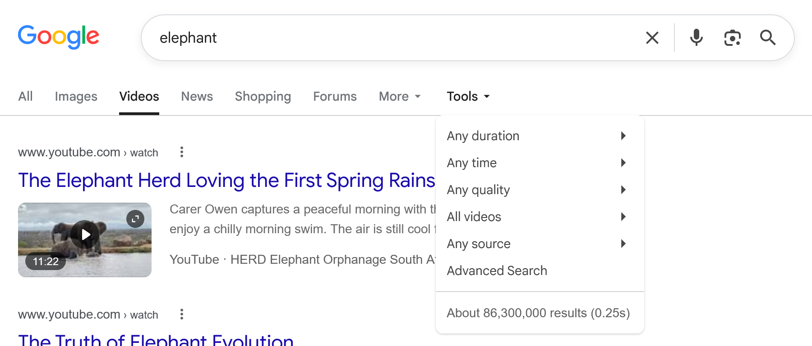
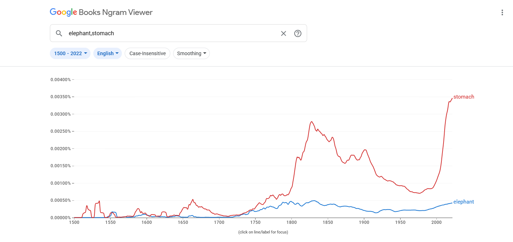
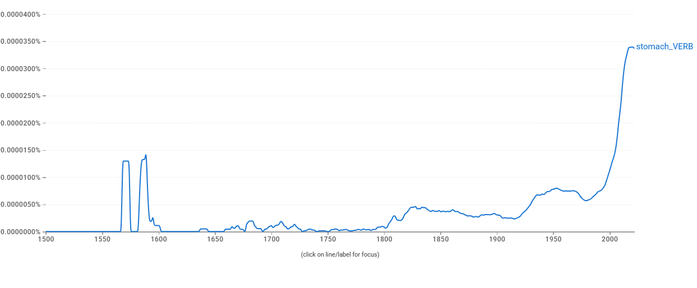
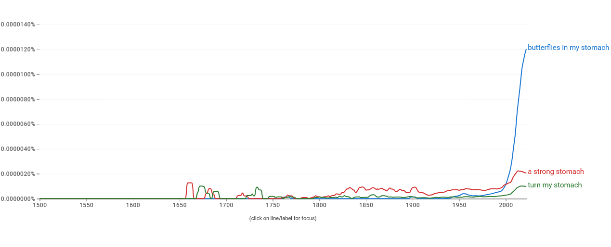

# Proposal for Emoji: Stomach

**Submitter:** Shuhan He, MD; David Rhew, MD (Global Chief Medical Officer and Vice President of Healthcare,
Microsoft); Heena Purohit (Director of AI Startups, Microsoft for Startups) 
**Main point of contact:** Shuhan He 
**Date:** 2026-07-28

## 1. Identification

**CLDR short name:** stomach 
**CLDR keywords:** digestion; gut; belly; abdomen; hunger; appetite; fullness; nausea; indigestion; reflux 
**Category:** People & Body body-parts 
**Sort location:** after Lungs

## 2. Images

|  | 18x18 | 72x72 |
| --- | --- | --- |
| **Color** |  |  |
| **Black and white** |  |  |

**License:** I, Shuhan He, certify that these example images are original work created for this proposal, that
I own all IP Rights in them, and that they contain no third-party artwork, logo, trademark, or text. I release
the images under the [CC0 1.0 Universal Public Domain Dedication](https://creativecommons.org/publicdomain/zero/1.0/)
and grant the rights required by the Unicode Emoji Proposal Agreement and License.

## 3. Reference emoji

Nauseated Face, Worried Face, Butterfly, Fork and Knife, Pregnant Man, Pregnant Person, and the mandated
comparison term Elephant.

## 4. Factors for inclusion

### a. Multiple meanings

Stomach names the organ and everyday body area. Merriam-Webster also records appetite and the verb meaning to
tolerate. Expressions include "butterflies in your stomach," "a strong stomach," "turn my stomach," and being
unable to stomach something. Section 7 documents the verb and idioms in published use.

Sources: [Merriam-Webster](https://www.merriam-webster.com/dictionary/stomach) and
[Cambridge Dictionary](https://dictionary.cambridge.org/us/dictionary/english/stomach).

### b. Use in sequences

Stomach gives existing emoji a precise semantic anchor:

- Stomach + Fork and Knife: fullness or digestion after a meal.
- Stomach + Nauseated Face: an upset stomach.
- Stomach + Butterfly: nervous anticipation, or "butterflies in the stomach."

Without Stomach, the face, utensil, and animal retain unrelated meanings. The proposed character improves
existing emoji by making these compositions precise rather than replacing them.

### c. Breaks new ground

**Yes.** No existing emoji names or depicts the stomach. CLDR 48.2 English annotations have no exact match for
`stomach`, `digestion`, `gut`, `abdomen`, or `nausea`. Related searches fragment across Pregnant Man and
Pregnant Person (`belly`), Nauseated Face (`nauseated`), faces, foods, and Fork and Knife (`hungry`), and Worried
Face (`butterflies`). None represents the organ.

The audit is reproducible against Unicode's pinned
[CLDR 48.2 English annotations](https://raw.githubusercontent.com/unicode-org/cldr/11299982335beb974c1c63c45265184e759c0f41/common/annotations/en.xml).
Stomach adds one body-part building block connecting the organ with digestion, appetite, fullness, tolerance,
and idioms.

### d. Distinctiveness

The image has a J shape, long upper inlet, open inner curve, broad lower body, and short outlet. At 18x18, the
J shape and two openings distinguish it from Beans, Anatomical Heart, Lungs, and Meat on Bone. The comparison
uses nearest-neighbor enlargement to preserve the actual pixels.

The comparison glyphs are open-licensed Noto Emoji and are not part of the proposed artwork.

### e. Usage level

Section 7 supplies the five required empirical measures. `Stomach` is higher in Google Video Search, the
displayed Trends Web average, and recent Books data; `elephant` is higher in Google Search and most of the
Trends Image range. Continuous worldwide and published use supports expected use without claiming pre-encoding
emoji usage.

### f. Completeness

N/A. Internal organs are not a fixed or closed set.

### g. Compatibility

N/A. No high-frequency Stomach pictograph is claimed in Snapchat, X, QQ, a legacy carrier set, or another
popular proprietary system. The CLDR search-routing issue above is an interoperability finding, not a claim of
pre-existing proprietary emoji compatibility.

## 5. Counterarguments to factors for exclusion

### a. Already representable

Nauseated Face expresses illness or disgust; Fork and Knife expresses eating; Butterfly depicts an animal;
Worried Face expresses anxiety; and Pregnant Man or Pregnant Person can express bloating or fullness. None names
the organ, and combinations preserve that ambiguity.

### b. Overly specific

Stomach is the general organ and body-area concept, not a disease, procedure, brand, or subtype. The noun spans
digestion, appetite, fullness, nausea, reflux, tolerance, and idioms.

### c. Open-ended

**No.** The case rests on this noun's independent literal, verbal, and idiomatic range, not an anatomy set. It
makes no claim for Liver, Pancreas, Gallbladder, Spleen, or Intestines and requires no further organs.

### d. Transient

Stomach is not tied to a product, campaign, or event. Section 7 shows the verb in continuous use since the
seventeenth century, durable idioms, and "butterflies in my stomach" rising after 1990.

### e. Faulty comparison

This proposal does not depend on the existence of other body-part emoji. Anatomical Heart, Lungs, Beans, and
other characters are visual or semantic comparators only; none creates an entitlement to encode Stomach.

## 6. Other information

Vendors should preserve the J shape, upper inlet, open inner curve, and short outlet while varying color, angle,
outline, and shading. Fine anatomical detail should yield to clarity at 18x18.

UTS #51 identifies CLDR annotations as data used to search and group emoji. With no Stomach character,
CLDR-based products have no standard target for `stomach` or `digestion`; app-specific images cannot round-trip
as one character across products. Encoding Stomach would give vendors a shared unit and annotation target.
Products may customize CLDR, so this does not claim every picker returns identical results.

Source: [UTS #51, Unicode Emoji](https://www.unicode.org/reports/tr51/).

## 7. Evidence of frequency

Captures used a private browser window, disabled search personalization, and the widest date range available.
Trends used All categories because `stomach` is unambiguous and a health category would distort the required
`elephant` comparison. The data are a dated, reproducible snapshot.

| Source | `stomach` | `elephant` | Finding |
| --- | --- | --- | --- |
| Google Search | 353,000,000 | 491,000,000 | elephant higher |
| Google Video Search | 139,000,000 | 86,300,000 | stomach higher |
| Google Trends, Web Search | higher displayed average | lower displayed average | stomach higher |
| Google Trends, Image Search | lower across most of range | higher across most of range | elephant higher |
| Google Books Ngram | substantially higher recently | lower recently | stomach higher |

### Google Search

Captured 2026-07-26 for `stomach` and 2026-07-27 for `elephant`.
[Open stomach query](https://www.google.com/search?q=stomach&hl=en&filter=0) and
[open elephant query](https://www.google.com/search?q=elephant&hl=en&num=10&pws=0).

### Google Video Search

Captured 2026-07-26 for `stomach` and 2026-07-27 for `elephant`.
[Open stomach video query](https://www.google.com/search?tbm=vid&q=stomach&hl=en&num=10&pws=0) and
[open elephant video query](https://www.google.com/search?tbm=vid&q=elephant&hl=en&num=10&pws=0).

### Google Trends: Web Search

Captured 2026-07-26, Worldwide, 2004-present, All categories. Stomach holds the higher displayed average and
the higher line across most of the range.
[Open comparison](https://trends.google.com/trends/explore?date=all&q=stomach,elephant).

### Google Trends: Image Search

Captured 2026-07-26, Worldwide, 2008-present, All categories. Elephant is higher across most of the range.
Stomach rises above elephant only in the most recent period; no weight is placed on that terminal crossover.
[Open comparison](https://trends.google.com/trends/explore?date=all&gprop=images&q=stomach,elephant).

### Google Books Ngram Viewer

Captured 2026-07-26 using the English corpus, 1500-2022, case-insensitive matching, and smoothing 3. Stomach
substantially exceeds elephant in the latest displayed years.
[Open comparison](https://books.google.com/ngrams/graph?content=elephant%2Cstomach&year_start=1500&year_end=2022&corpus=en&smoothing=3).

### Supplementary Ngram evidence

Captured 2026-07-27 using the English corpus, 1500-2022, and smoothing 3. The first exhibit isolates the tagged
verb; the second documents three idiomatic phrases.

