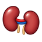
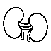
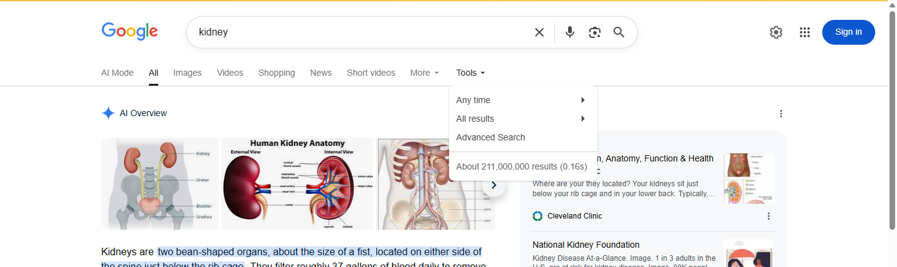
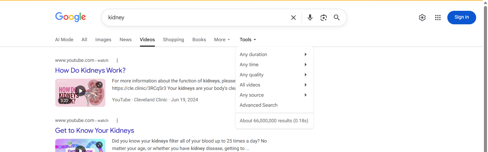
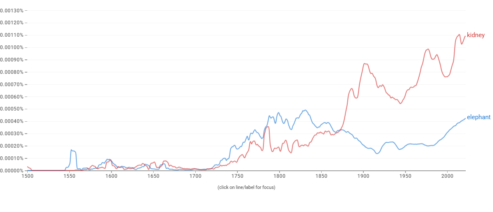

# Proposal for Emoji: Kidney

**Submitter:** Shuhan He; Edgar Lerma; Caitlyn Vlasschaert; Jade M. Teakell; Harish Seethapathy; Danielle Miller; Timur Erk; Lauren Beaudin; Heena Purohit (Microsoft for Startups); David Rhew, MD (Chief Medical Officer, Microsoft)<br>
**Main point of contact:** Shuhan He<br>
**Date:** 2026-07-28

## Identification

**Suggested name:** Kidney<br>
**Suggested keywords:** renal; anatomy; organ; filtration; urine; dialysis; transplant; donation; stone; test<br>
**Suggested category:** People & Body - body-parts<br>
**Suggested sort location:** Near anatomical heart, lungs, and brain in the body-parts subgroup.

## Required Example Images

| Size | Color | Black and white |
| --- | --- | --- |
| 18x18 |  |  |
| 72x72 |  |  |

I, Shuhan He, certify that these example images are original work created for this proposal, that I own all IP Rights in them, and that they contain no third-party artwork, logo, trademark, or text. I release the images under the CC0 1.0 Universal Public Domain Dedication and grant the rights required by the Unicode Emoji Proposal Agreement and License.

[CC0 1.0 Universal Public Domain Dedication](https://creativecommons.org/publicdomain/zero/1.0/)

## Factors for Inclusion

### A. Multiple meanings

Beyond the organ, `kidney-shaped` is an established shape descriptor in ordinary non-medical English. It names a
recognized form in furniture and landscape design: kidney tables, kidney desks, kidney trays, and kidney-shaped
swimming pools. Retail and design catalogues use the term as a primary product category rather than as a
figure of speech; see [1stDibs kidney-shaped tables](https://www.1stdibs.com/buy/kidney-shaped-table/) and
[Houzz kidney-shaped pools](https://www.houzz.com/photos/mid-century-modern-kidney-shaped-pool-ideas-phbr2-bp~t_727~s_2115~a_42-311).

This sense is not marginal relative to the literal ones the proposal relies on. In the English Google Books
corpus, `kidney-shaped` reaches a higher historical peak than `kidney stone` and remains at roughly two-thirds
of its 2022 level.
[Open the reproducible Google Books Ngram query](https://books.google.com/ngrams/graph?content=kidney-shaped%2Ckidney%20stone%2Ckidney%20bean&year_start=1900&year_end=2022&corpus=en&smoothing=3).

A Kidney character therefore carries an organ sense and a widely used shape sense. The shape sense is offered as
an additional meaning, not as the basis for encoding.

### B. Use in sequences

Two short combinations express established phrases:

- Kidney + rock: `kidney stone`.
- Kidney + test tube: `kidney tests` or `kidney function tests`.

MedlinePlus uses `kidney stone analysis` for a patient collecting a passed stone for a provider or laboratory,
and lists `kidney tests`, `kidney function tests`, and `kidney panel` as established names for blood, urine, and
imaging checks. See [Kidney Stone Analysis](https://medlineplus.gov/lab-tests/kidney-stone-analysis/) and
[Kidney Tests](https://medlineplus.gov/kidneytests.html).

### C. Breaks new ground

**Yes.** The [current Unicode Emoji List](https://www.unicode.org/emoji/charts/full-emoji-list.html) has no Kidney
character, and the current English CLDR annotations associate `kidney` with exactly one emoji:

```
<annotation cp="🫘">beans | food | kidney | legume | small</annotation>
```

That character is U+1FAD8 BEANS. Its CLDR short name is `beans`, and it remains a Food & Drink pictograph.
CLDR documents character keywords as words or short phrases used to search for an emoji. The present data
therefore connects the organ term to a food pictograph while providing no encoded Kidney character. See the
[CLDR English annotations](https://github.com/unicode-org/cldr/blob/main/common/annotations/en.xml) and
[CLDR emoji names and keyword guidance](https://cldr.unicode.org/translation/characters/short-names-and-keywords).

Changing that annotation alone cannot fill the representation gap. Removing `kidney` from Beans would stop
the misleading association, but a user searching for `kidney` would still have no recognizable kidney-organ
pictograph to find. Encoding Kidney supplies the missing character and allows the term to be associated with
the organ it names. Generic medical emoji add care or testing but do not supply that literal noun.

### D. Distinctiveness

Kidney is shown as two maroon, inward-facing forms with visible medial notches and a clear diagonal offset. The
polished 72-pixel example adds restrained shading and the renal vessels; the purpose-built 18-pixel example
keeps only the two solid notched bodies and the offset, which are the cues that survive at that size. Those
cues distinguish it from separate Beans and from the symmetric lobes and top-entering airway of Lungs. Vendors
may vary color, shading, and fine anatomical detail while preserving the paired notched bodies and the offset.

### E. Expected usage level

The five required frequency exhibits provide this proposal's primary empirical evidence of expected usage.
They test the exact proposed name, `kidney`, in Google Search, Google Video Search, Google Trends Web Search,
Google Trends Image Search, and Google Books Ngram Viewer. The Trends and Books exhibits compare `kidney` with
`elephant` as instructed. Together, the five independent sources show sustained current and historical use of
the proposed name. The cited message contexts below connect that name-level evidence to concrete uses for the
character.

The search data is reinforced by evidence that people already try to communicate the organ pictographically.
Lacking a Kidney character, writers substitute Beans: third-party emoji reference sites index Beans
combinations under kidney and nephrology headings, and practitioners report that the substitution is confusing
in the context of kidney disease. This is contextual evidence of the representation problem, not a substitute
for the required frequency measurements. See
[Kidney emoji combinations](https://emojicombos.com/kidney) and
[The Case for a Kidney Emoji](https://www.ajkd.org/article/S0272-6386(22)00626-6/fulltext).

Kidney supplies the missing noun in ordinary messages about a stone, test results, dialysis, a transplant, or
living donation. U.S. patient guidance uses the exact phrases `kidney stone`, `kidney tests`, `kidney
transplant`, and `donate a kidney`; U.K. guidance likewise uses `kidney transplant tests` and explains dialysis
when kidneys can no longer filter normally. These are concrete situations in which people collect a stone,
discuss results, prepare for treatment, or donate or receive an organ; this is not an argument from medical importance.
See [Kidney Stone Analysis](https://medlineplus.gov/lab-tests/kidney-stone-analysis/),
[Kidney Tests](https://medlineplus.gov/kidneytests.html),
[Kidney Transplant](https://www.niddk.nih.gov/health-information/kidney-disease/kidney-failure/kidney-transplant),
[Living Donation](https://www.hrsa.gov/optn/patients/organ-donation/living-donation),
[Kidney Transplant Tests](https://www.nhsbt.nhs.uk/organ-transplantation/kidney/is-a-kidney-transplant-right-for-you/kidney-transplant-tests/),
and [Dialysis](https://www.nhsbt.nhs.uk/organ-transplantation/kidney/is-a-kidney-transplant-right-for-you/alternatives-to-a-kidney-transplant/dialysis/).

#### Google Search

Captured 2026-05-13 in signed-out Google Web Search with English-language results and no date or country filter selected. The page reports about 211,000,000 indexed results. [Open the reproducible Google Search query](https://www.google.com/search?q=kidney&hl=en&num=10&pws=0).



#### Google Video Search

Captured 2026-05-13 in signed-out Google Video Search with English-language results and no date or country filter selected. The page reports about 66,000,000 indexed results. [Open the reproducible Google Video Search query](https://www.google.com/search?tbm=vid&q=kidney&hl=en&num=10&pws=0).



#### Google Trends - Web Search

Captured 2026-05-13 using Worldwide, 2004-present, All categories, and Web Search. Elephant has the higher historical average; kidney remains sustained and reaches comparable or greater interest in recent periods. [Open the reproducible Google Trends Web Search query](https://trends.google.com/trends/explore?date=all&q=elephant,kidney).


#### Google Trends - Image Search

Captured 2026-05-13 using Worldwide, 2008-present, All categories, and Image Search. Kidney shows sustained image-search interest but remains below elephant for most of the displayed range. [Open the reproducible Google Trends Image Search query](https://trends.google.com/trends/explore?date=all_2008&gprop=images&q=elephant,kidney).


#### Google Books Ngram Viewer

Captured 2026-07-09 using the English corpus, 1500-2022, and smoothing 3. Kidney exceeds elephant in recent published-book usage. [Open the reproducible Google Books Ngram query](https://books.google.com/ngrams/graph?content=elephant%2Ckidney&year_start=1500&year_end=2022&corpus=en&smoothing=3).



### F. Completeness

Not applicable. Internal organs are not a fixed set.

### G. Compatibility

Not applicable. This proposal does not rely on compatibility with a popular existing system. The separate
CLDR search mismatch is addressed under Breaks new ground and Already representable.

## Factors for Exclusion

### A. Already representable

Beans is the strongest existing single emoji, and it is already being used this way. Unicode's own `kidney`
keyword makes Beans searchable under the organ term, but searchability is not representation: the result is
still a food pictograph. Writers who need the organ reach for it in the absence of anything better.
Third-party emoji reference sites independently index Beans combinations under kidney and nephrology headings;
see [Kidney emoji combinations](https://emojicombos.com/kidney) and
[Nephrology emoji](https://emojidb.org/nephrology-emojis). A 2022 editorial in the American Journal of Kidney
Diseases describes Beans as among the best available alternatives and reports that it is confusing when used in
the context of kidney disease; several authors of that editorial are also submitters here, so it is offered as
practitioner testimony rather than independent measurement. See
[The Case for a Kidney Emoji](https://www.ajkd.org/article/S0272-6386(22)00626-6/fulltext).

That is the substance of this factor. The question is not whether a substitute can be improvised; it is whether
the improvisation works. Beans is named `beans`, is categorized under Food & Drink, and displays food. Beans +
Hospital can suggest kidney care but can equally read as food, diet, or beans at a hospital. Beans + Rock does
not clearly name `kidney stone`, and Beans + Test Tube does not clearly name `kidney tests`; in each case the
reader must first assume that Beans means an organ. Observed substitution shows the need; the recorded confusion
shows the substitute does not meet it. Removing the `kidney` annotation would stop that misleading search
result, but would not make the organ representable. A Kidney character supplies the missing noun. See the
[Unicode Emoji List](https://unicode.org/emoji/charts/emoji-list.html).

### B. Overly specific

Kidney represents the organ generally. The same noun is used in kidney stone analysis, kidney testing,
dialysis, transplantation, and living donation; it is not a specific disease, procedure, campaign, organization,
or subtype.

### C. Open-ended

Kidney is not proposed as the first member of an anatomy-completion project. It clears four independent filters:
the required five-source frequency evidence; the failure of Beans or a short sequence to identify the organ;
established stone, testing, dialysis, donation, and transplant messages that need the noun; and a paired notched
form that remains recognizable at 18x18 pixels. An adjacent organ would have to establish its own evidence under
every selection factor. Encoding Kidney therefore does not create an automatic series or establish that another
organ meets the same threshold.

### D. Transient

Kidney is an established anatomical term rather than a campaign, event, or product. The embedded Google Books
evidence spans 1500-2022, while current NIDDK, MedlinePlus, and HRSA guidance uses the same noun across testing,
stones, dialysis, transplantation, and donation.

### E. Faulty comparison

Existing organ emoji do not create an entitlement to Kidney. Lungs is used only as a small-size legibility
comparison; the Kidney case rests on the named stone, testing, dialysis, transplant, and donation messages, the
remaining ambiguity of Beans, the frequency evidence, and the paired notched pictograph.

## Other Information

The singular name Kidney identifies the organ concept even though the example shows the familiar paired organs;
this proposal does not request separate singular and plural characters. Vendors may vary color, shading, and
fine anatomy while preserving two inward-facing notched bodies and a visible offset. Vascular anatomy is
intentionally omitted from the 18x18 examples, where it does not survive, and retained in the 72x72 examples.

Official guidance: [Unicode Emoji Proposals](https://www.unicode.org/emoji/proposals.html).
